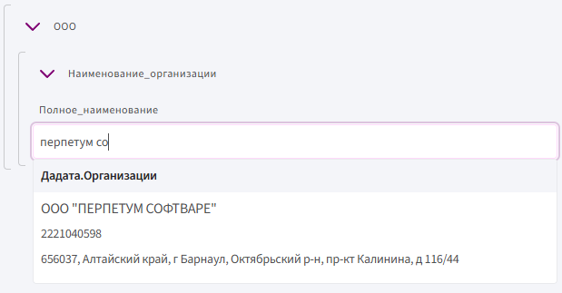

## Получение API-ключа  

Чтобы начать работу с **DaData**, выполните следующие шаги:

1. Перейдите на сайт **[https://dadata.ru](https://dadata.ru)**.

3. Нажмите на кнопку **«Войти»** в правом верхнем углу страницы. Если у вас нет аккаунта — зарегистрируйтесь.

5. После входа откройте **личный кабинет**: нажмите на аватар в правом верхнем углу и выберите **«Личный кабинет»**.

7. Перейдите на вкладку **«Почта, ключи, деньги»** → раздел **«Ключи»**.

8. Скопируйте **API-ключ**.

⚠️ **Важно:** используйте только **API-ключ, не секретный ключ!**

## Добавление API-ключа в Комбинатор  

Вы можете указать ключ либо для себя, либо сразу для всей организации.

**Добавление для личного пользования**

1. Войдите в **Комбинатор** и перейдите в **настройки** (кнопка с аватаром в правом верхнем углу → «Настройки»).
     
3. В левом меню выберите вкладку **«DaData»**.

4. Раскройте блок **«Пользовательские настройки»**.

5. Вставьте API-ключ в пустое поле и сохраните. 

**Для всей организации:**

Доступно только администраторам.

1. Откройте **панель администратора**.
   
2. Перейдите в раздел **настроек → «DaData»**.
   
3. Отметьте галочкой опцию **«Использовать настройки организации»**.
   
4. Вставьте API-ключ и нажмите **«Сохранить»**.

## Привязка данных к полям

С помощью интеграции с DaData можно автоматически заполнять поля анкеты на основе введённого значения (например, ИНН, ФИО, адрес и др.). Комбинатор поддерживает два способа привязки:

**Полный перенос полей из DaData**

Это упрощённый способ — данные сразу распределяются по вложенным полям внутри составного поля. Требует минимальной ручной настройки.

**Создание:**

1. Во время создания составного поля нажмите **«Привязка данных»**.

2. В разделе **«Доступ к источнику данных»** выберите **DaData**.

3. Укажите **источник данных**, например: **Организации**.

4. Отметьте галочками поля, которые хотите добавить в анкету.

5. Нажмите на одно из полей в анкете (например, ИНН) и в его свойствах включите опцию «Поле быстрого поиска».

**Режим заполнения:**

Чтобы вытянуть данные из **ДаДаты**, начните ввод текста в поле, которое вы отметили как **«Поле быстрого поиска»** (например, ИНН или название организации).

**Важно:**

Не нажимайте Enter. Подождите, пока появится выпадающий список с результатами от DaData, и **выберите нужный вариант**.

После выбора остальные поля заполнятся автоматически

**Привязка данных к существующим полям**

Этот способ подходит, если вы хотите вручную связать поля анкеты с данными из **ДаДаты**. Он требует понимания, какие именно данные доступны и как они вытягиваются из источника.

⚠️ Все поля, которые вы хотите связать, должны находиться внутри **составного поля**.

1. Нажмите на **составное поле** в анкете.

2. Справа в **свойствах**, в разделе **«Привязка данных»**, нажмите кнопку **«Добавить»**.

3. В поле **«Доступ к источнику данных»** выберите **Дадату**.

4. В поле **«Источник данных»** выберите, например, **Организации**.

5. Нажмите **ОК** — источник будет добавлен.

6. Теперь поочерёдно перейдите в **свойства каждого поля внутри составного поля**, которое нужно связать.

7. В разделе **«Привязка данных»** вы увидите строку с иерархией:

    

8. Удалите текущую привязку (инн) — как только вы это сделаете, появится выпадающий список с доступными идентификаторами.

9. Выберите нужный идентификатор из списка.

10. Чтобы убедиться, что вы указали полную цепочку, поставьте точку (`.`) — если после неё появится ещё один список, значит есть вложенные идентификаторы.

     * Выберите следующий элемент.
       
     * Повторите: поставьте точку и проверьте, появится ли ещё один список.
     * Продолжайте, **пока выпадающий список не перестанет появляться** — это значит, вы дошли до конечного значения.

✅ **Не забудьте:**

Для одного из полей (обычно ИНН или название) необходимо **включить галочку «Поле быстрого поиска»** — это нужно, чтобы пользователь мог найти данные в режиме заполнения.

Галочка находится в свойствах поля, сразу под основными настройками. Без неё поиск и автозаполнение работать не будут.

**Результат:**

Поле теперь точно связано с нужным элементом данных из ДаДаты. При выборе организации (или другого объекта) остальные поля будут автоматически заполняться в соответствии с заданной структурой.
