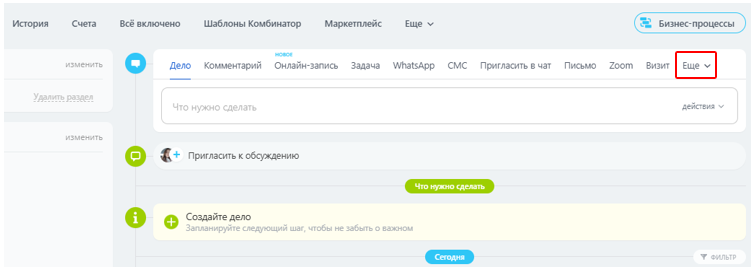
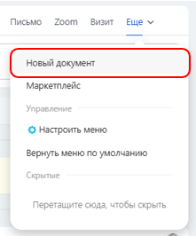
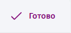
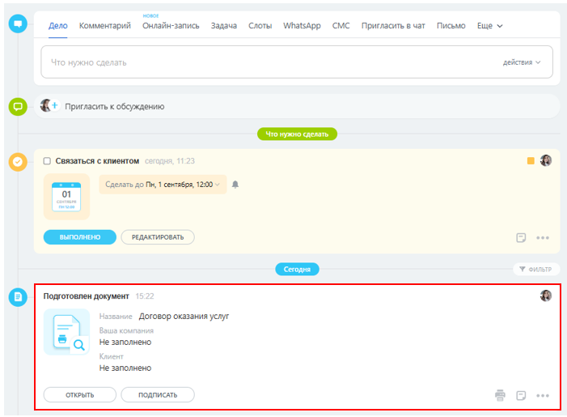
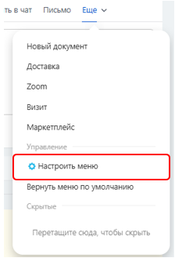
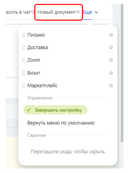
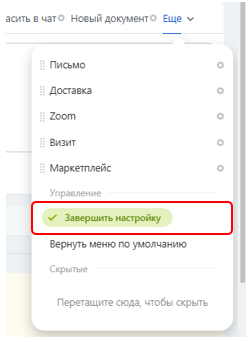

# Создание документа на основе готового шаблона

1. Находясь в элементе сущности (например, в конкретной **сделке**), нажмите на выпадающий список **«Ещё»** в меню действий над таймлайном.

     

3. Выберите пункт **«Новый документ»**.

     
 
4. Укажите шаблон, который необходимо заполнить.

5. Дождитесь, пока данные подгрузятся в шаблон, и нажмите кнопку **«Готово»** в правом верхнем углу.

     

7. Введите имя документа и нажмите **«ОК»**.

8. Созданный документ отобразится в таймлайне.
 
     

## Настройка меню

Меню действий над таймлайном можно настраивать. Кнопку **«Новый документ»** удобно вынести в основное меню, чтобы не заходить каждый раз в раздел **«Ещё»**.

Для этого:

1. Откройте список **«Ещё»**.

2. Нажмите **«Настроить меню»**.

     

3. Зажмите левой кнопкой мыши пункт **«Новый документ»** и перетащите его в основное меню.

     

4. Завершите настройку.

     

После этого кнопка будет доступна сразу в панели действий.