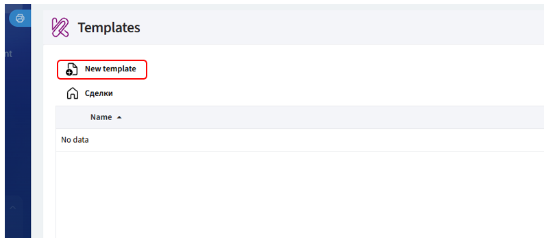
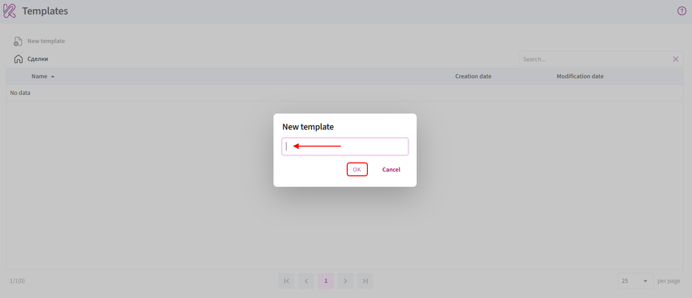
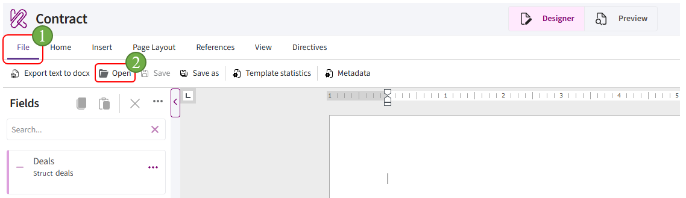
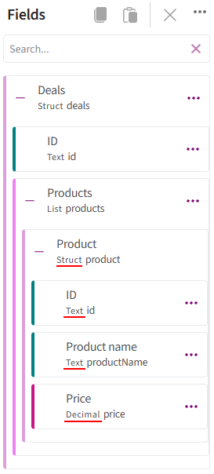

# Creating a template

After completing the [app setup](setting.md), you can create a template.

A template is created from the Bitrix24 entity where it will be used. For example, to create a template for deals, open any deal card.

## Opening Kombinator Templates

1. Open the required Bitrix24 entity, for example **Deals**.

2. Open any card within the selected entity.

3. In the card menu, select **«Kombinator Templates»**.

      

      If the item is not displayed in the main menu, open **«More»**.

      To pin the item to the main menu, click **«Configure menu»**, click and hold **«Kombinator Templates»**, and drag it to the required position. Then finish editing the menu.

      If **«Kombinator Templates»** is not available in either the main menu or the **«More»** section, go to [app setup](setting.md#integration) and make sure the required entity is enabled.

## Creating a new template

1. Open the **«Kombinator Templates»** tab and click **«New template»**.

      

2. Enter the template name and click **«OK»**.

      

3. Open the **«File»** tab, click **«Open»**, and select the **DOCX** document you want to convert into a template.

      

## Adding fields

**«Fields»** is the panel on the left side of the editor. It contains the fields whose data can be used to populate the template.

1. Click the three-dot menu next to the required entity, for example **Deals**, and select **«Edit fields»**.

      

2. In the window that opens, find the required fields using search or by scrolling through the list.

      

3. Select the fields you want to add to **«Fields»** and click **«OK»**.

      

**Note.** Custom Bitrix24 fields have the `UF_CRM_` prefix.

## Adding fields to the document

To insert a field into the document:

1. Place the cursor where you want to insert the field.

      

2. Find the required field in **«Fields»**.

3. Click the three-dot menu next to the field.

4. Select the required insertion method.

      

## Working with fields in the document

**Example:**

<video controls preload="metadata" style="width: 100%; max-width: 900px;">
  <source src="../../img/bitrix/34.mp4" type="video/mp4">
  Your browser does not support video playback.
</video>

Fields can be inserted into the document using **Expression**, **Condition expression**, **Switch**, **For**, or **Table**.

Before inserting a field, check its type and whether it is nested inside a list.

### How to identify a field type

The field type is displayed below the field name in **«Fields»**.

For example:

- **Product name** — **Text**;
- **Price** — **Decimal**;
- **Products** — **List**;
- **Product** — **Struct**.

Field nesting is indicated by indentation. The farther a field is shifted to the right, the deeper it is nested in the structure.

### Insertion methods

| Insertion method | How it works | Applicable field types |
|---|---|---|
| **Insert «Expression»** | Inserts the field value or the result of an expression into the document | [Text](../typesField/text.md), [number](../typesField/decimal.md), [date](../typesField/date.md) |
| **Insert «Condition expression»** | Controls whether a document fragment is displayed. The fragment is included only when the specified condition is met | [Boolean](../typesField/boolean.md) |
| **Insert «For»** | Creates a repeating section. Text and fields from list items can be placed inside it, and the content is repeated for each item | [List](../typesField/list.md) |
| **Insert «Table»** | Repeats table rows for list items. Fields from each list item can be inserted into the cells of the repeated rows | [List](../typesField/list.md) |

> **Note.** Each field type supports a specific set of functions. The table above includes links to the corresponding field type articles, where the available functions are listed.

### «Marker must be inside…» error

The **«Marker must be inside…»** message appears when a field is nested inside a list but is inserted into the document outside that list.

For example, if you try to insert the **Product Name** field outside a **For** or **Table** marker, the following message will appear:

> Marker must be inside Products.

This means that **Product name** is nested inside the **Products** list.

In this case:

1. Insert **Products** using **For** or **Table**.

2. Place the cursor inside the inserted structure.

3. Insert **Product name** using **Expression**.

> If a similar message then appears with the name of another list, the field is nested inside multiple lists. Add a separate **For** or **Table** marker for each list, starting with the outermost list and moving inward.

---

After creating the template:

- if the document should be generated automatically using Bitrix24 automation rules or business processes, proceed to [template automation](../../UserInterface/Documents/template-automation.md);
- if automation is not required, proceed to [generating a document](../../UserInterface/Documents/add-document.md).