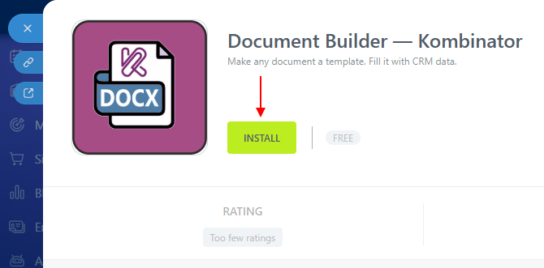
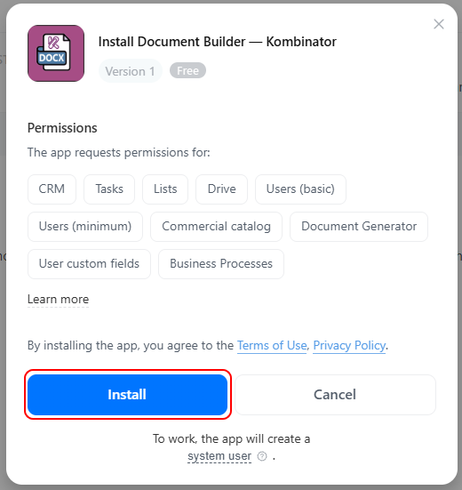
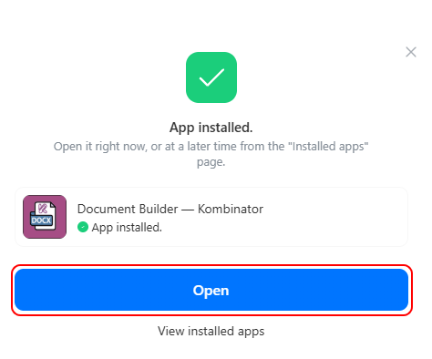

# App installation  

1. Open **Market**.

2. Enter **«Kombinator»** in the search bar and open the app from the search results.

3. Click **«Install»**.

     

4. In the window that opens, review the app terms of use and click **«Install»**.

     

5. Once the installation is complete, click **«Open»** nd proceed to the [app setup](setting.md).

     