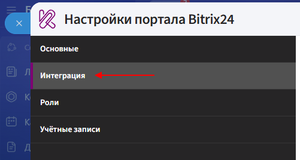
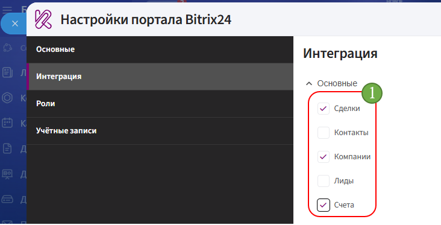
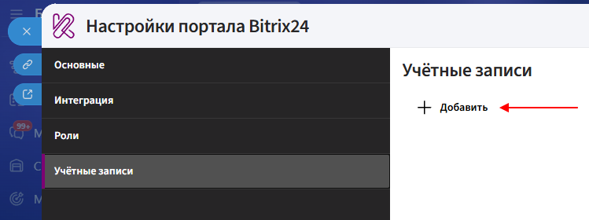
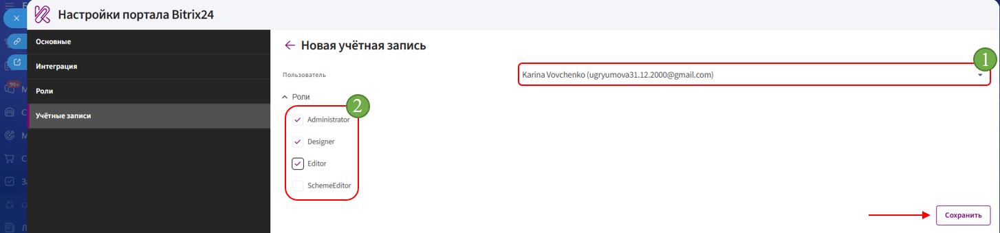

# App setup

## Integration

**Integration** determines which Bitrix24 entity cards will display the Kombinator app.

1. Open the **«Integration»** tab.

      

2. Select the entities where the app should be available.

      

3. Click **«Save»**. 

## Roles

The **«Roles»** tab is used to configure sets of permissions that can then be assigned to Kombinator users.

The **Administrator**, **Designer**, and **Editor** roles are created by default. If needed, you can create a custom role and specify which actions are available to it.

**Default roles**

1. **Designer** — provides access to view and edit templates, as well as organization administrator permissions.

      The following permissions are enabled:

      - **Templates — Read**;
      - **Templates — Edit**;
      - **Team admin**.

2. **Editor** — provides read-only access to templates.

      The following permission is enabled:

      - **Templates — Read**.

3. The **Administrator** role is also created by default.

**Adding a role**

To create a custom role:

1. Open the **«Roles»** tab.

2. Click **«Add»**.

3. Enter the role **name**.

4. Select the required permissions:

      - **Templates — Read** — allows users to view templates;
      - **Templates — Edit** — allows users to edit templates;
      - **Team admin** — grants organization administrator permissions.

5. Click **«Save»**.

The created role can then be assigned to an employee in the **«User Accounts»** tab.

## Accounts 

**Accounts** — are Bitrix24 employees who have access to the Kombinator app.

1. Open the **«Accounts»** tab.

2. Click **«Add»**.

      

3. In the **«User»** field, select the required employee.

4. Assign the required roles and click **«Save»**.

      

Once the setup is complete, proceed to [creating a template](creat.md).

