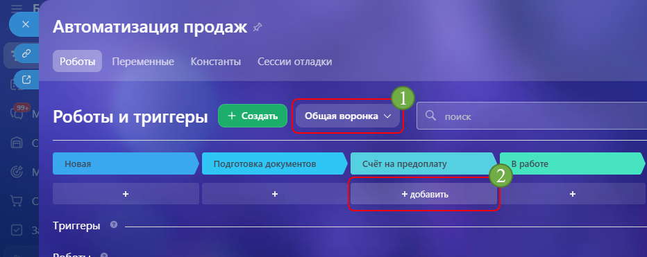
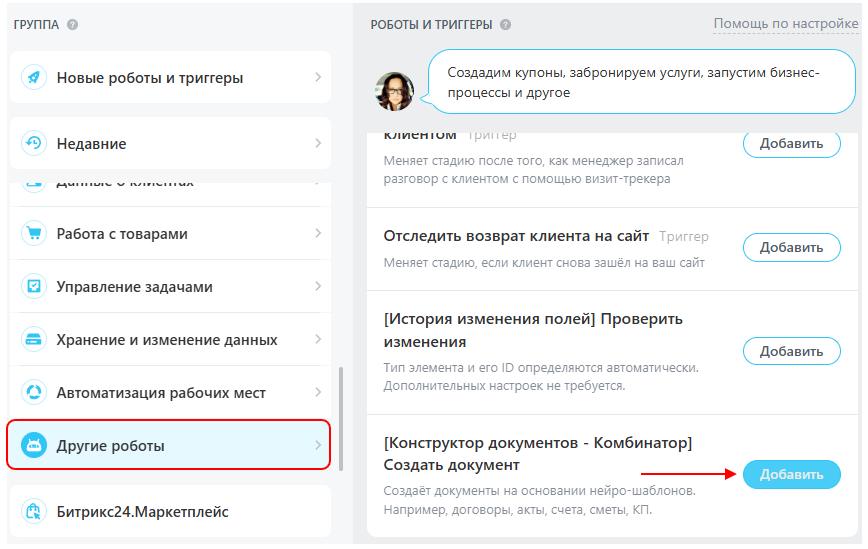
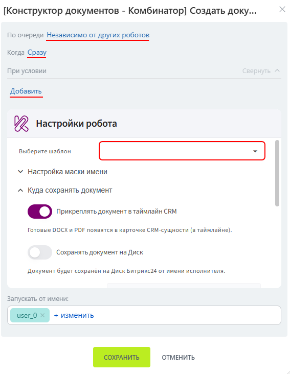
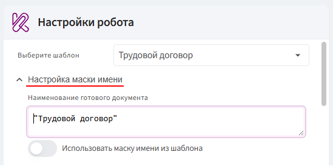
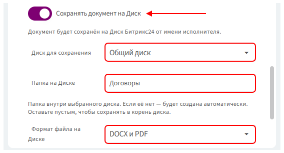
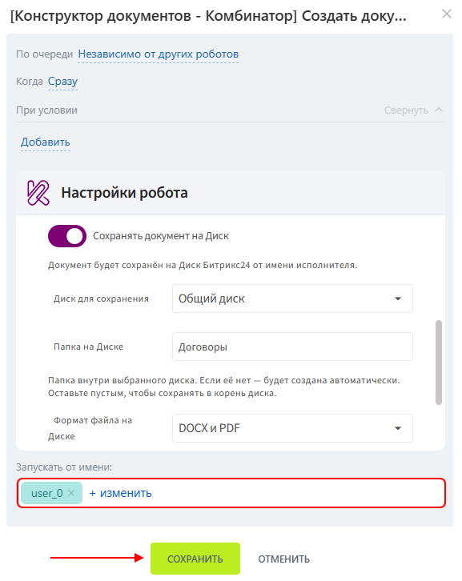
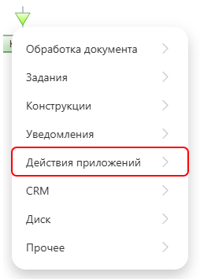
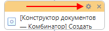

# Template automation

Document generation from a template can be automated using a Bitrix24 automation rule.

An automation rule can be added:

- to CRM automation — the document will be generated when an item moves to a specific stage;

- to a workflow — the document will be generated when the workflow reaches the corresponding action.

Before setting up automation, make sure the document template has been created and saved, and that Kombinator is connected to the required Bitrix24 entity.

## Adding an automation rule to CRM

The automation rule generates a document when a CRM item moves to the stage where the rule is configured.

### Adding the automation rule

1. Go to **CRM**.

2. Open the required entity, for example **Deals**.

3. Open the **«Automation rules»** tab.

      

4. Select the required pipeline.

5. At the stage where the document should be generated, click **«+ add»**.

      

6. In the **«Other»** group, find **«[Document Builder — Kombinator] Create a document»**.

7. Click **«Add»**.

      

8. In the window that opens, configure the conditions, execution order, and execution time.

9. In **«Robot settings»**, select the template that should be used to generate the document.

      

### Setting up the file name mask

1. Expand **«Name mask settings»**.

      

2. By default, the mask field contains the name of the selected template in double quotation marks. If you leave the settings unchanged, this name will be used as the document name.

3. If needed, change how the document name is generated:

      - if the file name mask is already configured in the template, enable **«Use the name mask from the template»**;

      - if no mask is configured in the template, enter it directly in the automation rule settings;

      - if no separate mask is required, leave the default template name.

> The file name mask field cannot be empty.

### Saving the document to Drive

By default, the generated document is attached to the item timeline. You can also save it to Bitrix24 Drive.

1. Enable **«Save document to Drive»**.

2. Select where the document should be saved: a shared drive or a personal drive.

3. Enter the folder name. The automation rule will check whether a folder with this name already exists on the selected drive:

      - if the folder exists, documents will be saved there;

      - if the folder does not exist, it will be created automatically.

4. Select the file formats that should be saved to Drive.

      

### Completing the setup

1. Select the employee whose account will be used to run the automation rule.

2. Click **«Save»**.

      

The automation rule will now generate a document whenever a CRM item moves to the selected stage.

## Adding Kombinator to a workflow

Kombinator can also generate documents as part of a Bitrix24 workflow.

The settings are similar to those of the CRM automation rule. The main difference is how document generation is triggered: in CRM automation, the rule runs when an item moves to a specific stage, while in a workflow the document is generated when the workflow reaches the corresponding action.

### Creating a workflow

1. Go to **«Automation»**.

2. Open **«Workflows»** and select **«Workflows in CRM»**.

3. Select the CRM entity for which you want to configure document generation, for example **Deals**.

4. Click **«Add Template»**.

5. Enter the workflow name.

6. If needed, configure **Autorun**:

      - **«When added»** — the workflow starts when a new CRM item is created;

      - **«When changed»** — the workflow starts when a CRM item is modified.

      If Autorun is not enabled, the workflow can be started manually from the CRM item.

7. Save the settings and open the Workflow Designer.

### Adding the Kombinator action

In a workflow, document generation is added as a separate action.

1. Click the arrow at the point in the workflow where the document should be generated.

2. In the list of actions, select **«Application Actions» → «[Document Builder — Kombinator] Create a document»**.

      

3. Click the gear icon next to the added action to open its settings.

      

4. Configure the action in the same way as the [CRM automation rule](#adding-an-automation-rule-to-crm): select the template, specify the file name mask, storage location, and document format.

5. Select the employee whose account will be used to run the action.

6. Save the action settings and the workflow template.

> In a workflow, you do not need to separately specify the CRM stage, execution order, or execution time. The action runs according to its position and the logic configured in the workflow.