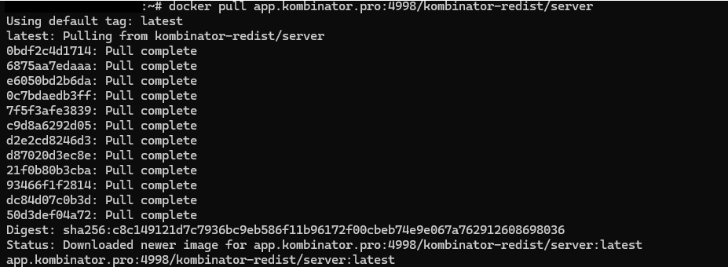
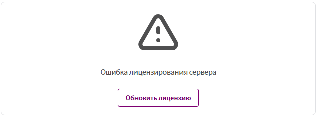
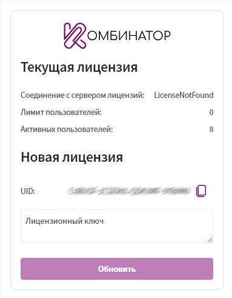
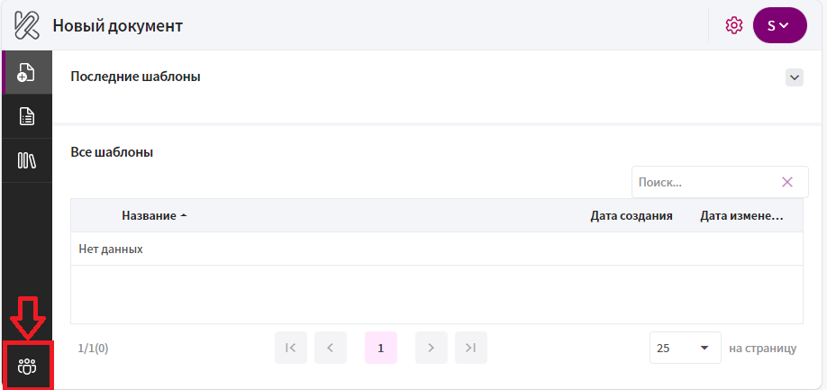

## **Базовая конфигурация «всё в одном»:**

Реализуется одновременное развёртывание в **Docker** образов Комбинатор и **PostgreSQL** на машине клиента. 

Комбинатор будет работать как отдельно стоящий сервер (**Kestrel**), использующий порты **80** (http) и **443** (https). Для обеспечения работы сервера по https необходим **TLS-сертификат** в виде .pfx-файла. **Http-only** работа в данной конфигурации **не поддерживается**.

Для развёртывания потребуется установленный **Docker Compose**. 

**Процедура развёртывания:**

1. Скачать на целевой сервер (например, в /var/downloads/kombinator) файлы, необходимые для установки:

     * [ZIP-архив](https://kombinator.ru/wp-content/uploads/2025/10/fajly_dlya_ustanovki_a5afd35b_c55e_40d1_ad1c_c17fb1f1cddd.zip)

2. Вписать корректные значения конфигурации .pfx-файла в файле «.env»:

     * PFX_File_Path

     * PFX_File_Name

     * PFX_File_Password.

3. **Опционально:** В файле «.env» поменять значения по умолчанию для конфигурации PostgreSQL (Postgres_Data_Location, Postgres_User, Postgres_User_Password). По умолчанию база данных комбинатора будет сохраняться в директории /var/postgres_kombinator/data/.

4.	Авторизоваться в хранилище образов с помощью логина и пароля, полученного при приобретении коробочной версии. Выполнить в консоли команду:

     `docker login app.kombinator.pro:4998`

5.	Загрузить на целевой сервер новый образ Комбинатора:

     `docker pull app.kombinator.pro:4998/kombinator-redist/server`

     Пример вывода при успешной загрузке образа:

     

6.	Выполнить развёртывание. В консоли выполнить команду:

     `docker-compose -f <path_to_yml>/kombinator_basic.yml up –d`

     Если при загрузке файлов была использована директория /var/downloads/kombinator:

     `docker-compose -f /var/downloads/kombinator/kombinator_basic.yml up –d`  

     Пример вывода при успешном выполнении команды:

     

7. **Опционально:** Выйти из хранилища образов:

     `docker logout app.kombinator.pro:4998`

Развёртывание завершено. Сервер доступен по назначенному для него url, либо по IP-адресу хоста.

**Примечания:**

* Файлы **«kombinator_basic.yml»** и **«.env»** необходимо сохранить для последующих обновлений.

## Первый вход и первоначальная настройка

1. Откройте url сервера в браузере.

2. Авторизуйтесь: 

     * **Имя пользователя:** `sysadmin`

     * **Пароль:** `nimdasys`

       Рекомендуется впоследствии изменить пароль на более защищённый.
     
       Также рекомендуется создать дополнительного пользователя с правами системного администратора.

3.	После авторизации появится предупреждение **«Ошибка лицензирования сервера»**:

     

4.	По нажатию на кнопку **«Обновить лицензию»** в новой вкладке браузера откроется страница «Обновить лицензию». На странице указано состояние лицензии и **UID**.

     

5.	Для получения лицензии вышлите UID на email [vladimir.krasnov@enterra-inc.com](###). В ответном письме вы получите файл с лицензией.

6.	Вставьте текст из полученного файла в поле **«Лицензионный ключ»** и нажмите **«Обновить»**. После проверки лицензии изменится значение **«Лимит пользователей»**. Страницу можно закрыть.

**Примечания:**

* При необходимости повторного обновления лицензии используйте URL 

     `https://<адрес_вашего_сервера>/ServerLicense/Update`

* Лицензия привязана к машине, на которой развёрнут Комбинатор. При переносе сервера Комбинатор на другую машину, необходимо заново получать лицензию.

* Управление организациями, пользователями и лицензиями осуществляется в панели администратора. Перейти в панель администратора можно с помощью навигационной панели на стартовом окне приложения:

     