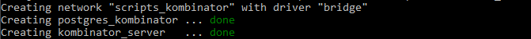

## Обновление конфигурация «всё в одном»

**Процедура обновления:**

1. Авторизоваться в хранилище образов с помощью логина и пароля, полученного при приобретении коробочной версии:

     `docker login app.kombinator.pro:4998`

2. Загрузить на целевой сервер новый образ Комбинатора:

     `docker pull app.kombinator.pro:4998/kombinator-redist/server`

     Пример вывода при успешной загрузке образа:

     
 
3. Остановить работу текущей конфигурации Комбинатор. Выполнить в консоли команду:

     `docker-compose -f <path_to_yml>/kombinator_basic.yml down`

     * `<path_to_yml>` - путь к директории, использованной при первоначальном развёртывании Комбинатора (в ней хранятся файлы **«kombinator_basic.yml»** и **«.env»**).

4. **При необходимости:** Заменить файл «kombinator_basic.yml» в директории `<path_to_yml>`.

5.	Выполнить развёртывание. В консоли выполнить команду:

     `docker-compose -f <path_to_yml>/kombinator_basic.yml up –d`

     

6.	**Опционально:** Выйти из хранилища образов:

     `docker logout app.kombinator.pro:4998`

Обновление завершено. Сервер доступен по назначенному для него url, либо по IP-адресу хоста. Для освобождения места на сервере можно удалить старые версии образов Комбинатора. 

