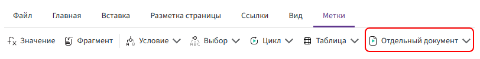
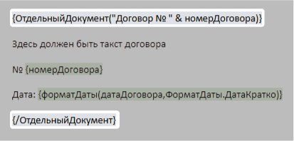

# Метка «Отдельный документ»

Метка **«Отдельный документ»** используется для формирования нескольких отдельных файлов из одного шаблона.

Например, из одного шаблона можно сформировать договор, акт и приложение — каждый отдельным документом.



## Добавление метки

Метка состоит из открывающей и закрывающей частей. Всё содержимое между ними формируется как отдельный документ.

Чтобы добавить метку:

1. Установите курсор перед содержимым, которое необходимо сформировать как отдельный документ.
2. На вкладке **«Метки»** откройте список **«Отдельный документ»** и выберите **«Отдельный документ»**.
3. В поле **«Имя нового документа»** задайте имя создаваемого файла и нажмите **«ОК»**.
4. Установите курсор после содержимого документа и выберите **«/Отдельный документ»**.

В шаблоне открывающая и закрывающая метки располагаются по обе стороны от содержимого отдельного документа:



## Имя документа

Имя нового документа задаётся с помощью выражения.

Например:

```text
"Договор № " & номерДоговора
```

Здесь:

- `"Договор № "` — текст;
- `&` — оператор объединения значений;
- `номерДоговора` — поле, значение которого добавляется в имя документа.

Если поле `номерДоговора` содержит значение `125`, имя сформированного документа будет:

```text
Договор № 125
```

В выражении можно использовать значения полей, функции и операторы по общим правилам синтаксиса Комбинатора.

Подробнее: [«Основные правила»](../syntax/syntax.md).