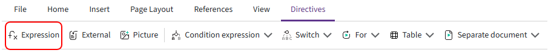

# Expression

The **«Expression»** directive is used to insert a field value or the result of an expression into the document. It can insert text, numbers, dates, calculation results, or function results.



## Expression

When adding the directive, specify the expression whose result should be inserted into the document.

For a regular field, enter its identifier:

```text
customerName
```

For a nested field, specify the full path using a period (`.`):

```text
deals.fullName
```

You can also use more complex expressions, for example:

- a calculation — `quantity * price`;
- a function — `formatDate(contractDate, "dd.MM.yyyy")`;
- concatenation — `"Contract № " & contractNumber`;
- a conditional function — `if(...)`.

Expression syntax is described in [«Basic rules»](../syntax/syntax.md).

## Limitations

The **«Expression»** directive is not intended for repeating list items. Use the [«For»](for.md) or [«Table»](table.md) directive for lists.

To show or hide part of the document depending on a condition, use the [«Condition expression»](if.md) directive.