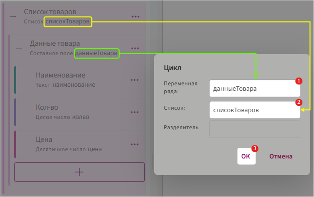

# Метка «Цикл»

Метка **«Цикл»** используется для повторения части документа для каждого элемента списка.

Например, с её помощью можно последовательно вывести товары, услуги, сотрудников или другие данные из поля типа **«Список»**.


## Для чего используется цикл

Поле типа **«Список»** может содержать несколько элементов. Например:

```text
Товар 1
Наименование: Ноутбук
Количество: 2
Цена: 80 000

Товар 2
Наименование: Монитор
Количество: 3
Цена: 25 000

Товар 3
Наименование: Клавиатура
Количество: 5
Цена: 4 000
```

Чтобы вывести эти данные в документ, не нужно создавать отдельный блок для каждого товара.

Достаточно один раз настроить цикл, а Комбинатор последовательно подставит в него данные каждого элемента списка.

Количество повторений определяется количеством элементов в списке. Если в списке 10 товаров, цикл будет выполнен 10 раз. Если список пуст, содержимое цикла не выводится.

## Добавление и структура метки

1. Установите курсор в месте, где должен начинаться повторяющийся блок, и выберите **«Метки» → «Цикл» → «Цикл»**.

       В настройках метки укажите:

       - **Переменная ряда** — имя текущего элемента списка;
       - **Список** — поле типа **«Список»**, элементы которого нужно перебрать;
       - **Разделитель** — при необходимости текст или символ между результатами повторений.
       
       
       
       После добавления метки формируется открывающая часть цикла:

       ```
       {цикл(данныеТовара из списокТоваров)}
       ```

2. После открывающей части разместите текст и другие метки, которые должны повторяться для каждого элемента списка.

3. Обязательно завершите цикл закрывающей меткой `{/цикл}`.

В результате конструкция может выглядеть так:

```text
{цикл(данныеТовара из списокТоваров)}

Товар: данныеТовара.наименование
Количество: данныеТовара.количество
Цена за единицу: данныеТовара.цена

{/цикл}
```

## Текущий элемент списка

В цикле используется имя, через которое выполняется обращение к текущему элементу списка.

По умолчанию в качестве этого имени указывается идентификатор составного поля, которое является элементом списка.

Например, если составное поле имеет идентификатор `данныеТовара`, обращения к его вложенным полям будут выглядеть так:

```text
данныеТовара.наименование
данныеТовара.количество
данныеТовара.цена
```

Имя текущего элемента можно изменить и указать другое допустимое имя. Например:

```text
{цикл(товар из списокТоваров)}
```

Тогда обращения к вложенным полям также нужно записывать с новым именем:

```text
товар.наименование
товар.количество
товар.цена
```

## «Цикл» и «Таблица»

Обе метки используются для работы с данными из поля типа **«Список»**, но предназначены для разных способов их вывода.

**«Цикл»** используется, когда для каждого элемента нужно повторить произвольный фрагмент документа: текст, несколько строк, абзац или блок с другими метками.

Если элементы списка нужно вывести в виде строк таблицы, используется метка **«Таблица»**.