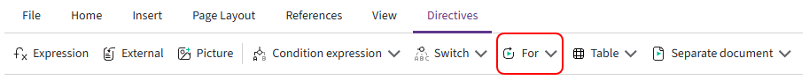

# For

The **«For»** directive is used to repeat part of a document for each item in a list.

For example, it can be used to display products, services, employees, or other data from a **List** field.



## What the For directive is used for

A **List** field can contain multiple items. For example:

```text
Product 1

Name: Laptop
Quantity: 2
Price: 80,000

Product 2

Name: Monitor
Quantity: 3
Price: 25,000

Product 3

Name: Keyboard
Quantity: 5
Price: 4,000
```

You do not need to create a separate block for each product.

Configure the **For** directive once, and Kombinator will process each item in the list and repeat the content for it.

The number of repetitions depends on the number of items in the list. If the list contains 10 products, the content inside the directive is repeated 10 times. If the list is empty, the content inside the directive is not included in the document.

## Adding and structuring the directive

1. Place the cursor where the repeating block should begin and select **«Directives» → «For» → «For»**.

       In the directive settings, specify:

       - **Row variable** — the name used to reference the current list item;
       - **Source** — the **List** field whose items should be processed;
       - **Separator** — optional text or a character inserted between repeated blocks.
              
       After the directive is added, the opening part is inserted:

      ```text
      {for(productData in productList)}
      ```

2. After the opening part, add the text and other directives that should be repeated for each list item.

3. Close the construction with `{/for}`.

The complete construction may look like this:

```text
{for(productData in productList)}

Product: productData.name

Quantity: productData.quantity

Unit price: productData.price

{/for}
```

## Current list item

Inside the **For** directive, a variable is used to reference the current item in the list.

By default, this name is the identifier of the composite field that represents a list item.

For example, if the composite field identifier is `productData`, its nested fields can be referenced as:

```text
productData.name
productData.quantity
productData.price
```

You can change the current item variable and use another valid name.

For example:

```text
{for(product in productList)}
```

In this case, the nested fields must also be referenced using the new variable:

```text
product.name
product.quantity
product.price
```

## «For» and «Table»

Both directives are used to work with data from a **List** field, but they are intended for different output formats.

Use **«For»** when you need to repeat any document fragment for each list item, such as text, several lines, a paragraph, or a block containing other directives.

Use the **«Table»** directive when list items should be displayed as table rows.