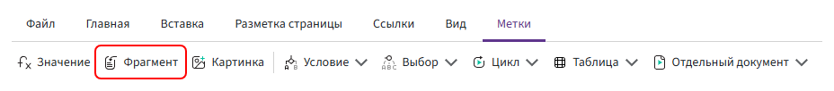
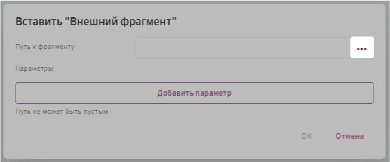

# «External» directive

The **«External»** directive is used to insert content from one template into another.

This allows you to reuse the same document sections without copying them. If the external template is updated, the changes will be applied wherever that template is used.



## Adding an external template

To add content from another template:

1. Place the cursor where you want to insert the content.

2. On the **«Directives»** tab, select **«External»**.

3. Select the template whose content you want to insert.



When the document is generated, the content of the selected template will be inserted at the position of the directive.

## Passing values to an external template

If the main template and the external template use fields with the same identifiers, no additional configuration is required.

For example, if both templates use the field:

```text
counterparty
```

the field value will also be available in the external template.

If the field identifiers are different, configure a parameter to pass the required value.

For example:

- the field in the external template has the identifier `contractor`;
- the required value in the main template is stored in the `counterparty` field.

In this case, specify:

**Parameter name** — the field identifier in the external template:

```text
contractor
```

**Parameter expression** — the field or expression from the main template whose value should be passed:

```text
counterparty
```

As a result, the `contractor` field in the external template will receive the value of the `counterparty` field from the main template.

## Fields used in the external template

If the external template uses fields that are not included in **Fields** of the main template and their values are not passed through parameters, add those fields to **Fields** in the main template.