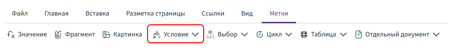

# Метка «Условие»

Метка **«Условие»** используется для управления содержимым документа в зависимости от заданного условия.



С её помощью можно определить, какая часть шаблона должна попасть в сформированный документ. Комбинатор проверяет указанное условие и в зависимости от результата выводит или исключает содержимое внутри метки.

Например, можно:

- добавить отдельный пункт договора только при определённом значении поля;
- вывести дополнительный текст, если сумма превышает установленное значение;
- показать один вариант содержимого при выполнении условия и другой — если оно не выполняется.

## Структура метки

Метка состоит из открывающей и закрывающей частей.

В открывающей части задаётся условие:

```text
{если (условие)}

Содержимое, которое должно быть выведено.

{/если}
```

Комбинатор проверяет выражение, указанное в открывающей части.

Если результат — `истина`, содержимое между `если` и `/если` добавляется в документ.

Если результат — `ложь`, это содержимое не выводится.

## Условие

В качестве условия указывается выражение, результатом которого является логическое значение `истина` или `ложь`.

Например, можно проверить значение числового поля:

```text
сумма > 100000
```

Если поле `сумма` содержит значение больше `100000`, условие выполняется.

Можно сравнивать значения полей:

```text
количество > лимит
```

проверять текстовые значения:

```text
статус = "Согласовано"
```

или проверять наличие значения:

```text
номерДоговора != пусто
```

В условии также можно использовать логические операторы и функции по общим правилам выражений.

Подробнее: [«Основные правила»](../syntax/syntax.md).

## Поле «Да/Нет»

Поле **«Да/Нет»** можно использовать в качестве условия напрямую.

Например:

```text
доставка
```

Если поле **«Доставка»** имеет значение **«Да»**, результат условия — `истина`, и содержимое метки выводится.

Если значение — **«Нет»**, результат — `ложь`, и содержимое не выводится.

Чтобы проверить противоположное значение, можно использовать оператор `не`:

```text
не доставка
```

В этом случае содержимое будет выведено, если поле **«Доставка»** имеет значение **«Нет»**.

## Несколько условий

В одном выражении можно проверить сразу несколько условий.

Оператор `и` используется, если должны выполняться оба условия:

```text
сумма > 100000 и согласование
```

Содержимое будет выведено только в том случае, если сумма больше `100000` **и** поле `согласование` имеет значение `истина`.

Оператор `или` используется, если достаточно выполнения хотя бы одного условия:

```text
срочныйЗаказ или важныйКлиент
```

Содержимое будет выведено, если выполняется хотя бы одно из этих условий.

## Блок «Иначе»

Блок **«Иначе»** используется, если необходимо задать два варианта содержимого: один — для выполненного условия, другой — для невыполненного.

Структура выглядит так:

```text
{если (условие)}

Содержимое при выполнении условия.

{иначе}

Содержимое, если условие не выполнено.

{/если}
```

Например:

```text
{если (сумма > 100000)}

Требуется дополнительное согласование.

{иначе}

Дополнительное согласование не требуется.

{/если}
```

Если `сумма > 100000`, в документ попадёт первый вариант.

Если условие не выполняется, будет выведено содержимое после блока **«Иначе»**.

Блок **«Иначе»** необязателен. Если альтернативное содержимое не требуется, достаточно использовать `если` и `/если`.

## Вложенные условия

Одну метку **«Условие»** можно разместить внутри другой. Это позволяет последовательно проверять несколько зависимых условий.

Например:

```text
{если (доставка)}

Условия доставки товара.

    {если (срочнаяДоставка)}

    Срок доставки — в течение одного рабочего дня.

    {/если}

{/если}
```

Сначала проверяется поле `доставка`.

Только если первое условие выполняется, проверяется вложенное условие `срочнаяДоставка`.