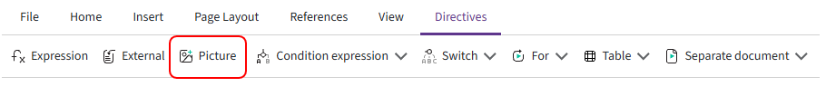

# Picture

The **«Picture»** directive is used to insert an image into a document.

You can specify the field from which Kombinator should retrieve the image, set its size, and choose how the image should be resized while preserving its original proportions.



## Directive parameters

When adding the **«Picture»** directive, specify the following parameters:

- **Expression** — a [Picture](../typesField/picture.md) field from which Kombinator retrieves the image;

- **Image height** — the image height in centimeters. The default value is `3 cm`;

- **Image width** — the image width in centimeters. The default value is `3 cm`;

- **Resize mode** — determines how the image is resized relative to the specified height and width.

## Resize modes

When the image is resized, its original proportions are preserved.

Three resize modes are available.

### By height

The image height is set to the value specified in **Image height**. The width is calculated automatically to preserve the original proportions.

In this mode, the specified width does not limit the image size.

For example, if the following values are set:

```text
Height — 3 cm
Width — 4 cm
```

but the proportional width is `6 cm` when the image height is `3 cm`, the resulting image size will be `3 × 6 cm`.

### By width

The image width is set to the value specified in **Image width**. The height is calculated automatically to preserve the original proportions.

In this mode, the specified height does not limit the image size.

For example, if the following values are set:

```text
Height — 3 cm
Width — 4 cm
```

but the proportional height is `5 cm` when the image width is `4 cm`, the resulting image size will be `5 × 4 cm`.

### By height and width

The image is resized proportionally so that neither its height nor its width exceeds the specified values.

For example, if the following values are set:

```text
Height — 3 cm
Width — 5 cm
```

the image will be fitted within `3 × 5 cm`. Depending on its original proportions, one side may be smaller than the specified value.

## Picture directive in the template

After the directive is added, a placeholder image appears in the template. It shows the position and size of the image that will be inserted into the generated document.

You can resize the placeholder directly in the editor. The updated height and width are saved and used when the document is generated.

The image is placed **inline with text**, so its position depends on where the directive is located in the template.

When the document is generated, the placeholder is replaced with the image from the field specified in **Expression**.