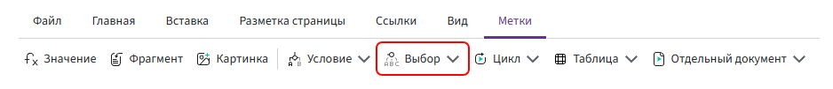

# Метка «Выбор»

Метка **«Выбор»** используется, когда в документе нужно вывести один из нескольких вариантов содержимого в зависимости от значения поля.



Комбинатор получает значение указанного поля, сравнивает его с заданными вариантами и выводит содержимое того варианта, с которым найдено совпадение.

Например, в зависимости от значения поля `типКонтрагента` можно выводить разные формулировки для ООО, ИП и физического лица.


## Структура метки

Конструкция состоит из:

- открывающей метки **«Выбор»** — в ней указывается поле, значение которого необходимо проверить;
- одного или нескольких блоков **«Вариант»** — для каждого возможного значения;
- необязательного блока **«Прочее»** — для случая, когда совпадений нет;
- закрывающей метки **«/Выбор»**.

Общая структура:

```text
{выбор (поле)}

{вариант ("Значение 1")}

Содержимое первого варианта.

{вариант ("Значение 2")}

Содержимое второго варианта.

{прочее}

Содержимое, если совпадений нет.

{/выбор}
```

## Поле для проверки

В открывающей метке **«Выбор»** указывается поле, значение которого Комбинатор будет сравнивать с вариантами.

Например:

```text
типКонтрагента
```

Если нужно обратиться к вложенному полю, указывается полный путь через точку (`.`):

```text
контрагент.тип
```

Правила обращения к полям описаны в разделе [«Основные правила»](../syntax/syntax.md).

## Блок «Вариант»

Для каждого значения, которое необходимо обработать, добавляется отдельный блок **«Вариант»**.

Например:

```text
{выбор (типКонтрагента)}

{вариант ("ООО")}

Текст для юридического лица.

{вариант ("ИП")}

Текст для индивидуального предпринимателя.

{вариант ("Физическое лицо")}

Текст для физического лица.

{/выбор}
```

Если поле `типКонтрагента` содержит значение `"ИП"`, в документ попадёт только содержимое соответствующего блока:

```text
Текст для индивидуального предпринимателя.
```

Значение, указанное в блоке **«Вариант»**, должно точно соответствовать значению проверяемого поля. Для текстовых значений учитывается регистр: `"ИП"` и `"ип"` считаются разными значениями.


## Блок «Прочее»

Блок **«Прочее»** используется, если необходимо вывести содержимое для значения, которому не соответствует ни один из заданных вариантов.

Например:

```text
{выбор (типКонтрагента)}

{вариант ("ООО")}

Юридическое лицо.

{вариант ("ИП")}

Индивидуальный предприниматель.

{прочее}

Другой тип контрагента.

{/выбор}
```

Если значение поля не совпадает ни с `"ООО"`, ни с `"ИП"`, в документ будет выведено:

```text
Другой тип контрагента.
```

Блок **«Прочее»** необязателен. Если он не добавлен и подходящий вариант не найден, на месте метки ничего не выводится.

## Особенности метки

Метки **«Выбор»** и [«Условие»](if.md) используются для управления содержимым документа, но решают разные задачи.

**«Выбор»** удобен, когда есть одно поле и несколько возможных значений, для каждого из которых нужно определить своё содержимое.

Например:

```text
ООО
ИП
Физическое лицо
```

**«Условие»** используется, когда необходимо проверить логическое выражение:

```text
сумма > 100000
```

или несколько условий:

```text
сумма > 100000 и согласование
```

Если нужно выбрать один из нескольких вариантов по значению одного поля, удобнее использовать метку **«Выбор»**.