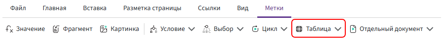
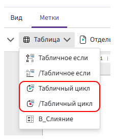
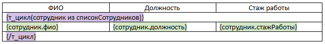
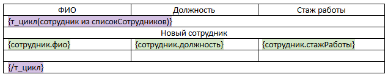
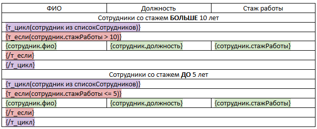
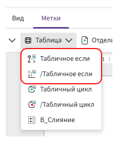
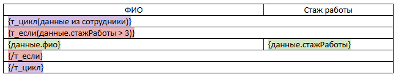
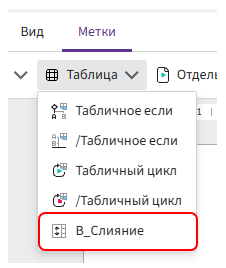
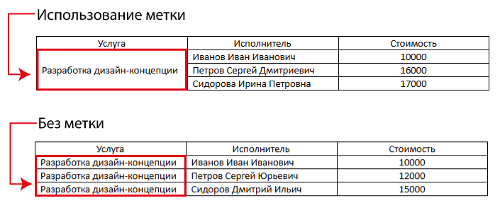

# Метка «Таблица»

Метка **«Таблица»** используется для управления строками таблицы при формировании документа.

С её помощью можно повторять строки для элементов списка, выводить строки только при выполнении условия и объединять соседние ячейки по вертикали.



## Табличный цикл

Табличный цикл `т_цикл` используется для вывода данных из поля типа **«Список»** в таблицу.



### Структура табличного цикла

Открывающая часть табличного цикла имеет вид:

```text
{т_цикл(сотрудник из списокСотрудников)}
```

Где:

- `списокСотрудников` — поле типа **«Список»**, элементы которого нужно перебрать;
- `сотрудник` — имя текущего элемента списка, через которое внутри цикла доступны его данные.

Если элемент списка является составным полем, к его вложенным полям обращаются через точку:

```text
сотрудник.фио
сотрудник.должность
сотрудник.стажРаботы
```

Имя текущего элемента можно изменить. Например:

```text
{т_цикл(данные из списокСотрудников)}
```

Тогда обращения к вложенным полям также нужно записывать с новым именем:

```text
данные.фио
данные.должность
данные.стажРаботы
```

Табличный цикл обязательно завершается закрывающей меткой:

```text
{/т_цикл}
```

Открывающая и закрывающая метки табличного цикла должны занимать отдельные строки таблицы.

В строках с `{т_цикл(...)}` и `{/т_цикл}` не нужно размещать текст, значения или другие метки. Эти строки используются только для обозначения начала и конца табличного цикла.

### Какие строки повторяются

`т_цикл` повторяет весь табличный блок, расположенный между открывающей и закрывающей частями.

Для одного элемента списка это может быть одна строка:



или несколько строк:



Внутри повторяющегося блока также могут использоваться другие метки и дополнительная логика:



Например, если для одного элемента списка внутри цикла расположены три строки, эти три строки будут сформированы для каждого элемента списка.

Поэтому количество строк в готовой таблице зависит не только от количества элементов списка, но и от структуры, размещённой внутри цикла.

## Табличное условие

Табличное условие `т_если` используется для управления отображением строк таблицы.

Строки, расположенные между открывающей и закрывающей частями метки, выводятся только при выполнении указанного условия.



### Структура табличного условия

Табличное условие состоит из открывающей части с условием и закрывающей части.

Например:

```text
{т_если(данные.стажРаботы > 3)}

...

{/т_если}
```

Если выражение `данные.стажРаботы > 3` возвращает `истина`, строки внутри конструкции выводятся в документ. Если возвращает `ложь` — не выводятся.

В качестве условия можно использовать поле типа **«Да/Нет»** или логическое выражение.

Открывающая и закрывающая метки табличного условия должны занимать отдельные строки таблицы.

В строках с `{т_если(...)}` и `{/т_если}` не нужно размещать текст, значения или другие метки. Эти строки используются только для обозначения начала и конца условного блока.

### Табличное условие внутри цикла

`т_если` можно использовать внутри `т_цикл`, чтобы проверять условие отдельно для каждого элемента списка.

Структура в этом случае выглядит так:



Табличный цикл переберёт всех сотрудников, а условие будет проверяться для каждого из них. Строки с данными сформируются только для сотрудников, у которых выполняется условие `данные.стажРаботы > 3`.

## Вертикальное слияние

Метка `в_слияние` используется для объединения соседних ячеек таблицы по вертикали.

Она размещается внутри ячейки того столбца, в котором нужно выполнить объединение.



### Как работает слияние

В метке указывается выражение:

```text
в_слияние(выражение)
```

При формировании документа Комбинатор сравнивает результат этого выражения в соседних строках.

Если результаты совпадают, соответствующие ячейки объединяются по вертикали. Когда результат изменяется, начинается новая группа.

Например:

```text
в_слияние(данные.тип)
```

Если поле `данные.тип` последовательно содержит:

```text
Монтаж
Монтаж
Монтаж
Доставка
Доставка
```

ячейки со значением `Монтаж` будут объединены в одну группу, а следующие ячейки со значением `Доставка` — в другую.

