***

**Функции** — это встроенные инструменты, которые помогают **автоматически обрабатывать данные прямо внутри шаблона**.

Они работают как маленькие «умные помощники» и позволяют:

* изменить формат текста (например, сделать заглавные буквы);

* просклонять ФИО;

* округлить или посчитать числа;

* подставить значение по условию;

* преобразовать даты;

* и многое другое.

Благодаря функциям шаблоны становятся **гибкими**: данные из анкеты автоматически подстраиваются под нужную форму, падеж, формат.

***

## **Как использовать функцию**

1. **Дважды щёлкните левой кнопкой мыши по нужному полю** (в области редактирования).

      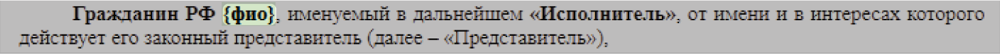

2. В открывшемся окне нажмите кнопку `f(x)` — это переход к функциям.

      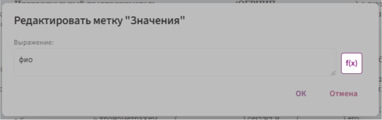

3. В появившемся списке выберите подходящую функцию.

    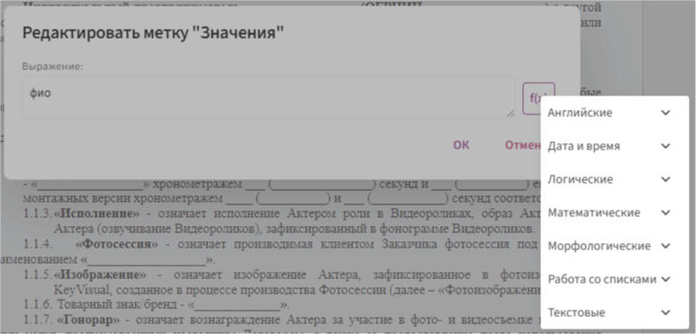

****

## Дата и Время

***

### **Частые ошибки**

Часто возникает ошибка, когда функция форматирования даты `форматДаты` применяется **до** выполнения вычислений с датами. Это нарушает логику работы формул и может приводить к некорректному отображению или сбоям.

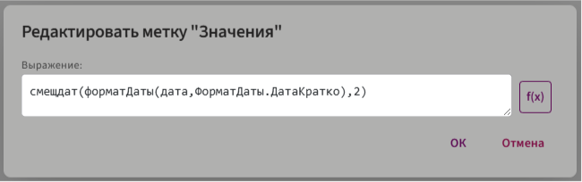

**Почему возникает ошибка**

Функция **форматДаты** преобразует дату в текст. Например:

```
форматДаты(дата, ФорматДаты.ДатаКратко) → "24.01.2025"
```

А функции:

* `конмесяца`

* `начмесяца`

* `датамес`

* `разндат`

* `смещдат`

работают **только с типом "дата"**.

Если им передать строку, а не дату — они **не смогут выполнить вычисление**.

***

⚠️ **Что может произойти при неправильном порядке:**

* **Некорректное отображение**: к дате добавляется ~"00:00:00"~ — например, `"24.01.2025 00:00:00"`.

* **Ошибка выполнения**: формула не обрабатывается 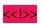

***

✅ **Как правильно**

Сначала выполняйте расчёты с датами, затем — форматируйте результат:


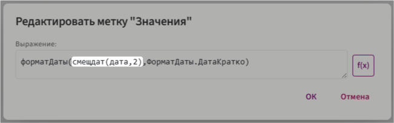

Здесь:

* **`конмесяца(дата, 2)`** возвращает корректное значение типа `"дата"`.

* **`форматДаты(...)`** превращает дату в текст.

***

📌 **Рекомендация**

> Всегда выполняйте все вычисления с датой до её форматирования.

Это обеспечивает:

* правильную работу функций,

* корректный формат отображения,

* отсутствие технических ошибок.

***

### **дата**

Функция `дата` используется для создания даты на основе переданных параметров: день, месяц и год. Она поддерживает как фиксированные значения (например, `12.12.2024`), так и динамические данные в виде переменных (текст или целые числа).

**Синтаксис**

```
дата(день,месяц,год)
```

* день (дд)  — число от 1 до 31.

* месяц (мм)  — число от 1 до 12.

* год (гггг)  — четырёхзначное числовое значение года (например, 2024)

**Типы передаваемых параметров**

   - Конкретные значения: можно задать фиксированную дату, например: `дата(12, 12, 2024)`

   - Переменные: вместо фиксированных чисел можно использовать переменные (текст или целое число), например: `дата(полеДень, полеМесяц, полеГод)`

Функция `дата` возвращает полное значение даты в формате:

```
12.12.2024 00:00:00
```

📌 **Важно!** Если необходимо убрать время (00:00:00), используйте функцию [форматДаты](Функции.md#_20). Например:

```
форматДаты(дата(12, 12, 2024), ФорматДаты.ДатаКратко)
```

---

### **датамес**

Функция `датамес` сдвигает исходную дату на заданное количество месяцев вперёд или назад. Сдвиг может быть задан как фиксированным числом, так и переменной, содержащей динамическое значение.

**Синтаксис**

```
датамес(исходнаяДата,сдвигМесяцев)
```

* `исходнаяДата` — идентификатор поля типа **«Дата»**, от которого производится сдвиг.

* `сдвигМесяцев` — количество месяцев, на которое смещается дата. Можно передавать:

    * фиксированное число (например, `датамес(исходнаяДата,6)`);
    * идентификатор поля типа **«Целое число»**, содержащий динамическое значение сдвига.

**Пример использования**

**Задача:** Определить дату окончания договора, которая наступит через 6 месяцев после даты подписания.

**Шаги:**

1. Создайте поле типа **«Дата»** и назовите его **«Дата договора»**.

2. Вставьте это поле в тело шаблона.

3. Дважды кликните на вставленное поле левой кнопкой мыши.

4. В открывшемся окне добавьте функцию `датамес`.

5. В качестве первого параметра укажите идентификатор поля **«Дата договора»**.

6. В качестве второго параметра укажите число `6` (количество месяцев для сдвига).

    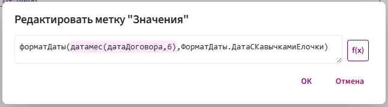

**Результат**

Функция вернёт новую дату, которая соответствует исходной дате, сдвинутой на 6 месяцев.

📌 **Пример вывода:**

Если **дата договора = 15.03.2025**, то результат выполнения функции:
```
15.10.2025
```
---

### **конмесяца**

Функция `конмесяца` используется для получения последнего дня месяца, основываясь на заданной дате. Она также позволяет смещать эту дату на указанное количество месяцев вперёд или назад.

**Синтаксис**

```
конмесяца(исходнаяДата,сдвигМесяцев)
```

* `исходнаяДата` — идентификатор поля типа **«Дата»**, от которого производится сдвиг.

* `сдвигМесяцев` — количество месяцев, на которое смещается дата. Можно передавать:

    * фиксированное число (например, `2`);
    * идентификатор поля типа **«Целое число»**, содержащий динамическое значение сдвига.

**Пример использования**

**Задача:** Определить **последний день месяца**, в котором истекает срок договора. Срок вводится пользователем.

**Шаги:**

1. Создайте поле типа **«Дата»** и назовите его **«Дата договора»**.

2. Создайте поле типа **«Целое число»** и назовите его **«Срок договора»**.

3. Вставьте поле **«Дата договора»** в тело шаблона.

4. Дважды кликните на вставленное поле левой кнопкой мыши.

4. Оберните идентификатор `датаДоговора` в функцию `конмесяца`.

5. В качестве второго параметра укажите идентификатор поля **«Срок договора»** вместо фиксированного числа.

    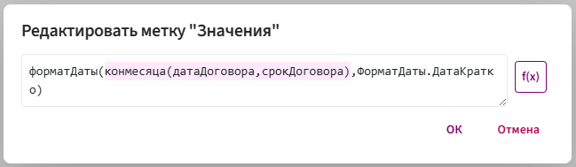

**Результат**

Функция вернёт последний день месяца, рассчитанный с учётом введённого пользователем срока.

📌 **Пример вывода:**

Если **дата договора = 15.04.2025**, а **срок договора = 2 месяца**, то результат выполнения функции:

```
31.06.2025
```
Если **срок договора = 12 месяцев**, результат будет `30.04.2026`.

---

### **начмесяца**

Функция `начмесяца` используется для получения первого дня месяца, основываясь на заданной дате. Она также позволяет смещать эту дату на указанное количество месяцев вперёд или назад.

**Синтаксис**

```
начмесяца(исходнаяДата,сдвигМесяцев)
```

* `исходнаяДата` — идентификатор поля типа **«Дата»**, от которого производится сдвиг.

* `сдвигМесяцев` — количество месяцев, на которое смещается дата. Можно передавать:

    * фиксированное число (например, `2`);
    * идентификатор поля типа **«Целое число»**, содержащий динамическое значение сдвига.

**Пример использования**

**Задача:** Определить **первый день месяца**, в котором истекает срок договора. Срок вводится пользователем.

**Шаги:**

1. Создайте поле типа **«Дата»** и назовите его **«Дата договора»**.

2. Создайте поле типа **«Целое число»** и назовите его **«Срок договора»**.

3. Вставьте поле **«Дата договора»** в тело шаблона.

4. Дважды кликните на вставленное поле левой кнопкой мыши.

4. Оберните идентификатор `датаДоговора` в функцию `начмесяца`.

5. В качестве второго параметра укажите идентификатор поля **«Срок договора»** вместо фиксированного числа.

    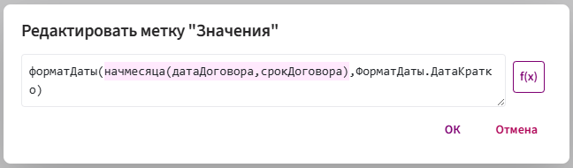

**Результат**

Функция вернёт первый день месяца, рассчитанный с учётом введённого пользователем срока.

📌 **Пример вывода:**

Если **дата договора = 15.04.2025**, а **срок договора = 4 месяца**, то результат выполнения функции:

```
01.08.2025
```
Если **срок договора = 12 месяцев**, результат будет `01.04.2026`.

---

### **разндат**

Функция `разндат` используется для вычисления разницы между двумя датами. Она позволяет определить разницу в днях.

**Синтаксис**

```
разндат(начальнаяДата, конечнаяДата)
```

* `начальнаяДата` — поле типа **«Дата»**, от которого начинается отсчёт.

* `конечнаяДата` — поле типа **«Дата»**, до которого ведётся расчёт.

**Пример использования**

**Задача:** Определить разницу между датой заключения договора и датой его окончания.

**Шаги:**

1. Создайте поле типа **«Дата»** с названием **«Дата договора»**.

2. Создайте поле типа **«Дата»** с названием **«Дата окончания договора»**.

3. Вставьте метку **«Значение»** в тело шаблона.

4. Нажмите кнопку `f(x)`, чтобы открыть окно выбора функции.

5. В меню **«Дата и время»** выберите функцию **«разндат»**.

6. В поле **«Дата начала»** укажите параметр `датаДоговора`.

7. В поле **«Дата окончания»** укажите параметр `датаОкончанияДоговора`.

    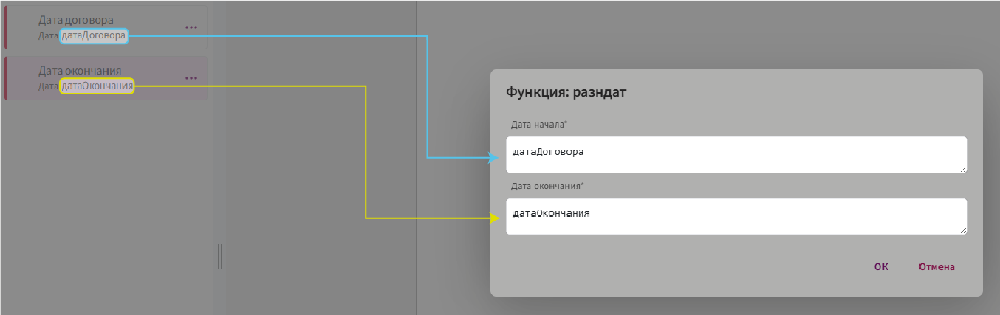

**Результат**

Функция вернёт разницу между двумя датами в днях.

📌 **Пример вывода:**

Если **дата договора = 31.03.2025**, а **дата окончания = 04.06.2025**, то разница составит:

```
65 дней
```

---

### **сегодня**

Функция `сегодня` возвращает текущую дату (дату, на которой производится расчёт или создание документа). Она может использоваться как самостоятельно, так и в сочетании с полями для автоматизации работы с датами.

**Синтаксис**

```
сегодня()
```

* Функция не принимает параметров.

**Способы использования**

* **Самостоятельное использование**

    Функция `сегодня` может быть использована без дополнительных данных или привязки к полям. В этом случае она просто возвращает текущую дату. Однако, при таком способе использования дату нельзя редактировать.

* **Использование в сочетании с полями**

    Функцию `сегодня` можно использовать в свойствах поля, в разделе **«Значение по умолчанию»**. В этом случае поле будет автоматически заполняться текущей датой, но пользователь сможет её редактировать.

**Пример использования**

**Задача:** Автоматически заполнять поле **«Дата оформления»** текущей датой при создании нового документа.

**Шаги:**

1. Создайте поле типа **«Дата»** с названием **«Дата оформления»**.

2. В свойствах поля **«Дата оформления»** в разделе **«Значение по умолчанию»** пропишите функцию `сегодня()`.

    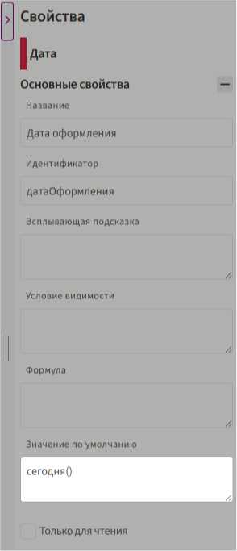

**Результат**

При создании нового документа поле **«Дата оформления»** будет автоматически заполняться текущей датой, но пользователь сможет изменить её по необходимости.

---

### **смещдат**

Функция `смещдат` позволяет сдвигать дату на определённое количество дней вперёд или назад. Дата может быть сдвинута на фиксированное количество дней или изменяться динамически, в зависимости от значения, введённого пользователем.

**Синтаксис**

```
смещдат(исходнаяДата,сдвигМесяцев)
```

* `исходнаяДата` — идентификатор поля типа **«Дата»**, от которого производится сдвиг.

* `сдвигМесяцев` — количество дней, на которое смещается дата. Можно передавать:

    * фиксированное число (например, `6`);
    * идентификатор поля типа **«Целое число»**, содержащий динамическое значение сдвига.

**Пример использования**

**Задача:** Определить дату последнего дня оплаты, которая наступит через 20 дней с момента подписания договора.

**Шаги:**

1. Создайте поле типа **«Дата»** и назовите его **«Дата оплаты»**.

2. Вставьте это поле в тело шаблона.

3. Дважды кликните на вставленное поле левой кнопкой мыши.

4. В открывшемся окне добавьте функцию `смещдат`.

5. В качестве первого параметра укажите идентификатор поля **«Дата оплаты»**.

6. В качестве второго параметра укажите число `20` (количество дней для сдвига).

    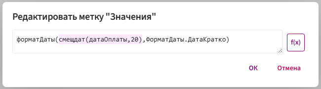

**Результат**

Функция вернёт новую дату, которая соответствует исходной дате, сдвинутой на 20 дней.

📌 **Пример вывода:**

Если **дата оплаты = 31.03.2025**, то результат выполнения функции:
```
20.04.2025
```
---

### **тдата**

Функция `тдата` используется для автоматического получения текущей даты и времени. Её поведение зависит от контекста использования: самостоятельно или в сочетании с полями.

Функция позволяет зафиксировать точную дату и время, но возможность редактирования значения определяется способом её применения.

**Синтаксис**

```
тдата()
```

* Функция не принимает параметров.

**Способы использования**

* **Самостоятельное использование**

    Функция `тдата` может быть использована без привязки к полям. В этом случае она просто возвращает текущую дату и время, но результат нельзя редактировать.

* **Использование в сочетании с полями**

    Функцию `тдата` можно использовать в свойствах поля, в разделе **«Значение по умолчанию»**. В этом случае поле будет автоматически заполняться текущей датой и временем, но пользователь сможет изменить данные вручную при необходимости.

**Пример использования**

**Задача:** Автоматически заполнять поле **«Дата и время посещения»** текущей датой и временем при создании нового документа.

**Шаги:**

1. Создайте поле типа **«Дата и Время»** с названием **«Дата и время посещения»**.

2. Откройте свойства этого поля, и в разделе **«Значение по умолчанию»** пропишите функцию `тдата()`.

    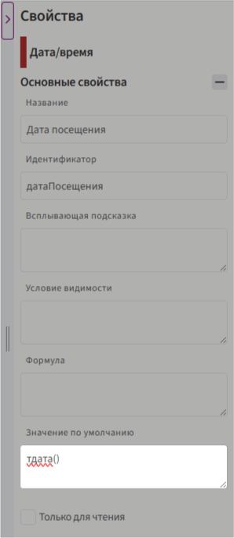

**Результат**

При создании нового документа поле **«Дата и время посещения»** автоматически заполнится текущей датой и временем, но пользователь сможет изменить значение вручную при необходимости.

---

## Логические

### **если**

Функция `если` — это логическая функция, которая позволяет выполнять различные действия в зависимости от выполнения условия.

Если условие истинно, функция возвращает одно значение, если условие ложно — другое.

**Синтаксис**

```
если(условие, значение_если_истина, значение_если_ложь)
```
Где:

* `условие` — логическое выражение, которое проверяется на истинность.

       * Может быть сравнением (`A1 > 10`), проверкой равенства (`B2 = "Да"`) или любым другим выражением, возвращающим `истина` или `ложь`.

* `значение_если_истина` — результат, который функция возвращает, если условие выполняется.

       * Может быть текстом, числом, формулой или значением из поля.

* `значение_если_ложь` — результат, который функция возвращает, если условие не выполняется.

       * Также может быть текстом, числом, формулой или значением из поля.

**Пример использования**

**Задача:** В договоре есть поле **«Сумма оплаты»**. Если сумма **больше 100 000**, то автоматически подставляется текст **«Требуется согласование»**, иначе — **«Согласование не требуется»**.

**Шаги:**

1. Создайте поле **«Сумма оплаты»** (тип **Десятичное число**).

2. В тело шаблона вставьте метку **«Значение»**.

3. Нажмите **f(x)** и выберите логическую функцию **`если`**.

4. В качестве **условия** укажите: `суммаОплаты > 100000`.

5. В поле **значение, если** **истина** укажите "Требуется согласование" (в двойных ковычках).

6. В поле **значение, если** **ложь** укажите "Согласование не требуется" (также в двойных кавычках).

    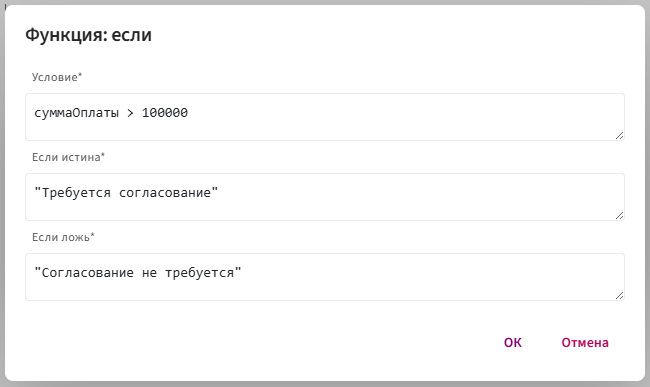

**Результат**

Функция `если` возвращает одно из двух значений в зависимости от выполненного логического условия.

## Математические

### **округлить**

Функция выполняет округление числового значения до указанного количества знаков после запятой.

**Синтаксис**

```
округлить(число, количество_знаков)
```
Где:

* `число` — идентификатор поля, значение которого будет округляться.
* `количество_знаков` — число знаков после запятой (например, 2 для округления до сотых).

**Пример использования**

**Задача:** Округлить десятичное число до целого.

**Шаги:**

1. Вставьте поле с десятичным числом в шаблон.

2. Дважды щёлкните на поле, чтобы открыть настройки.

3. Нажмите кнопку `f(x)`.

4. Выберите категорию **«Математические»** → **«округлить»**.

5. В поле **«Знаков после запятой»** укажите `0` (чтобы округлить до целого числа).

**Результат**

Функция возвращает округлённое значение, соответствующее заданным параметрам.

📌 **Пример вывода:**

`12,78 → 13`

`12,32 → 12`

***

### **exp**

Функция `exp` используется для вычисления экспоненциального роста или изменения. Она возводит число e (математическая `константа ≈ 2.718`) в указанную степень.

**Синтаксис**

```
exp(число)
```

* `число` — показатель степени, в которую возводится **e**.

**Работа функции:**

Функция `exp` вычисляет значение **e^число**.

* **Пример 1:** `exp(2)` → e² ≈ 7.389.

* **Пример 2:** `exp(-1)` → e⁻¹ ≈ 0.368 (экспоненциальное убывание).

📌 **Особенности:**

* Чем **больше** показатель степени, тем **быстрее** растёт результат.

* Если показатель **отрицательный**, результат будет **меньше 1**, что соответствует экспоненциальному спаду.

**Результат**

Функция возвращает число `e`, возведённое в указанную степень.

***

### **ln**

Функция `ln` вычисляет натуральный логарифм числа, то есть определяет, в какую степень нужно возвести число e (математическая `константа ≈ 2.718`), чтобы получить указанное значение.

**Синтаксис**

```
ln(число)
```
* `число` — значение, для которого вычисляется натуральный логарифм. Должно быть **положительным** (x > 0), так как логарифм отрицательных чисел и нуля не определён.

**Работа функции:**

Функция `ln` выполняет обратную операцию к возведению e в степень:

* Пример 1: `ln(7.389)` → 2, так как e² ≈ 7.389.

* Пример 2: `ln(e³)` → 3, так как e³ = e³.

📌 **Применение:**

* Анализ экспоненциального роста и затухания.

* Расчёт финансовых и биологических процессов, где скорость изменения зависит от текущего значения.

**Результат**

Функция возвращает **натуральный логарифм указанного числа** — степень, в которую нужно возвести **e**, чтобы получить это число.

***

### **log10**

Функция `log10` вычисляет десятичный (декадный) логарифм числа, то есть определяет, в какую степень нужно возвести **10**, чтобы получить указанное значение.

**Синтаксис:**

```
log10(число)
```

* `число` — значение, для которого вычисляется десятичный логарифм. Должно быть **положительным** (x > 0), так как логарифм отрицательных чисел и нуля не определён.

**Работа функции:**

Функция `log10` выполняет обратную операцию к возведению **10** в степень:

**Пример 1:** `log10(1000)` → 3, так как 10³ = 1000.

**Пример 2:** `log10(0.01)` → -2, так как 10⁻² = 0.01.

📌 **Применение:**

* Используется в инженерных и научных расчётах.

* Применяется в шкалах измерений, таких как уровень звука (децибелы) или кислотность (pH).

**Результат**

Функция возвращает **десятичный логарифм числа**, то есть степень, в которую нужно возвести **10**, чтобы получить это число.

***

## Морфологические

### **инициалы**

Функция `Инициалы` используется для преобразования полного имени **(Фамилия Имя Отчество)** в заданный формат: с сокращениями (инициалами) или без, а также в нужном падеже. Она позволяет автоматически формировать ФИО в удобном виде для документов, списков, подписей и других случаев использования.

**Синтаксис**

```
инициалы(фио, падеж, формат)
```
**Где:**

* `фио` — идентификатор текстового поля, к которому применяется функция.

* `падеж` — параметр, определяющий склонение ФИО в заданный падеж (например, `Падеж.Именительный`).

* `формат` параметр, задающий формат вывода ФИО (например, `ФорматФИО.ФамилияИО` для отображения "Иванов И.И.").

**Принцип работы**

1. Функция принимает строку с полным ФИО.

2. Производит разбор строки, выделяя фамилию, имя и отчество.

3. В зависимости от переданного параметра `формат`, изменяет порядок и форму записи ФИО:

    * Может оставить полное написание или заменить имя и отчество инициалами.

    * Может изменить порядок слов (например, "И.О. Фамилия" вместо "Фамилия И.О.").

4. При необходимости функция изменяет падеж ФИО согласно переданному параметру `падеж`.

5. Возвращает итоговую строку с преобразованным ФИО.

**Пример использования**

**Задача:** Преобразовать полное ФИО в формат "Фамилия И.О." в именительном падеже.

**Шаги:**

1. Вставьте текстовое поле в шаблон.

2. Нажмите дважды левой кнопкой мыши на вставленное поле в теле шаблона.

3. Нажмите на кнопку `f(X)` и выберите **«Морфологические»** → **«Инициалы»**.

4. Выберите нужный падеж и формат отображения.

5. Подтвердите действия и проверьте результат.

**Результат**

Функция возвращает строку с преобразованным ФИО в зависимости от заданных параметров.

📌 **Внимание:** 

Если ФИО отображается некорректно, откройте режим заполнения и нажмите на значок ⚙️ рядом с ФИО в теле шаблона. В окне **«Грамматические исключения»** в строке **«Значение»** введите ФИО в правильном падеже.

***

### **окончание**

Функция `окончание` используется для автоматического изменения окончания слова в зависимости от рода или числа.

**Синтаксис**

```
окончание(фио,"ый","ая","ое","ые")
```
**Где:**

* `фио` — идентификатор текстового поля, к которому применяется функция.

* `"ый"` — окончание слова, если `фио` будет мужского рода.

* `"ая"` — окончание слова, если `фио` будет женского рода.

* `"ое"` — окончание слова, если `фио` будет среднего рода.

* `"ые"` — окончание слова, если `фио` будет во множественном числе.

**Принцип работы**

Функция анализирует переданное слово и автоматически выбирает соответствующее окончание в зависимости от рода (мужской, женский, средний) и числа (единственное или множественное).

**Пример использования**

**Задача:** Менять окончание слова «Уважаемый» в зависимости от рода и числа.

**Шаги:**

1. Удалите изменяемое окончание из слова (например: **«Уважаем(ый/ая)» → «Уважаем»**), затем вставьте вместо окончания текстовое поле **«ФИО»**.

2. Дважды щелкните на вставленное поле.

3. Нажмите кнопку `f(X)` и выберите функцию **«Морфологические» → «Окончание»**.

4. Укажите окончания в кавычках (например: **"ый"**, **"ая"**).

5. Подтвердите изменения и проверьте результат.

```
окончание(фио,"ый","ая","","")
```

**Результат**

* Если в поле **ФИО** передать `Петрова Ирина Владимировна`, то функция вернёт `Уважаемая`.

* Если в поле **ФИО** передать `Иванов Иван Иванович`, то функция вернёт `Уважаемый`

***

### **склонение**

Функция `склонение` предназначена для изменения формы отдельных слов или целых фраз в зависимости от заданного падежа и числа, что позволяет автоматически подстраивать текст под нужные грамматические формы.

**Синтаксис**

```
склонение(полеТекст, падеж, число)
```
**Где:**

* `полеТекст` — идентификатор текстового поля, к которому применяется функция.

* `падеж` — параметр, определяющий склонение текста в одном из падежей (например, Именительный, Родительный, Дательный и т.д.).

* `число` — параметр, определяющий число слова (единственное или множественное).

**Принцип работы**

1. **Приём строки:** функция принимает строку текста, которую необходимо преобразовать.

2. **Анализ текста:** функция анализирует переданную строку для определения её грамматической формы.

3. **Изменение падежа и числа:** в зависимости от выбранных параметров, функция изменяет падеж и число.

4. **Возврат результата:** после выполнения изменений функция возвращает строку с правильно изменёнными словами.

**Пример использования**

**Задача:**  Изменить падеж и число в словосочетании «Изменение падежа».

**Шаги:**

1. Вставьте текстовое поле в шаблон.

2. Нажмите дважды левой кнопкой мыши на вставленное поле в теле шаблона.

3. Нажмите на кнопку `f(X)` и выберите **«Морфологические»** → **«Склонение»**.

4. Выберите нужный падеж и число.

5. Подтвердите действия и проверьте результат.

**Результат**

Функция возвращает слово или фразу в нужной грамматической форме.

***

### **транслит**

Функция `транслит` используется для автоматической транслитерации текста с кириллицы (русский алфавит) на латиницу (английский алфавит).

**Синтаксис**

```
транслит(поле)
```

* `полеТекст` — идентификатор текстового поля, содержащий строку на кириллице.

**Принцип работы**

1. **Получение строки:** функция принимает строку на кириллице.

2. **Побуквенное преобразование:** каждая буква заменяется на соответствующий латинский символ в соответствии с таблицей транслитерации.

    **Примеры:**
    
       * Ж → Zh
       * Ю → Iu
       * Я → Ia
       * Й → I

3. **Сохранение регистра:** сохраняется регистр исходных символов (прописные и строчные).

4. **Возврат результата:** возвращается строка, полностью переведённая на латиницу.

**Пример использования**

**Задача:** Получить латинское написание ФИО.

**Шаги:**

1. Вставьте текстовое поле с ФИО в шаблон.

2. Дважды щелкните по идентификатору в теле шаблона.

3. Нажмите кнопку `f(X)` и выберите **«Морфологические»** → **«транслит»**.

4. Подтвердите изменения и проверьте результат.

**Результат**

```
Ввод: Иванов Иван Иванович

Вывод: Ivanov Ivan Ivanovich
```

Функция вернёт строку, в которой все символы преобразованы в латинский алфавит.

***

### **форматВалюты**

Функция `форматВалюты` предназначена для форматирования числовых значений в виде денежных сумм с указанием валюты. Она добавляет разделители тысяч, округляет число до определённого количества знаков после запятой и добавляет символ валюты.

**Синтаксис**

```
форматВалюты(число, ФорматВалюты, Падеж, РазделительТысяч)
```

* `число` — числовое значение, подлежащее форматированию.

* `ФорматВалюты` — способ отображения валюты:

    * Например, `ФорматВалюты.Длинный`, `ФорматВалюты.Краткий` и т.д.

* `Падеж` — падеж, в котором будет отображаться название валюты:

    * Например, `Падеж.Именительный`, `Падеж.Родительный` и т.д.

* `РазделительТысяч` — управление отображением разделителя тысяч:

    * `РазделительТысяч.Отобразить` или `РазделительТысяч.Скрыть`

**Принцип работы**

1. Функция получает числовое значение.

2. Преобразует его в строку денежного формата:

    * Округляет до двух знаков после запятой.

    * Добавляет пробелы между тысячами (если задано).

3. Применяет нужный формат валюты.

4. Склоняет название валюты в соответствии с выбранным падежом.

5. Возвращает итоговую строку с отформатированной суммой.

**Пример использования**

**Задача:** Отобразить сумму в кавычках с копейками.

**Шаги:**

1. Вставьте поле с числовым значением в шаблон.

2. Дважды кликните по вставленному полю.

3. Нажмите кнопку `f(X)` и выберите **«Морфологические»** → **«форматВалюты»**.

4. Укажите параметры:

    * **Формат:** 1 234 (одна тысяча двести тридцать четыре) рубля 57 копеек.

    * **Падеж:** Именительный.

    * **Разделитель тысяч:** Отобразить.

5. Подтвердите изменения и проверьте результат.

**Результат**

```
Ввод: 5678,78

Вывод: 5 678 (пять тысяч шестьсот семьдесят восемь) рублей 78 копеек
```

Функция возвращает строку с числовым значением, отформатированным как денежная сумма в заданном падеже, формате и с учётом разделителей тысяч.

***

### **форматДаты**

Функция `форматДаты` предназначена для преобразования даты в текстовый формат. Она позволяет гибко отображать дату в различных форматах — с числом, месяцем и годом, с кавычками или без и т.д.

Функция **не изменяет само значение даты**, а лишь управляет её отображением в шаблоне.

Например: `01.12.2023` может быть выведено как:

* `1 декабря 2023 года`

* `"01" декабря 2023 г.`

* `декабрь 2023`

* `01.12.2023`

**Синтаксис**

```
форматДаты(дата,ФорматДаты)
```

* `дата` - идентификатор поля «Дата».

* `ФорматДаты` - способ отображения даты:

    * Например, `ФорматДаты.ДатаПолностьюГода`, `ФорматДаты.ДатаСКавычками` и т.д. 

**Пример использования**

**Задача:** Отобразить дату в виде: `"01" декабря 2023 г.`

**Шаги:**

1. В теле шаблона нажмите правой кнопкой мыши и выберите **«Вставить метку»** → **«Значение»**.

2. В строке пропишите идентификатор поля типа **«Дата»**.

3. Нажмите кнопку `f(X)` и выберите **«Морфологические»** → **«форматДаты»**

4. Выберите нужный формат и нажмите **«ОК»**, затем ещё раз **«ОК»**.

**Результат**

```
Ввод: 07.04.2025

Вывод: "07" апреля 2025 г.
```

Функция преобразует дату в заданный формат и возвращает результат в текстовом виде.

***

### **целоеСТекстом**

Функция `целоеСТекстом` предназначена для преобразования целочисленного значения в текстовый формат с добавлением текстового описания. Она используется для отображения числовых данных в виде строки, где нужно объединить число с текстом (например, число `2` и слово `яблоко` — `2 (два) яблока`).

**Синтаксис**

Функция принимает 6 параметров:

```
целоеСТекстом(число,"яблоко","i (ii) W",ТипЧислительного.Количественное,
Падеж.Именительный,".")
```

* `число` — идентификатор целочисленного поля.
* `"яблоко"` — выражение слова, которое склоняется в зависимости от переданного числового значения (например, "яблоко", "яблока", "яблок").
* `"i (ii) W"` — формат отображения числа с текстом:

    * **i** — число в цифровой записи
    * **ii** — число прописью
    * **W** — текст

* `ТипЧислительного.Количественное` - тип числительного.
* `Падеж.Именительный` - падеж, в котором будет отображаться число с текстом.
* `"."` — разделитель тысяч, который может быть одним из следующих символов: **точка (.)**, **запятая (,)**, **двоеточие (:)** или **пробел ( )**. Пример: **1.234**.

**Принцип работы:**

1. **Получение числового значения.** Функция принимает целое число, которое будет преобразовано в текстовый формат.

2. **Определение формы слова.** На основе переданного числового значения функция автоматически выбирает правильную форму слова (например, для числа 1 — "яблоко", для числа 2 — "яблока", для числа 5 — "яблок").

3. **Формат отображения.** Параметр "i (ii) W" указывает, как будет отображаться число с текстом.

4. **Склонение по падежам.**  Функция изменяет форму слова в зависимости от падежа, заданного в параметре (например, Падеж.Именительный).

5. **Использование разделителя тысяч.** Если число большое, функция применяет разделитель тысяч для улучшения читаемости.

**Пример использования**

**Задача:** Отобразить числовое значение с правильным склонением слова "яблоко" в зависимости от количества.

**Шаги:**

1. Вставьте поле **«Целое число»** в тело шаблона.

2. Дважды кликните по вставленному полю левой кнопкой мыши.

3. Нажмите кнопку `f(x)` и выберите **«Морфологические»** → **«целоеСТекстом»**.

4. В поле **«Выражение слова»** введите слово "яблоко" в двойных кавычках.

5. В поле **«Свой формат»** укажите: `i (ii) W`.

6. При необходимости, настройте падеж и разделитель тысяч.

7. Сохраните изменения и проверьте результат.

**Результат**

При вводе числа **3** результат будет `3 (три) яблока`. Для числа **1** — `1 (одно) яблоко`, для **5** — `5 (пять) яблок`.

***

### **форматЧисла**

Функция `форматЧисла` предназначена для **форматирования числовых значений**, содержащихся в поле типа **«Десятичное число»**. Она позволяет:

* устанавливать количество знаков после запятой,

* настраивать разделители тысяч и дробной части,

* применять пользовательские форматы отображения чисел.

**⚠️ Функция не изменяет исходное значение, а только визуально форматирует его для отображения в шаблоне.**

**Синтаксис**

Функция принимает 4 параметра:

```
форматЧисла(число, "формат", "разделительДробнойЧасти", "разделительТысяч")
```

* `число` — значение, которое необходимо отформатировать.

* `формат` — строка формата, определяющая структуру вывода. Допустимые символы:

    * `#` — отображает только значимые цифры.

    * `0` — добавляет ведущие или завершающие нули при необходимости.
    
    * `.` — разделитель дробной части (может быть заменён на указанный в следующем параметре).
   
    * `,` — разделитель тысяч (также может быть переопределён).

* `разделительДробнойЧасти` — символ, который будет использоваться для отделения целой и дробной части (по умолчанию `"."`).

* `разделительТысяч` — символ, используемый для разделения тысяч (например, пробел, точка, запятая и др.).

**Принцип работы:**

Функция `форматЧисла` преобразует числовое значение в строку, соответствующую заданному формату. Она используется для:

* приведения чисел к единому виду,

* настройки отображения количества десятичных знаков,

* установки нужных разделителей для читаемости.

**Пример использования**

**Задача:** Отобразить число `1234567,8` в виде `1 234 567,80`.

**Шаги:**

1. Создайте поле типа **«Десятичное число»**.

2. Вставьте его в тело шаблона.

3. Дважды щёлкните по вставленному полю.

4. Нажмите кнопку `f(x)` и выберите: **Морфологические** → **форматЧисла**.

5. Заполните параметры.

6. Подтвердите изменения и проверьте результат.

**Результат**

Функция возвращает строку, представляющую собой отформатированное число по заданным правилам:

```
1 234 567,80
```

***
### **числоСТекстом**

Функция `числоСТекстом` автоматически преобразует числовое значение в текст, согласуя его с указанным словом по **числу** и **падежу**, позволяя динамически изменять формы слов в зависимости от числа и формата записи (цифрами или прописью) для корректного оформления документов и текстов.
Также функция поддерживает вывод чисел **цифрами** или **прописью**, в зависимости от заданного формата.

**Синтаксис**

Функция принимает 5 параметров:

```
числоСТекстом(число, "слово", ФорматЭлемента.Длинный, 
ТипЧислительного.Количественное, Падеж.Именительный)
```
* `число` — числовое значение, которое требуется преобразовать в текст с согласованным словом.

* `"слово"` —  существительное, с которым должно быть согласовано числительное. Указывается в кавычках. Примеры: `"этаж"`, `"комната"`,` "день"`.

* `ФорматЭлемента.Длинный` — формат отображения:

    * `ФорматЭлемента.Длинный`  — вывод числительного цифрами и прописью (например: `5 (пять) этажей`).

    * `ФорматЭлемента.Короткий` — вывод числительного цифрами (например: `5 этажей`).

    * `ФорматЭлемента.Прописью` — вывод числительного прописью (например: `пять этажей`).

* `ТипЧислительного.Количественное` — определяет тип числительного:

    * `Количественное` — один, два, три и т.д.

    * `Порядковое` — первый, второй, третий и т.д.

* `Падеж.Именительный` — грамматический падеж.

**Принцип работы**

1. Функция получает числовое значение и существительное.

2. Определяет форму слова в нужном падеже и числе.

3. Преобразует число в слова (если выбран полный формат).

4. Возвращает строку: числительное + слово в согласованной форме.

**Пример использования**

**Задача:** Преобразовать число `5` в строку `5 (пять) комнат`.

**Шаги:** 

1. Создайте поле типа **«Целое число»**.

2. Вставьте его в тело шаблона.

3. Дважды щёлкните по вставленному полю.

4. Нажмите кнопку `f(x)` и выберите: **Морфологические** → **числоСТекстом**.

5. Заполните параметры:

    * Выражение слова: `"комната"`.

    * Формат: Длинный - `5 (пять) дней`.

6. Подтвердите изменения и проверьте результат.

**Результат**

Функция возвращает текстовую строку, где число согласовано с существительным по заданным грамматическим правилам.

***

## Работа со списками

### **макс**

Функция `макс` используется для определения **наибольшего числового значения** среди элементов списка.

Она применяется, когда необходимо найти, например, **самую высокую цену**, **максимальный балл** или **наибольшее количество товаров**.

**Синтаксис**

```
макс(имя_элемента из список, имя_элемента.поле)
```

* `имя_элемента` — произвольное имя переменной, представляющей текущий элемент списка.

* `список` — идентификатор списка, из которого берутся элементы.

* `имя_элемента.поле` — числовое поле элемента списка, по которому выполняется поиск максимального значения.

**Принцип работы:**

1. Функция перебирает все элементы в указанном списке.

2. Для каждого элемента вычисляется значение поля, указанного во втором аргументе (например, `данные.стоимость`). То есть из каждого элемента списка извлекается нужное числовое значение.

3. Все полученные значения сравниваются между собой.

4. Функция возвращает **наибольшее** из этих значений.

**Пример использования:**

**Задача:** Найти наибольшую стоимость товара в таблице.

**Шаги:**

1. Создайте поле типа **«Список»**. Элементом списка выберите **«Составное поле»**, которое будет содержать два вложенных поля:

    * **«Текст»** (например, `наименование товара`)

    * **«Десятичное число»** (например, `стоимость`).

          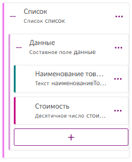

2. Вставьте таблицу в шаблон и настройте отображение данных с помощью **табличных меток** и **значений**.

    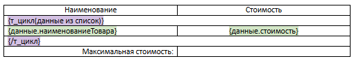

3. Напротив строки **«Максимальная стоимость»**:

    * Щёлкните правой кнопкой мыши → выберите **«Вставить метку»** → **«Значение»**.

    * Нажмите кнопку `f(x)`, затем выберите **«Работа со списками»** → **«макс»**.

4. Заполните параметры функции:

    * Список: `список`.

    * Имя элемента списка: `данные`.

    * Выражение: `данные.стоимость`.

          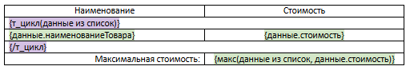

6. Подтвердите изменения и проверьте результат.

**Результат**

Функция возвращает одно числовое значение — максимальное из всех значений, вычисленных по указанному полю.

***

### **мин**

Функция `мин` используется для определения **наименьшего числового значения** среди элементов списка.

**Синтаксис**

```
мин(имя_элемента из список, имя_элемента.поле)
```

* `имя_элемента` — произвольное имя переменной, представляющей текущий элемент списка.

* `список` — идентификатор списка, из которого берутся элементы.

* `имя_элемента.поле` — числовое поле элемента списка, по которому выполняется поиск минимального значения.

**Принцип работы:**

1. Функция перебирает все элементы в указанном списке.

2. Для каждого элемента извлекается значение поля, заданного во втором аргументе (например, `данные.стоимость`).

3. Все полученные значения сравниваются между собой.

4. Функция возвращает **наименьшее** из этих значений.

**Пример использования:**

**Задача:** Найти минимальную стоимость товара в таблице.

**Шаги:**

1. Создайте поле типа **«Список»**. Элементом списка выберите **«Составное поле»**, которое будет содержать два вложенных поля:

    * **«Текст»** (например, `наименование товара`)

    * **«Десятичное число»** (например, `стоимость`).

          

2. Вставьте таблицу в шаблон и настройте отображение данных с помощью **табличных меток** и **значений**.

    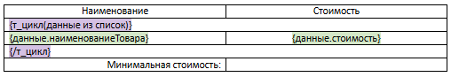

3. Напротив строки **«Минимальная стоимость»**:

    * Щёлкните правой кнопкой мыши → выберите **«Вставить метку»** → **«Значение»**.

    * Нажмите кнопку `f(x)`, затем выберите **«Работа со списками»** → **«мин»**.

4. Заполните параметры функции:

    * Список: `список`.

    * Имя элемента списка: `данные`.

    * Выражение: `данные.стоимость`.

          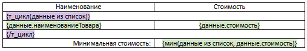

6. Подтвердите изменения и проверьте результат.

**Результат**

Функция возвращает одно числовое значение — минимальное из всех значений, вычисленных по указанному полю.

***

### **поискпоз**

Функция `поискпоз` ищет первую строку в списке, подходящую по условию, и возвращает её номер (позицию в списке).

**Синтаксис**

```
поискпоз(имя_элемента из список, условие)
```

* `имя_элемента` — любое имя, под которым мы перебираем строки списка.

* `список` — список, в котором осуществляется поиск.

* `условие` — логическое выражение, по которому идёт поиск (например: товары.стоимость > 5000).

**Принцип работы:**

1. Функция перебирает элементы указанного списка сверху вниз.

2. Для каждого элемента проверяет выполнение заданного условия.

3. Как только условие выполняется — возвращается номер строки, начиная с 1.

4. Если ни один элемент не подходит, ничего не возвращает.

**Пример использования**

**Задача:** найти первую строку, в которой стоимость превышает 5 000 рублей.

**Шаги:**

1. Создайте поле типа **«Список»**. Элементом списка выберите **«Составное поле»**, которое будет содержать два вложенных поля:

     * **«Текст»** (например, `наименование товара`)

     * **«Десятичное число»** (например, `стоимость`).

          

2. Вставьте метку в шаблон.

     * В теле шаблона щёлкните правой кнопкой мыши и выберите: **«Вставить метку»** → **«Значение»**.

3. Настройте функцию.

     * Нажмите кнопку `f(x)` и выберите: **«Работа со списками»** → **«поискПозиции»**.

4. Укажите параметры:

       * Список: `список`.

       * Название элемента списка: `данные`.

       * Условие: `данные.стоимость > 5000`.

5. Подтвердите изменения и проверьте результат.

**Результат**

Функция возвращает целое число — номер строки, которая первой удовлетворяет заданному условию.

***

### **срзнач**

Функция `срзнач` используется для вычисления среднего (арифметического) значения числового поля среди всех элементов списка.

**Синтаксис**

```
срзнач(имя_элемента из список, имя_элемента.поле)
```

* `имя_элемента` — произвольное имя переменной, представляющей текущий элемент списка.

* `список` — идентификатор списка, содержащего элементы.

* `имя_элемента.поле` — числовое поле элемента списка, значения которого участвуют в расчёте среднего значения.

**Принцип работы:**

1. Функция последовательно перебирает каждый элемент заданного списка.

2. Из каждого элемента извлекается значение указанного числового поля.

3. Все полученные значения складываются между собой.

4. Сумма делится на количество элементов в списке.

5. Возвращается результат — среднее арифметическое значение.

**Пример использования**

**Задача:** вычислить среднюю стоимость товаров в таблице.

**Шаги:**

1. Создайте поле типа **«Список»**. Элементом списка выберите **«Составное поле»**, которое будет содержать два вложенных поля:

     * **«Текст»** (например, `наименование товара`)

     * **«Десятичное число»** (например, `стоимость`).

          

2. Вставьте таблицу в шаблон, используя табличные метки и значения.

    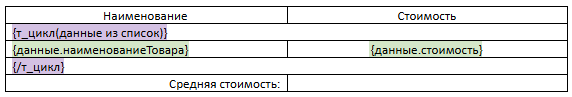

3. Под таблицей добавьте строку **«Средняя стоимость»**:

     * Щёлкните правой кнопкой → **«Вставить метку»** → **«Значение»**.

     * Нажмите `f(x)`, выберите **«Работа со списками»** → `срзнач`.

4. Заполните параметры функции:

     * Список: `список`.

     * Имя элемента списка: `данные`.

     * Выражение: `данные.стоимость`.

        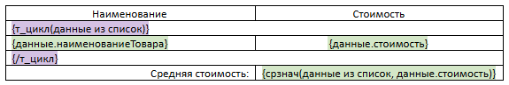

5. Подтвердите изменения и проверьте вывод шаблона.

**Результат**

Функция возвращает одно числовое значение — среднее арифметическое всех значений, извлечённых из указанного числового поля.

***

### **сумм**

Функция `сумм` используется для вычисления общей суммы числового поля среди всех элементов списка.

**Синтаксис**

```
сумм (имя_элемента из список, имя_элемента.поле)
```

* `имя_элемента` — произвольное имя переменной, представляющей текущий элемент списка.

* `список` — идентификатор списка, содержащего элементы.

* `имя_элемента.поле` — числовое поле элемента списка, значения которого будут суммироваться.

**Принцип работы:**

1. Функция перебирает все элементы указанного списка.

2. Из каждого элемента извлекается значение числового поля, указанного во втором аргументе.

3. Все полученные значения складываются между собой.

4. Результатом является общее (суммарное) значение.

**Пример использования:**

**Задача:** посчитать общую стоимость всех товаров в таблице.

**Шаги:**

1. Создайте поле типа **«Список»**. Элементом списка выберите **«Составное поле»**, которое будет содержать два вложенных поля:

     * **«Текст»** (например, `наименование товара`)

     * **«Десятичное число»** (например, `стоимость`).

          

2. Вставьте таблицу в шаблон и настройте отображение данных с помощью табличных меток и значений.

    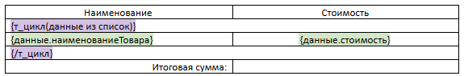

3. Внизу таблицы добавьте строку **«Итоговая сумма»**:

     * Щёлкните правой кнопкой мыши → **«Вставить метку»** → **«Значение»**.

     * Нажмите кнопку `f(x)`, выберите **«Работа со списками»** → `сумм`.

4. Укажите параметры функции:

     * Список: `список`.

     * Имя элемента списка: `данные`.

     * Выражение: `данные.стоимость`.

        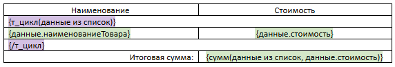

5. Подтвердите изменения и проверьте результат в шаблоне.

**Результат**

Функция возвращает одно числовое значение — сумму всех значений, вычисленных по заданному полю для всех элементов списка.

***

### **счет**

Функция `счет` используется для подсчёта количества элементов в списке.

**Синтаксис**

```
счет (имя_элемента из список)
```

* `имя_элемента` — произвольное имя переменной, представляющей текущий элемент списка.

* `список` — идентификатор списка, содержащего элементы.

**Принцип работы:**

1. Функция перебирает все элементы в заданном списке.

2. Для каждого элемента списка увеличивается счётчик.

3. Функция возвращает общее количество элементов в списке.

**Пример использования**

**Задача:** подсчитать количество товаров в таблице.

**Шаги:**

1. Создайте поле типа **«Список»**. Элементом списка выберите **«Составное поле»**, которое будет содержать два вложенных поля:

     * **«Текст»** (например, `наименование товара`)

     * **«Десятичное число»** (например, `стоимость`).

          

2. Вставьте таблицу в шаблон, используя табличные метки и значения.

    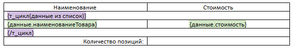

3. Под таблицей добавьте строку **«Количество позиций»**:

     * Щёлкните правой кнопкой → **«Вставить метку»** → **«Значение»**.

     * Нажмите `f(x)`, выберите **«Работа со списками»** → `счет`.

4. Заполните параметры функции:

     * Список: `список`.

     * Имя элемента списка: `данные`.

        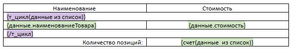

5. Подтвердите изменения и проверьте вывод шаблона.

**Результат**

Функция возвращает одно целочисленное значение — общее количество элементов в списке.

***

## Текстовые

### **длина**

Функция `длина` используется для вычисления количества символов в строковом значении.

**Синтаксис**

```
длина(текст)
```
* `текст` — строковое значение или текстовое поле, длину которого нужно вычислить.

**Принцип работы:**

1. Функция принимает строковое значение или поле, содержащее текст.

2. Она определяет количество символов в данном тексте, включая пробелы и специальные символы.

3. Возвращается числовое значение, которое представляет собой длину строки (количество символов).

**Пример использования**

**Задача:** 

**Шаги:** определить количество символов в названии товара.

1. Создайте текстовое поле.

2. Вставьте это текстовое поле в шаблон.

3. Дважды кликните по вставленному текстовому полю.

4. Нажмите на кнопку `f(x)` и выберите **«Текстовые»** → `длина`

5. Подтвердите изменения и сохраните результат.

**Примечание:** Помимо использования полей, в функцию можно **передавать конкретные текстовые значения**, заключённые в двойные кавычки (например, `длина("Привет, мир")`), где результатом будет `11` (учитываются все символы, включая пробел).

**Результат**

Функция возвращает количество символов в переданном тексте или значении текстового поля.

***

### **линияПодписи**

Функция `линияПодписи` используется для создания строки, состоящей из линий (подчёркиваний), длина которой задаётся целочисленным значением.

**Синтаксис**

```
линияПодписи(длина)
```

* `длина` — целочисленное значение, которое указывает количество символов в линии (длина линии).

**Принцип работы:**

1. Функция принимает целочисленное значение, определяющее длину линии.

2. Она генерирует строку, состоящую из подчёркиваний в количестве, равном переданному значению `длина`.

3. Возвращаемое значение — строка, представляющая собой линию указанной длины.

**Пример использования**

**Задача:** создать линию подписи, равную длине строки ФИО.

**Шаги:**

1. Создайте текстовое поле для ввода **ФИО**.

2. Вставьте это текстовое поле в тело шаблона

3. Дважды щелкните по вставленному полю левой кнопкой мыши.

4. Нажмите на кнопку `f(x) `и выберите **«Текстовые»** → `длина`.

5. Нажмите кнопку **ОК**.

6. Оберните всю конструкцию `длина(ФИО)` в функцию линияПодписи. В результате получите: `линияПодписи(длина(ФИО))`.

7. Подтвердите изменения и сохраните результат.

**Примечание:** Чтобы строка менялась в зависимости от введенного **ФИО**, необходимо сначала преобразовать текст в число, а затем передать это число в функцию, которая создаст линию. Это связано с тем, что функция `линияПодписи` принимает только целочисленные значения.

**Результат**

Функция возвращает строку, состоящую из подчёркиваний, длина которой равна переданному числовому значению.

***

### **обрезатьпробелы**

Функция `обрезатьпробелы` используется для удаления лишних пробелов в строке, которые могут находиться в начале и в конце текста.

**Синтаксис**

```
обрезатьпробелы(текст)
```

* `текст` — строковое значение или текстовое поле, из которого необходимо удалить пробелы.

**Принцип работы:**

1. Функция принимает строку или текстовое поле, содержащие текст с возможными пробелами в начале или в конце.

2. Она удаляет все лишние пробелы, которые находятся до первого символа текста и после последнего символа.

3. Возвращаемое значение — строка, в которой удалены начальные и конечные пробелы.

**Пример использования**

**Задача:** удалить лишние пробелы из строки с ФИО.

**Шаги:**

1. Создайте текстовое поле для ввода **ФИО**.

2. Вставьте это текстовое поле в тело шаблона

3. Дважды щелкните по вставленному полю левой кнопкой мыши.

4. Нажмите на кнопку `f(x) `и выберите **«Текстовые»** → `обрезатьпробелы`.

5. Подтвердите изменения и сохраните результат.

**Результат**

Функция возвращает строку, из которой удалены все начальные и конечные пробелы, оставляя текст без изменений внутри строки.

***

### **прописн**

Функция `прописн` используется для преобразования всей строки в прописные (заглавные) буквы.

**Синтаксис**

```
прописн(текст)
```

* `текст` — строковое значение или текстовое поле, которое необходимо преобразовать в прописные буквы.

**Принцип работы:**

1. Функция принимает строку или текстовое поле, содержащие текст в любом регистре.

2. Она преобразует все буквы в строке в заглавные (прописные) буквы.

3. Возвращаемое значение — строка, в которой все символы преобразованы в прописные буквы.

**Пример использования**

**Задача:** преобразовать строку с ФИО в заглавные буквы.

**Шаги:**

1. Создайте текстовое поле для ввода **ФИО**.

2. Вставьте это текстовое поле в тело шаблона

3. Дважды щелкните по вставленному полю левой кнопкой мыши.

4. Нажмите на кнопку `f(x) `и выберите **«Текстовые»** → `прописн`.

5. Подтвердите изменения и сохраните результат.

**Примечание:** Функция прописн изменяет только буквы в строке. Все остальные символы (пробелы, цифры, знаки препинания) остаются без изменений.

**Результат**

Функция возвращает строку, в которой все буквы преобразованы в прописные, а остальные символы остаются без изменений.

***

### **пропнач**

Функция `пропнач` используется для преобразования первой буквы каждого слова в строке в заглавную, а все остальные буквы — в строчные.

**Синтаксис**

```
пропнач(текст)
```

* `текст` — строковое значение или текстовое поле, в котором необходимо преобразовать первую букву каждого слова в заглавную/

**Принцип работы:**

1. Функция принимает строку или текстовое поле, содержащее текст.

2. Она преобразует первую букву каждого слова в строке в заглавную (прописную), а все остальные буквы — в строчные.

3. Возвращаемое значение —  строка, в которой первая буква каждого слова заглавная.

**Пример использования**

**Задача:** преобразовать строку с ФИО, чтобы первая буква каждого слова была заглавной.

**Шаги:**

1. Создайте текстовое поле для ввода **ФИО**.

2. Вставьте это текстовое поле в тело шаблона

3. Дважды щелкните по вставленному полю левой кнопкой мыши.

4. Нажмите на кнопку `f(x) `и выберите **«Текстовые»** → `пропнач`.

5. Подтвердите изменения и сохраните результат.

**Результат**

Функция возвращает строку, где каждое слово начинается с заглавной буквы.

***

### **пстр**

Функция `пстр` используется для извлечения подстроки из строки, начиная с указанной позиции и на заданную длину.

**Синтаксис**

```
пстр(текст, позиция, длина)
```

* `текст` — строковое значение или текстовое поле, из которого необходимо извлечь подстроку.

* `позиция` — целочисленное значение, указывающее, с какого символа начинается извлечение (нумерация начинается с 1).

* `длина` — количество символов, которое нужно извлечь, начиная с заданной позиции.

**Принцип работы:**

1. Функция принимает строку или текстовое поле, из которого необходимо извлечь часть текста.

2. Указывается позиция, с которой начинается извлечение, и длина подстроки.

3. Возвращаемое значение — подстрока, извлеченная из исходного текста, начиная с заданной позиции и с указанной длиной.

**Пример использования**

**Задача:** из строки извлечь первый символ и сделать его заглавным, а остальные — строчными. Длина строки заранее неизвестна.

**Шаги:**

1. Создайте текстовое поле.

2. Извлечение и преобразование первого символа: 

     * Вставьте это текстовое поле в тело шаблона.

     * Дважды щелкните по вставленному полю левой кнопкой мыши.

     * Нажмите на кнопку `f(x)` и выберите **«Текстовые»** → `пстр`.

     * Введите параметры функции: начальная позиция — 1, число знаков — 1. Результат: `пстр(текст, 1, 1)`.

     * Оберните полученное выражение в функцию **«Текстовые»** → `прописн`. Результат: `прописн(пстр(текст, 1, 1))`.

3. Извлечение и преобразование остальных символов в строчные:

     * Вставьте рядом текстовое поле в шаблон.

     * Нажмите на кнопку `f(x)` и выберите **«Текстовые»** → `пстр`.

     * Введите параметры функции: начальная позиция — 2, число знаков — длина(текст). Результат: `пстр(текст, 2, длина(текст))`.

     * Оберните полученное выражение в функцию **«Текстовые»** → `строчн`. Результат: `строчн(пстр(текст, 2, длина(текст)))`.

**Итоговая конструкция:**

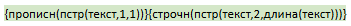

**Примечание:** если вы хотите извлечь часть строки до её конца, можно использовать функцию `длина`.

**Результат**

Комбинированное выражение возвращает строку, в которой первая буква заглавная, а остальные — строчные, независимо от изначального регистра и длины строки.

***

### **строчн**

Функция `строчн` предназначена для преобразования текста в нижний регистр (строчные буквы).

```
строчн(текст)
```

* `текст` — строковое значение или текстовое поле, которое необходимо преобразовать в строчные буквы.

**Принцип работы:**

1. Функция принимает строку или текстовое поле с текстом в любом регистре.

2. Она преобразует все буквы в строке в строчные (маленькие) символы.

3. Возвращаемое значение — строка, в которой все буквы приведены к нижнему регистру. Остальные символы (пробелы, знаки препинания, цифры) остаются без изменений.

**Пример использования**

**Задача:** преобразовать строку с `услугой` в строчные буквы.

**Шаги:**

1. Создайте текстовое поле.

2. Вставьте его в шаблон.

3. Дважды щелкните по вставленному полю.

4. Нажмите кнопку `f(x)` и выберите **«Текстовые»** → `строчн`.

5. Подтвердите изменения и сохраните результат.

**Результат**

Функция возвращает строку, в которой все буквы преобразованы в строчные, при этом остальные символы остаются без изменений.

***

## Английские

### integerToText

Функция `integerToText` используется для преобразования целого числа в его текстовое (прописью) представление.

**Синтаксис**

```
integerToText(число, типЧислительного)
```
* `число` — целочисленное значение или поле, которое нужно преобразовать в текст. Если полученное число - десятичное, то используется только целая часть, дробная отбрасывается (округление "вниз").

* `типЧислительного` — Cardinal (Количественное) или Ordinal (Порядковое). По умолчанию - Cardinal.

**Принцип работы:**

1. Принимает целое число и строку с указанием формата;

2. Преобразует число в соответствующее числительное на английском языке;

3. Возвращает результат в виде строки.

**Пример использования**

**Задача:** отобразить сумму в долларах и центах прописью на английском языке.

**Выражение:**

```
integerToText(число, NumberType.Cardinal) & " " &
если(число = 1, "US dollar", "US dollars") & " " &
integerToText(число остаток * 100, NumberType.Cardinal) & " " &
если(число остаток * 100 = 1, "cent", "cents")
```
**Пояснение:**

* `integerToText(число, NumberType.Cardinal)` — преобразует целую часть числа в слова.

* `если(число = 1, "US dollar", "US dollars")` — условия при которых будет измениться название валюты.

* `integerToText(число остаток * 100, NumberType.Cardinal)` — вычисляет количество центов. Где `остаток` - константа.

* `если(число остаток * 100 = 1, "cent", "cents")` — условия, при которых подбирается правильное склонение в зависимости от количества центов. Где `остаток` - константа.

**Пример результата при:** `1234,56`

```
one thousand two hundred thirty-four US dollars fifty-six cents
```

Форматированная строка, в которой сумма представлена словами, включая правильное склонение для доллара и центов на английском языке.

***