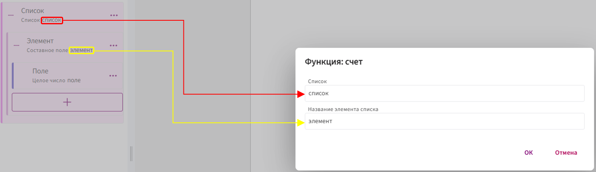
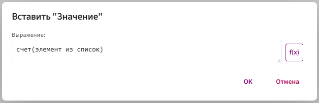
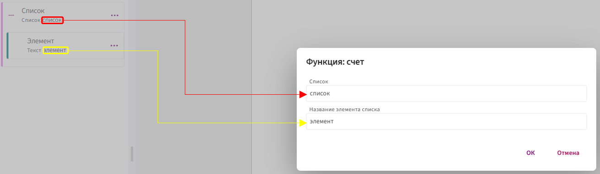

# **счет**

Функция `счет` используется для подсчёта количества элементов в списке.

## **Синтаксис**

**Общий синтаксис:**

```
счет(элемент из список)
```

* `элемент` — имя текущей записи списка (можете назвать как угодно: `элемент1`, `_2`, `_элемент` и т. п.).

* `список` — поле-список, по которому идёт обход.

**Элемент списка может быть двух видов:**

1. **СОСТАВНОЕ ПОЛЕ:**

      В качестве **названия элемента списка** передаётся временное имя текущего элемента списка (чаще всего — идентификатор самого составного поля).

      

      

      * **Название элемента списка** — это имя, через которое происходит обращение к каждому элементу. Вместо него можно использовать любое [допустимое](../../syntax/syntax.md) имя, например: `элемент1`, `_2`, `_элемент` и т.п.

          Соответственно, к полям, находящимся внутри составного поля, нужно обращаться с указанием этого имени. Например, если заменить `элемент` на `_2`, то обращение к полю будет выглядеть так:

           `_2.поле`

      * **Список** — передается идентификатор списка, в котором находятся данные.

2. **НЕ СОСТАВНОЕ ПОЛЕ**

     Когда элемент **несоставной** (десятичное или целое число, текст и т.д.), у него **нет внутренних полей**. Поэтому в **название элемента списка** программе нужен **конкретный идентификатор поля**.

     

     

      * **Список** — передается идентификатор списка, в котором находятся данные.
    
      * **Название элемента списка** — передается идентификатор поля, которое вы выбрали в качестве элемента списка. Всегда передаётся точный идентификатор.

## **Принцип работы:**

1. Функция перебирает все элементы в заданном списке.

2. На каждом шаге увеличивает счётчик на 1.

3. Возвращает общее количество строк, независимо от содержимого полей.

📌 Если список пуст — функция вернёт 0.

