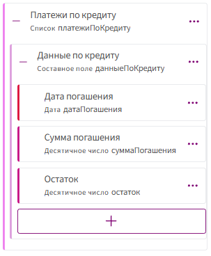
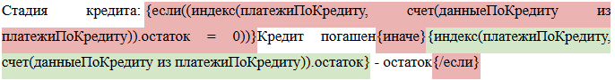

Функция **индекс** позволяет получить значение конкретного (одного) элемента списка по его позиции (индексу).

> Есть список — это как колонка в таблице.
>
> У каждого элемента есть номер: 1-й, 2-й, 3-й и т.д.
>
> Функция индекс говорит: «Дай мне элемент под номером N».

Если элемент простой — сразу получаем значение.

Если элемент составной — сначала берём строку списка, а потом нужное поле внутри неё.

***

## Синтаксис

Всегда есть **два параметра**:

1. **из какого списка берём** — `идентификаторСписка`;

2. **какой по счёту элемент нужен** — `индекс`;

3. (для составного элемента) **из какого поля взять значение** — `названиеПоляВСписке`,  
   пишется **после функции через точку**.

Нумерация **с единицы**: первый элемент — это `1`, второй — `2` и т.д.

<div style="display:flex; gap:20px;">

  <div style="background:#f5f5f5; padding:10px; border-radius:12px; width:50%; text-align: center;">
    <h3>ПРОСТОЙ ЭЛЕМЕНТ</h3>
    <hr class="func-sep">
    <br>
    <br>
    
    <p>Если в списке в качестве элемента выбрали обычное поле: текст, целое или десятичное число, дата, время, да/нет, перечисление и т.д.</p>
    <hr class="func-sep">
    <p><b>Синтаксис:</b></p>
    <p class="func-formula">индекс(идентификаторСписка, индекс)</p><br>
  </div>

  <div style="background:#f5f5f5; padding:10px; border-radius:12px; width:50%; text-align: center;">
    <h3 >СОСТАВНОЙ ЭЛЕМЕНТ</h3>
    <hr class="func-sep">
    
    <p>Если в списке лежит составное поле (у элемента есть несколько полей внутри: наименование, вид, цена…)</p>
    <hr class="func-sep">
    <p><b>Синтаксис:</b></p>
    <p class="func-formula">индекс(идентификаторСписка, индекс).названиеПоляВСписке</p>
  </div>

</div>

***

## Примеры

**Пример 1. Последний платёж: кредит погашен или нет**

**Задача:** Проверить, погашен ли кредит полностью, и, если нет, вывести остаток по кредиту.

**Поля в анкете:**



**Итоговый синтаксис:**



**Шаги для реализации:**

1. Поставьте курсор в то место шаблона, где нужно вывести стадию кредита.
2. Перейдите на вкладку **«Метки»** → **«Условие»** → **«Если»**.
3. В открывшемся окне вставьте условие:

      ```
      индекс(платежиПоКредиту, счет(данныеПоКредиту из платежиПоКредиту)).остаток = 0
      ```
      где:

      - `платежиПоКредиту` — идентификатор списка;
      - `счет(данныеПоКредиту из платежиПоКредиту)` — функция, которая считает количество элементов в списке и возвращает число (позицию последнего элемента);
      - `.остаток` — вложенное поле, по которому выполняется проверка.
Если в этом поле получилось 0, условие считается истинным.

4. После вставленной метки `{если(...)}` в тексте шаблона пропишите сообщение, которое должно выводиться, если условие **срабатывает**. В нашем примере это: `Кредит погашен`

5. Затем добавьте метку **«Условие → Иначе»** и внутри нее опишите, что должно происходить, если условие **не выполнено**.
В примере мы вставляем метку «Значение» с функцией индекс, чтобы показать последний рассчитанный остаток:

      ```
      индекс(платежиПоКредиту, счет(данныеПоКредиту из платежиПоКредиту)).остаток
      ```

     Эта метка будет отображать значение поля остаток для последнего платежа в списке.

6. Закройте конструкцию **«Условие → /Если»**.