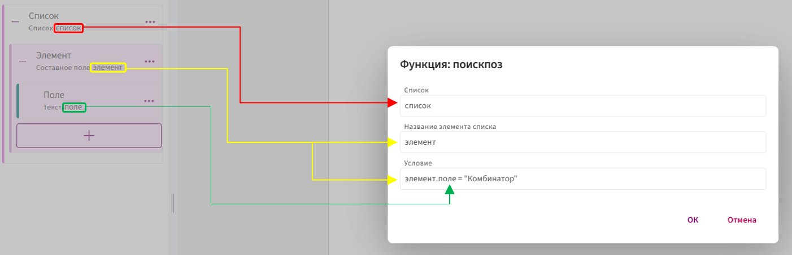
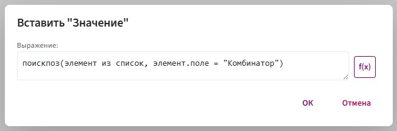
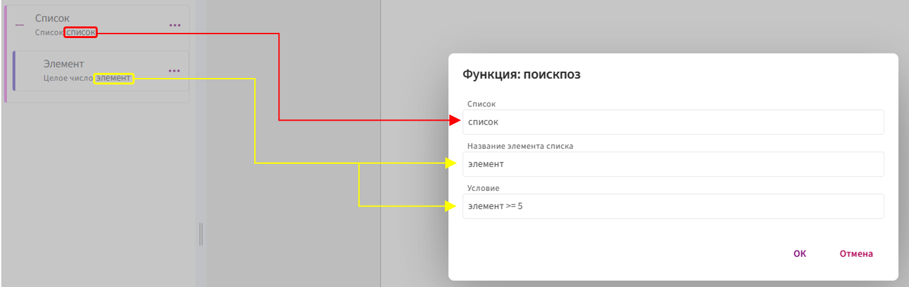
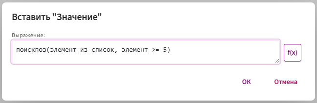

# **поискпоз**

Функция `поискпоз` используется для поиска первого подходящего элемента в списке и возвращает его порядковый номер.

📌 Применяется, когда нужно определить, в какой строке списка впервые встречается значение, удовлетворяющее условию.

## **Принцип работы:**

1. Функция перебирает элементы указанного списка сверху вниз.

2. Для каждого проверяет выполнение условия.

3. Как только условие выполняется — возвращается номер строки.

4. Если подходящих элементов нет, ничего не возвращает.

## **Синтаксис**

**Общий синтаксис:**

`поискпоз(элемент из список, любое_условие)`

Что это значит:

* `элемент` — имя текущей записи списка (можете назвать как угодно: `элемент`, `x`, `_1` и т. п.).

* `список` — поле-список, по которому идёт обход.

* `любое_условие` — произвольная формула, которая выполняется для каждого элемента и должна возвращать число (позицию **первой строки**, которая удовлетворяет условию).

**Элемент списка может быть двух видов:**

1. **СОСТАВНОЕ ПОЛЕ:**

      В качестве **названия элемента списка** передаётся временное имя текущего элемента списка (чаще всего — идентификатор самого составного поля).

       

       

     * **Название элемента списка** — это имя, через которое происходит обращение к каждому элементу. Вместо него можно использовать любое [допустимое](../../syntax/syntax.md) имя, например: `элемент1`, `_2`, `_элемент` и т.п.

        Соответственно, к полям, находящимся внутри составного поля, нужно обращаться с указанием этого имени. Например, если заменить `элемент` на `_2`, то обращение к полю будет выглядеть так:

         `_2.поле`

     * **Список** — передается идентификатор списка, в котором находятся данные.

     * **Условие** — произвольное условие, которое будет выполнено для каждого элемента списка, например: `элемент.поле = "Комбинатор"`

2. **НЕ СОСТАВНОЕ ПОЛЕ**

     Когда элемент **несоставной** (десятичное или целое число, текст и т.д.), у него **нет внутренних полей**. Поэтому в **название элемента списка** программе нужен **конкретный идентификатор поля**.

     

     

     * **Список** — передается идентификатор списка, в котором находятся данные.
    
     * **Название элемента списка** — передается идентификатор поля, которое вы выбрали в качестве элемента списка. Всегда передаётся точный идентификатор.
  
     * **Условие** — произвольное условие, которое будет выполнено для каждого элемента списка, например: `элемент >= 5`

