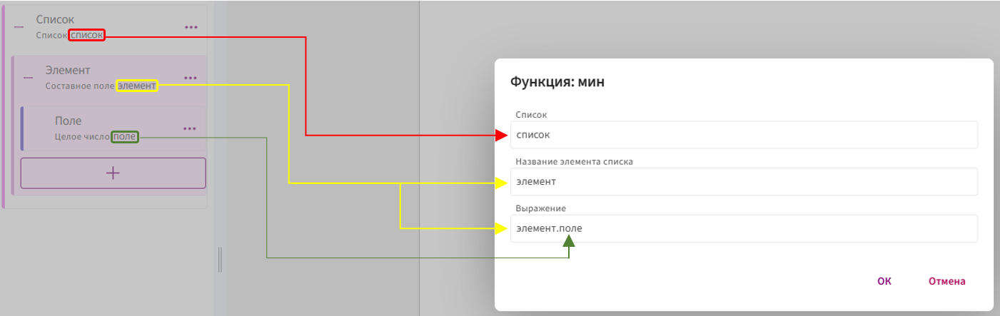
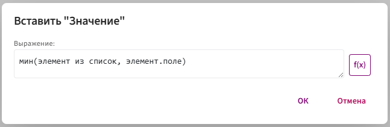
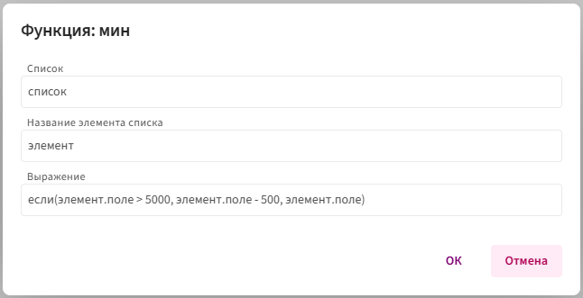
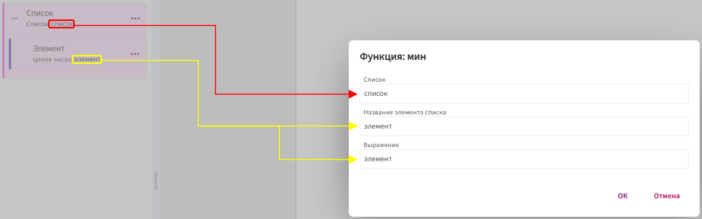
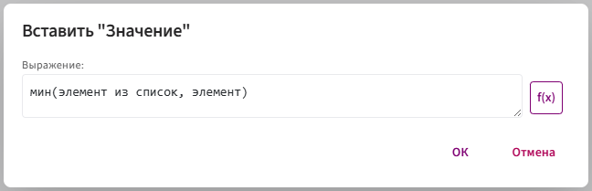
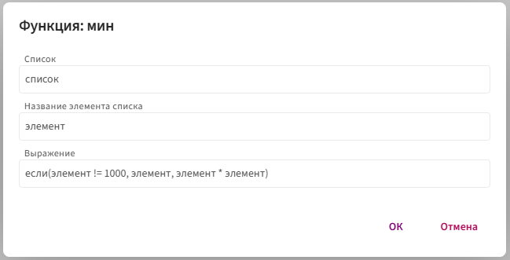

# **мин**

Функция `мин` используется для определения **наименьшего числового значения** среди элементов списка.

## **Синтаксис**

**Общий синтаксис:**

`мин(элемент из список, любое_выражение)`

Что это значит:

* `элемент` — имя текущей записи списка (можете назвать как угодно: `элемент`, `x` и т. п.).

* `список` — поле-список, по которому идёт обход.

* `любое_выражение` — произвольная формула, которая выполняется для каждого элемента и должна возвращать минимальное значение.

**Элемент списка может быть двух видов:**

1. **СОСТАВНОЕ ПОЛЕ:**

     В качестве **названия элемента списка** передаётся временное имя текущего элемента списка (чаще всего — идентификатор самого составного поля).

      

      

     * **Название элемента списка** — это имя, через которое происходит обращение к каждому элементу. Вместо него можно использовать любое [допустимое](../../syntax/syntax.md) имя, например: `элемент1`, `_2`, `_элемент` и т.п.

          Соответственно, к полям, находящимся внутри составного поля, нужно обращаться с указанием этого имени. Например, если заменить `элемент` на `_2`, то обращение к полю будет выглядеть так:

           `_2.поле`

     * **Список** — передается идентификатор списка, в котором находятся данные.

     * **Выражение** — произвольное выражение, которое будет выполнено для каждого элемента списка. Чаще всего передаётся просто идентификатор поля `элемент.поле`, по которому ищется минимальное значение из списка, но если у вас сложный расчёт, то можно использовать различные формулы и логику, например: `если(элемент.поле > 5000, элемент.поле - 500, элемент.поле)`
  
       

2. **НЕ СОСТАВНОЕ ПОЛЕ**

     Когда элемент **несоставной** (десятичное или целое число), у него **нет внутренних полей**. Поэтому в **название элемента списка** программе нужен **конкретный идентификатор поля**.

      

      

     * **Список** — передается идентификатор списка, в котором находятся данные.
    
     * **Название элемента списка** — передается идентификатор поля, которое вы выбрали в качестве элемента списка. Всегда передаётся точный идентификатор.
  
     * **Выражение** — произвольное выражение, которое будет выполнено для каждого элемента списка. Чаще всего передаётся просто идентификатор элемента списка `элемент`, по которому  ищется минимальное значение из списка, но если у вас сложный расчёт, можно использовать различные формулы и логику, например: `если(элемент != 1000, элемент, элемент * элемент)`

        

## **Принцип работы:**

1. Функция перебирает все элементы указанного списка.

2. Из каждого элемента извлекается нужное числовое значение.

3. Значения сравниваются между собой.

4. Возвращается наименьшее из них.

