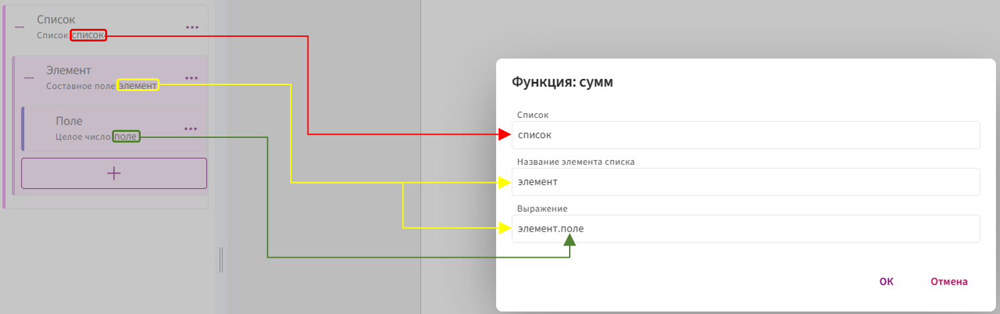
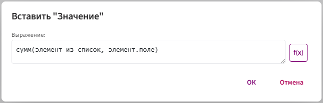
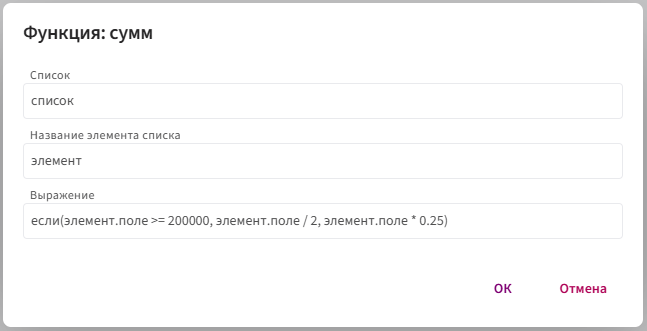
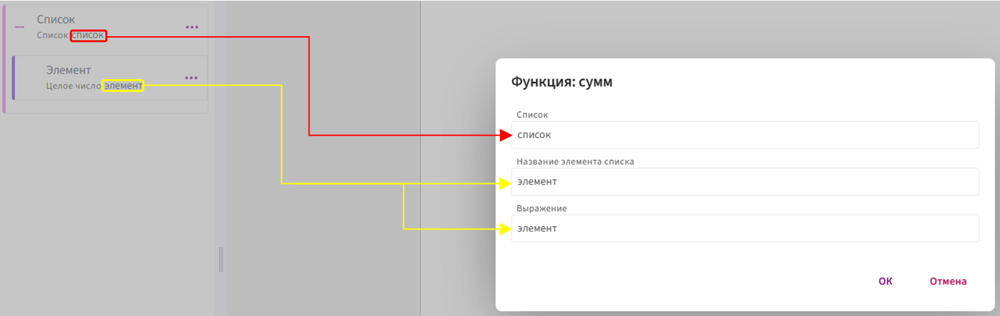
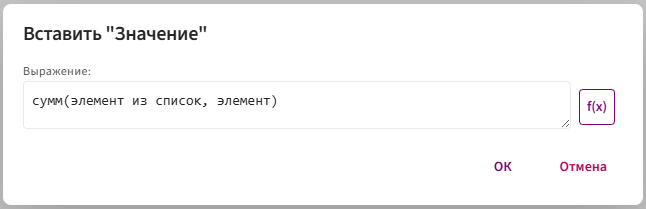
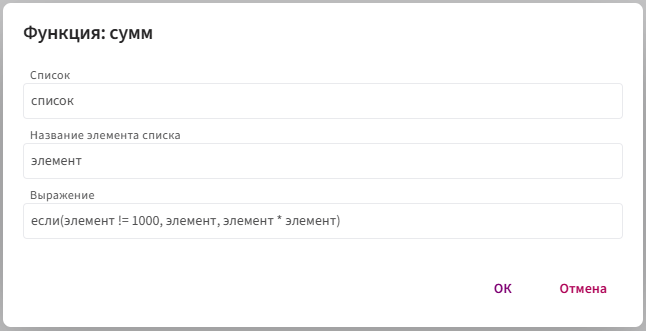

# **сумм**

Функция `сумм` используется для вычисления общей суммы числового поля среди всех элементов списка.

## **Синтаксис**

**Общий синтаксис:**

`сумм(элемент из список, любое_выражение)`

Что это значит:

* `элемент` — имя текущей записи списка (можете назвать как угодно: `элемент`, `x` и т. п.).

* `список` — поле-список, по которому идёт обход.

* `любое_выражение` — произвольная формула, которая выполняется для каждого элемента и должна возвращать число  (то, что суммируем).

📌 Поле должно быть числовым: **целое число** или **десятичное число**.

**Элемент списка может быть двух видов:**

1. **СОСТАВНОЕ ПОЛЕ:**

       В качестве **названия элемента списка** передаётся временное имя текущего элемента списка (чаще всего — идентификатор самого составного поля).

       

       

       * **Название элемента списка** — это имя, через которое происходит обращение к каждому элементу. Вместо него можно использовать любое [допустимое](../../syntax/syntax.md) имя, например: `элемент1`, `_2`, `_элемент` и т.п.

          Соответственно, к полям, находящимся внутри составного поля, нужно обращаться с указанием этого имени. Например, если заменить `элемент` на `_2`, то обращение к полю будет выглядеть так:

          `_2.поле`

       * **Список** — передается идентификатор списка, в котором находятся данные.

       * **Выражение** — произвольное выражение, которое будет выполнено для каждого элемента списка. Чаще всего передаётся просто идентификатор поля `элемент.поле`, по которому суммируется каждое значение из списка, но если у вас сложный расчёт, то можно использовать различные формулы и логику, например: `если(элемент.поле >= 200000, элемент.поле / 2, элемент.поле * 0.25)`
  
         

2. **НЕ СОСТАВНОЕ ПОЛЕ**

      Когда элемент **несоставной** (десятичное или целое число), у него **нет внутренних полей**. Поэтому в **название элемента списка** программе нужен **конкретный идентификатор поля**.

       

       

       * **Список** — передается идентификатор списка, в котором находятся данные.
    
       * **Название элемента списка** — передается идентификатор поля, которое вы выбрали в качестве элемента списка. Всегда передаётся точный идентификатор.
  
       * **Выражение** — произвольное выражение, которое будет выполнено для каждого элемента списка. Чаще всего передаётся просто идентификатор элемента списка `элемент`, по которому суммируется каждое значение из списка, но если у вас сложный расчёт, можно использовать различные формулы и логику, например: `если(элемент != 1000, элемент, элемент * элемент)`

          

## **Принцип работы:**

1. Список содержит несколько элементов, каждый из которых включает числовое поле (например, `стоимость`).

2. Функция перебирает все элементы этого списка.

3. Из каждого элемента извлекается значение указанного числового поля.

4. Все значения складываются.

5. Результатом становится итоговая сумма.

