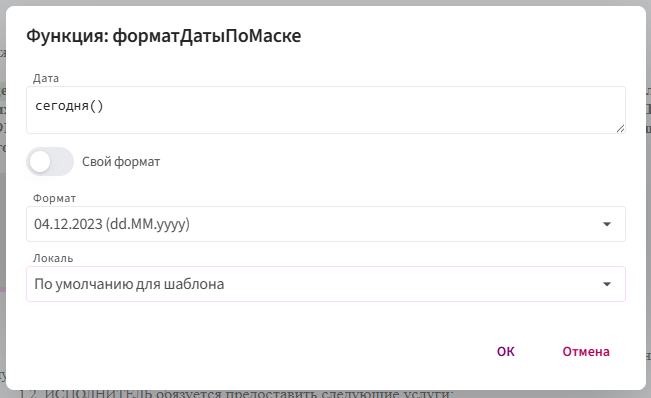

# форматДатыПоМаске

Функция `форматДатыПоМаске` преобразует дату и время в текст в указанном формате.

С её помощью можно использовать готовый формат или задать собственную маску, определив порядок и вид отображения дня, месяца, года и времени.

## Синтаксис

```text
форматДатыПоМаске(дата, формат, [локаль])
```

Где:

- `дата` — значение даты и времени, которое нужно отформатировать. Обязательный аргумент;
- `формат` — формат отображения даты и времени. Обязательный аргумент;
- `локаль` — языковая настройка, которая определяет, на каком языке будут выводиться текстовые части даты. Необязательный аргумент. Если локаль не указана, используется локаль шаблона.

Функция возвращает результат в виде текста.

## Настройка функции

Для работы функции необходимо указать **дату**, определить **формат её отображения** и при необходимости выбрать **локаль**.



**Дата** — значение даты и времени, которое нужно отформатировать. Можно использовать поле с датой или выражение, возвращающее дату и время.

**Формат** определяет, как дата и время будут выглядеть в сформированном документе: порядок и способ отображения дня, месяца, года и времени.

**Локаль** определяет язык текстовых частей даты, например названий месяцев и дней недели. Если выбрано **«По умолчанию для шаблона»**, используется локаль, установленная в настройках шаблона.

Например, при русской локали название месяца может быть выведено как:

```text
август
```

а при английской:

```text
August
```

### Готовые форматы

В поле **«Формат»** можно выбрать один из готовых вариантов отображения даты и времени.

Готовый формат уже содержит необходимые настройки, поэтому дополнительно задавать маску не требуется.

Выберите подходящий вариант из списка — Комбинатор сформирует дату в соответствии с выбранным форматом и локалью.

Если среди готовых вариантов нет подходящего, можно задать собственный формат.

### Свой формат

Чтобы самостоятельно определить вид даты и времени, включите **«Свой формат»** и укажите маску.

Маска задаёт, какие части даты и времени нужно вывести, в каком порядке и в каком виде.

Например:

- `yyyyMMdd` — 20260831  

- `yyyy-MM` — 2026-08

- `dd MMM yyyy HH:mm` — 31 авг. 2026 14:30

- `dddd, dd MMMM yyyy HH:mm` — понедельник, 31 августа 2026 14:30

- `dd.MM.yyyy 'в' HH:mm` — 31.08.2026 в 14:30

- `'Сформировано' dd.MM.yyyy 'в' HH:mm` — Сформировано 31.08.2026 в 14:30

В маске можно использовать следующие обозначения:

- `dd` — день месяца от `01` до `31`;
- `ddd` — сокращённое название дня недели;
- `dddd` — полное название дня недели;
- `MM` — месяц от `01` до `12`;
- `MMM` — сокращённое название месяца;
- `MMMM` — полное название месяца;
- `yy` — год двумя цифрами;
- `yyyy` — год четырьмя цифрами;
- `HH` — часы от `00` до `23`;
- `mm` — минуты от `00` до `59`;
- `ss` — секунды от `00` до `59`.

Обозначения можно комбинировать и разделять точками, пробелами, двоеточиями и другими символами.

Например:

```text
dddd, dd MMMM yyyy
```

может вернуть:

```text
понедельник, 31 августа 2026
```

В этом примере `dddd` и `MMMM` выводят текстовые значения, поэтому их язык определяется выбранной локалью.