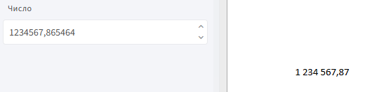
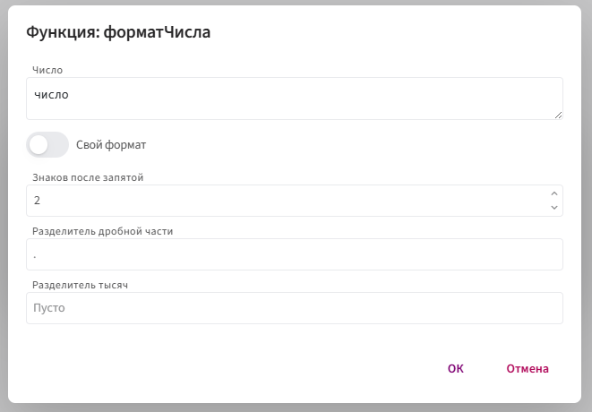

# **форматЧисла**

Функция `форматЧисла` используется для преобразования числового значения в строку по заданным правилам форматирования. Она позволяет настраивать внешний вид чисел — добавлять разделители тысяч, управлять количеством знаков после запятой и формировать единый стиль отображения значений.

📌 **Функция не изменяет само значение** — только визуально форматирует его в шаблоне.



## **Синтаксис**

```
форматЧисла(число, "формат", "разделительДробнойЧасти", "разделительТысяч")
```

* `число` — значение, которое нужно отформатировать (обычно поле типа «Десятичное число»).

* `формат` — строка формата, определяющая структуру вывода. Допустимые символы:

    **`#`** — отображает только значимые цифры.

    **`0`** — добавляет ведущие или завершающие нули при необходимости.
    
    **`.`** — разделитель дробной части (может быть заменён на указанный в следующем параметре).
   
    **`,`** — разделитель тысяч (также может быть переопределён).

* `разделительДробнойЧасти` — символ, который будет использоваться для отделения дробной части (например: `,`).

* `разделительТысяч` — символ для разделения тысяч (например: пробел, точка, запятая).

## **Принцип работы:**

1. Функция получает числовое значение, переданное напрямую или через поле шаблона.

2. Преобразует его в строку, учитывая заданный шаблон:

    * округляет до нужного количества знаков;
    * подставляет нули или скрывает лишние разряды;
    * вставляет нужные разделители (дробной части и тысяч).

3. Возвращает итоговую строку, оформленную в заданном формате. Значение используется только для отображения и не влияет на вычисления.

## **Пример:**

**Задача:** Отобразить число `1234567,865464` в виде `1 234 567,87`.

**Шаги:**


2. Вставьте поле в шаблон.

3. Дважды щёлкните по вставленному полю.

4. Нажмите `f(x)` и выберите: **Морфологические** → **форматЧисла**.

5. Заполните параметры:

     

**Результат**

Функция возвращает строку, представляющую собой отформатированное число по заданным правилам:


