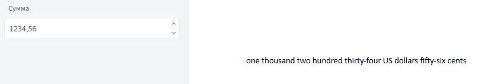

# integerToText

Функция `integerToText` преобразует целое число в его текстовое представление на **английском языке**.

## **Синтаксис**

```
integerToText(число, типЧислительного)
```
* `число` — целое значение или поле. Если передано десятичное число, дробная часть **отбрасывается**.

* `типЧислительного` — тип числительного:

    * `NumberType.Cardinal` — количественное (по умолчанию),

    * `NumberType.Ordinal` — порядковое.

## **Принцип работы:**

1. Получает целое число и тип числительного;

2. Преобразует его в текст — на английском языке;

3. Возвращает результат в виде строки.

## **Пример использования**

**Задача:** вывести сумму в долларах и центах прописью (например `One thousand two hundred thirty-four US dollars fifty-six cents`).

**Шаги:**


2. Вставьте в шаблон **метку "Значение"**.

3. В открывшемся окне введите следующее выражение:

```
integerToText(сумма, NumberType.Cardinal) & " " & 
если(сумма = 1, "US dollar", "US dollars") & " " & 
integerToText(округлить(сумма остаток - 1 * 100, 0), NumberType.Cardinal) 
& " " & если(округлить(сумма остаток - 1 * 100, 0) = 1, "cent", "cents")
```
**Пояснение:**

* `integerToText(сумма, NumberType.Cardinal)` —  переводит целую часть суммы в слова.

* `если(сумма = 1, "US dollar", "US dollars")` — задает правильное окончание для доллара.

* `сумма остаток - 1 * 100` — получение дробной части.

* `округлить(..., 0)` — округление центов до целого числа.

* `если(сумма остаток * 100 = 1, "cent", "cents")` — окончание для центов.

* `&` — объединение фрагментов.

* `сумма` — поле из анкеты.

**Пример:**

Если поле **Сумма** содержит значение `1234,56`, на выходе получится строка:



