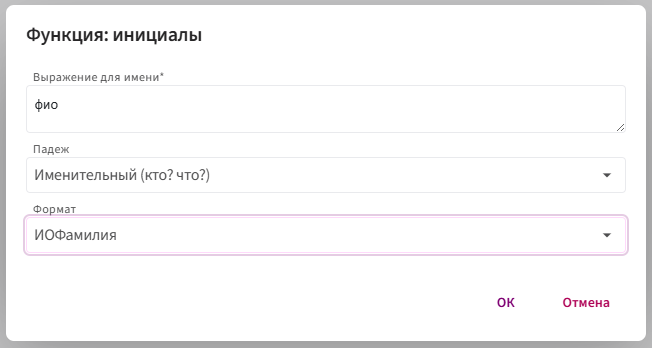
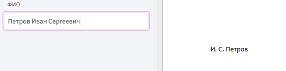

# **инициалы**

Функция `Инициалы` используется для изменения формата ФИО и его падежа.

## **Синтаксис**

```
инициалы(фио, падеж, формат)
```
**Где:**

* `фио` — идентификатор текстового поля, содержащего ФИО.

* `падеж` — параметр склонения: например, `Падеж.Именительный`, `Падеж.Дательный`.

* `формат` — способ отображения: например, `ФорматФИО.ФамилияИО` → "Иванов И.И.".

## **Принцип работы**

1. Функция получает строку с полным ФИО.

2. Разбивает её на фамилию, имя и отчество.

3. В зависимости от выбранного формата:

     * сокращает имя и отчество до инициалов (если требуется);

    * переставляет компоненты (например, фамилию в конец).

4. Склоняет результат в заданный падеж.

5. Возвращает итоговую строку — в нужной форме и структуре.

## **Пример:** 

**Задача:** отобразить ФИО в формате **И.О.Фамилия** в **именительном падеже**.

**Шаги:**

1. Вставьте текстовое поле в шаблон.

2. Нажмите дважды левой кнопкой мыши на вставленное поле в теле шаблона.

3. Нажмите на кнопку `f(X)` и выберите **«Морфологические»** → **«Инициалы»**.

4. Заполните параметры:

     

**Результат**



📌 **Важно:**

Если склонение работает некорректно — в теле шаблона нажмите ⚙️ рядом с полем, откройте «Грамматические исключения» и вручную задайте правильную форму.
