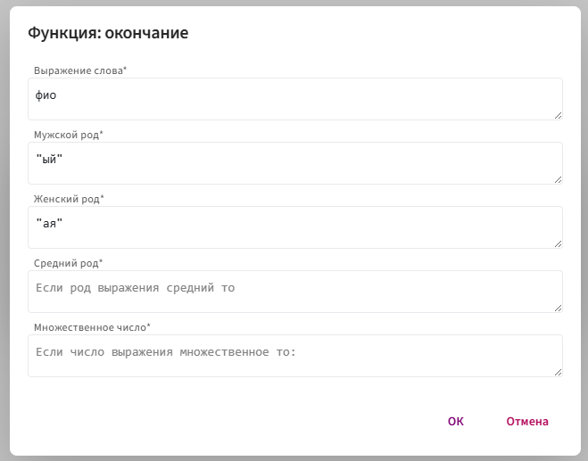
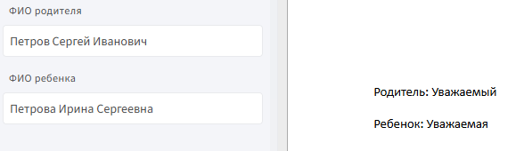

# **окончание**

Функция `окончание` используется для автоматической подстановки окончания слова в зависимости от рода и числа значения из текстового поля (например, ФИО).

## **Синтаксис**

```
окончание(полеТекста,"ый","ая","ое","ые")
```
**Где:**

* `полеТекста` — идентификатор текстового поля (например, фио), на основе которого определяется род и число.
  
* `"ый"` — окончание, если значение в поле мужского рода.

* `"ая"` — если женского.

* `"ое"` — если среднего.

* `"ые"` — если значение во множественном числе.

📌 В кавычках передаются сами окончания, которые должны подставляться в зависимости от формы слова.

## **Принцип работы**

1. Функция получает строку из текстового поля.

2. Определяет род и число переданного значения (по правилам морфологии).

3. Возвращает одно из переданных окончаний.

📌 Важно: если в поле присутствуют **цифры, кавычки или знаки препинания**, функция может не сработать и вызвать ошибку. Лучше использовать чистый текст.

## **Пример:**

**Задача:** изменять слово «Уважаем...» в зависимости от ФИО.

**Шаги:**


2. В шаблоне напишите слово без окончания, например: `Уважаем`.

3. Поставьте курсор сразу после слова и вставьте поле `фио` из анкеты.

4. Дважды кликните по вставленному полю.
   
5. Нажмите `f(x)` → **Морфологические** → `окончание`.

6. Введите окончание в **двойных кавычках**.

     

**Результат**



