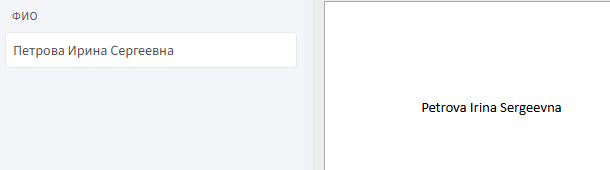

# **транслит**

Функция `транслит` используется для автоматической транслитерации текста с кириллицы (русский алфавит) на латиницу (английский алфавит).

## **Синтаксис**

```
транслит(поле)
```

* `поле` — идентификатор текстового поля, содержащий строку на кириллице.

## **Принцип работы**

1. **Получение строки:** функция принимает строку на кириллице.

2. **Побуквенное преобразование:** каждая буква заменяется на соответствующий латинский символ в соответствии с таблицей транслитерации.

    **Примеры:**
    
     * Ж → Zh
     * Ю → Iu
     * Я → Ia
     * Й → I

3. **Сохранение регистра:** сохраняется регистр исходных символов (прописные и строчные).

4. **Возврат результата:** возвращается строка, полностью переведённая на латиницу.

## **Пример:**

**Задача:** получить латинское написание ФИО.

**Шаги:**

1. Вставьте текстовое поле `фио` в шаблон.

2. Дважды щелкните по идентификатору в теле шаблона.

3. Нажмите `f(X)` и выберите **«Морфологические»** → **«транслит»**.

4. Подтвердите изменения и проверьте результат.

**Результат**



Функция вернёт строку, в которой все символы преобразованы в латинский алфавит.

