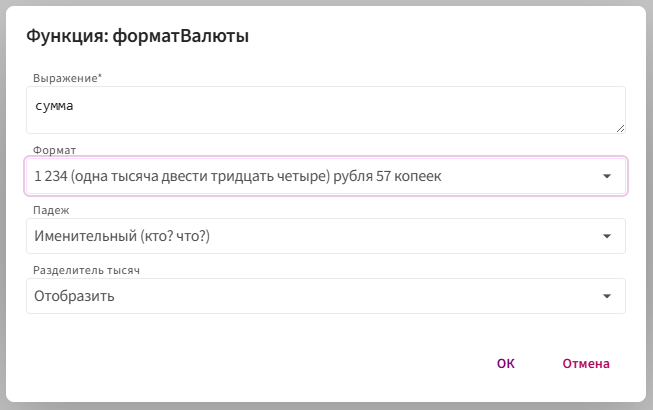
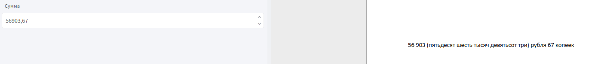

# **форматВалюты**

Функция `форматВалюты` используется для форматирования числового значения как денежной суммы: с указанием валюты, нужного падежа, разделителей тысяч и округления до копеек.

## **Синтаксис**

```
форматВалюты(число, ФорматВалюты, Падеж, РазделительТысяч)
```

* `число` — числовое поле или значение, которое нужно преобразовать в денежный формат.

* `ФорматВалюты` — формат отображения валюты:

     например, `ФорматВалюты.Длинный`, `ФорматВалюты.Краткий` и т.д.

* `Падеж` — падеж, в котором будет склоняться название валюты:

     например, `Падеж.Именительный`, `Падеж.Родительный` и т.д.

* `РазделительТысяч` — отображать или скрывать пробелы между тысячами:

    `РазделительТысяч.Отобразить` или `РазделительТысяч.Скрыть`

## **Принцип работы**

1. Функция получает числовое значение.

2. Преобразует его в строку денежного формата:

     Например, `1 234 (одна тысяча двести тридцать четыре) рубля 57 копеек`

3. Возвращает итоговую строку с отформатированной суммой.

## **Пример использования**

**Задача:** отобразить сумму в формате `1 234 (одна тысяча двести тридцать четыре) рубля 57 копеек`.

**Шаги:**


2. Вставьте поле из анкеты в шаблон.

3. Дважды кликните на вставленное поле.

4. Нажмите кнопку `f(x)` → **«Морфологические»** → `форматВалюты`.

5. Укажите параметры:

    

**Результат**



Функция возвращает строку с числовым значением, отформатированным как денежная сумма в заданном падеже, формате и с учётом разделителей тысяч.

