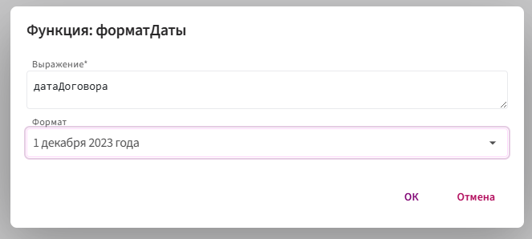
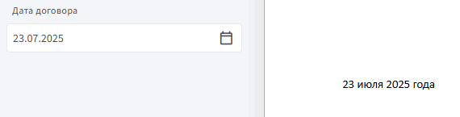

# **форматДаты**

Функция `форматДаты` используется для преобразования даты в нужный текстовый формат. Она не меняет саму дату, а лишь управляет её отображением в шаблоне.

Например, дата `01.12.2023` может быть показана как:

* `1 декабря 2023 года`

* `"01" декабря 2023 г.`

* `декабрь 2023`

* `01.12.2023`

## **Синтаксис**

```
форматДаты(дата,ФорматДаты)
```

* `дата` - поле типа Дата, значение которого нужно преобразовать.

* `ФорматДаты` - способ отображения. Например:

    * `ФорматДаты.ДатаПолностьюГода`
    * `ФорматДаты.ДатаСКавычками` и т.д. 

## **Пример:**

**Задача:** отобразить дату в виде: `"01" декабря 2023 г.`

**Шаги:**

1. В теле шаблона нажмите правой кнопкой мыши → **«Вставить метку»** → **«Значение»**.

2. Укажите поле типа **Дата** (например, `датаДоговора`).

3. Нажмите `f(X)` и выберите **Морфологические** → **форматДаты**

4. Выберите нужный формат.

    

**Результат**



Функция преобразует дату в заданный формат и возвращает результат в текстовом виде.
