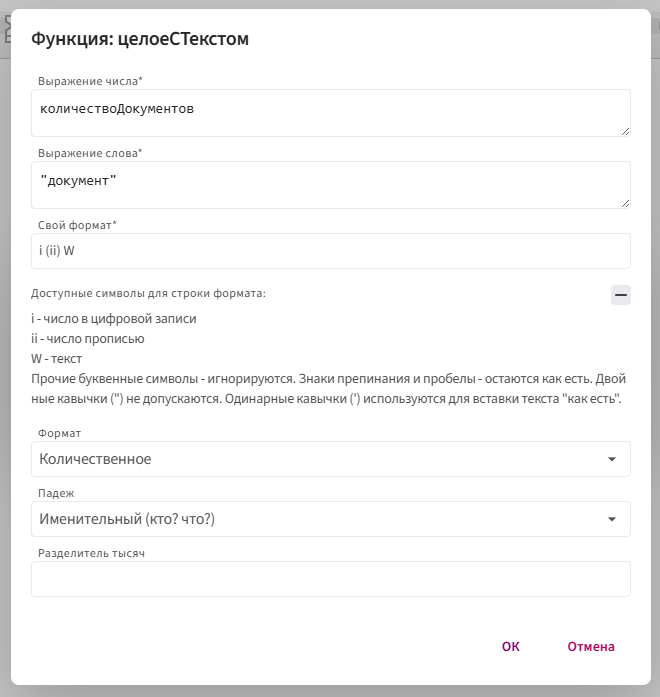
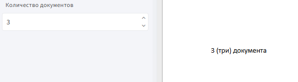

# **целоеСТекстом**

Функция `целоеСТекстом` используется для преобразования целого числа в строку: с числом, его прописью и нужным словом в правильной форме.

Применяется, когда нужно подставить числовое значение вместе с текстом — например, `3 (три) яблока`.

## **Синтаксис**

```
целоеСТекстом(число,"яблоко","i (ii) W",ТипЧислительного.Количественное,
Падеж.Именительный,".")
```

* `число` — поле или выражение, содержащее целое число.

* `"яблоко"` — текст, который будет склоняться по числу (например, "яблоко", "яблока", "яблок").

* `"i (ii) W"` — формат отображения числа с текстом:
  
    * `i` — число цифрами
      
    * `ii` — число прописью
      
    * `W` — текст
   
* `ТипЧислительного.Количественное` - тип числительного (Количественное или Порядковое).
  
* `Падеж.Именительный` - падеж, в котором будет отображаться число с текстом.
  
* `"."` — разделитель тысяч, который может быть одним из следующих символов: **точка (.)**, **запятая (,)**, **двоеточие (:)** или **пробел ( )**. Пример: **1.234**.

## **Принцип работы:**

1. **Получение числового значения.** Функция принимает целое число, которое будет преобразовано в текстовый формат.

2. **Определение формы слова.** На основе переданного числового значения функция автоматически выбирает правильную форму слова (например, для числа 1 — `яблоко`, для числа 2 — `яблока`, для числа 5 — `яблок`).

3. **Формат отображения.** Параметр `i (ii) W` указывает, как будет отображаться число с текстом.

4. **Склонение по падежам.**  Функция изменяет форму слова в зависимости от падежа, заданного в параметре (например, `Падеж.Именительный`).

5. **Использование разделителя тысяч.** Если число большое, функция применяет разделитель тысяч для улучшения читаемости.

## **Пример:**

**Задача:** вывести количество документов в формате `3 (три) документа`.

**Шаги:**

1. Вставьте в шаблон поле типа **«Целое число»** — `количествоДокументов`.

2. Дважды кликните по вставленному полю в шаблоне.

3. Нажмите `f(x)` и выберите **Морфологические** → **целоеСТекстом**.

4. Заполните параметры:

      

**Результат**


