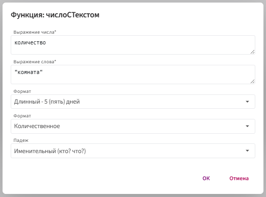
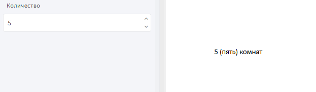

# **числоСТекстом**

Функция `числоСТекстом` используется для отображения числа вместе с подходящей формой слова — в нужном падеже, с нужным типом числительного и в заданном формате (цифрами, прописью или и тем и другим).

## **Синтаксис**

```
числоСТекстом(число, "слово", ФорматЭлемента.Длинный, 
ТипЧислительного.Количественное, Падеж.Именительный)
```
* `число` — поле с числовым значением (целое или десятичное).

* `"слово"` —  слово, которое будет согласовано с числительным (например, `"день"`, `"этаж"`).

* `ФорматЭлемента` — как будет отображаться число:

    * `ФорматЭлемента.Длинный`  — `5 (пять) комнат`

    * `ФорматЭлемента.Короткий` — `5 комнат`
      
    * `ФорматЭлемента.Прописью` — `пять комнат`

* `ТипЧислительного` — определяет тип числительного:

    * `Количественное` — один, два, три и т.д.

    * `Порядковое` — первый, второй, третий и т.д.

* `Падеж.Именительный` — грамматический падеж.

## **Принцип работы**

1. Функция получает числовое значение.

2. Определяет форму слова по падежу и числу.

3. Преобразует число в нужный формат (цифрами, прописью или оба сразу).

4. Склеивает результат и возвращает строку: **числительное + слово в согласованной форме**.

## **Пример:**

⚠️ **Примечание**

**Задача:** преобразовать число `5` в строку `5 (пять) комнат`.


**Шаги:** 

2. Вставьте поле в тело шаблона.

3. Дважды щёлкните по вставленному полю.

4. Нажмите `f(x)` и выберите: **Морфологические** → **числоСТекстом**.

5. Заполните параметры:

     

**Результат**



Функция возвращает текстовую строку, где число согласовано с существительным по заданным грамматическим правилам.

