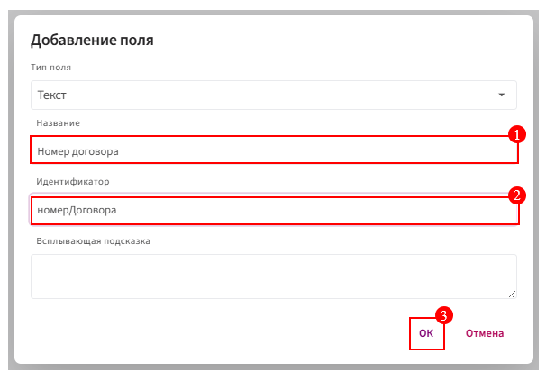
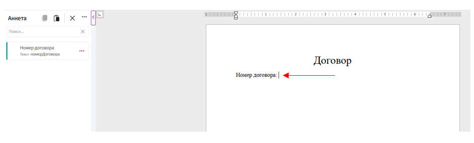
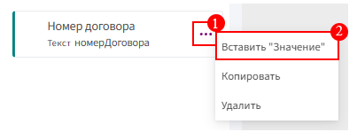

# Создание поля

1. Нажмите на кнопку **«+»** в левом нижнем углу экрана.

2. Выберите пункт **«Добавить поле»** из выпадающего меню.
   
4. Из списка **«Тип поля»** выберите нужный тип.

     * [Текст](text.md)

     * [Целое число](integer.md)

     * [Десятичное число](decimal.md)

     * [Да/Нет](boolean.md)

     * [Дата](date.md)

     * [Время](time.md)

     * [Дата/Время](datetime.md)

     * [Перечисление](enum.md)

     * [Составное поле](composite.md)

     * [Список](list.md)

5. Укажите наименование поля.

6. Нажмите на строку **«Идентификатор»** (она будет автоматически заполнена системой).

8. Нажмите кнопку **«ОК»** для сохранения изменений.

     

# Добавление поля

1. Откройте шаблон и поставьте курсор в то место, куда нужно будет вставить значение.

     

2. Перейдите в раздел **«Анкета»** (находится слева сбоку).

3. Найдите нужное поле.

4. Нажмите на **три точки** рядом с этим полем.

5. В появившемся меню выберите **Вставить "Значение"**.

     
