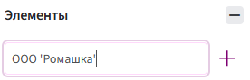

# Поле «Перечисление»

Поле **«Перечисление»** используется для выбора одного значения из заранее заданного набора вариантов.

Например, с его помощью можно выбрать способ оплаты, тип клиента или способ доставки.

## Создание и добавление поля

Создание и добавление полей: [ИНСТРУКЦИЯ](create-and-add.md).

## Настройки поля

Чтобы открыть настройки поля **«Перечисление»**:

1. Выберите поле в анкете.
2. Нажмите на него левой кнопкой мыши.
3. Справа откроется панель со свойствами поля.

Подробнее об общих настройках: [«Свойства полей»](properties.md).

Для поля **«Перечисление»** дополнительно доступны настройки **«Элементы»** и **«Показать в виде выпадающего списка»**.

### Элементы

В блоке **«Элементы»** задаются варианты, доступные пользователю при заполнении анкеты.

Например, для поля **«Тип исполнителя»** можно добавить:

- ООО;
- ИП;
- Физическое лицо.

Чтобы добавить вариант:

1. Введите его в строку **«Элемент»**.
2. Нажмите **«+»** справа.
3. Таким же способом добавьте остальные варианты.

Если в названии элемента необходимо использовать кавычки, замените двойные кавычки (`"`) на одинарные (`'`).



### Показать в виде выпадающего списка

Если включить настройку **«Показать в виде выпадающего списка»**, варианты будут отображаться в анкете в раскрывающемся списке.


## Использование через вкладку «Метки»

Поле **«Перечисление»** можно использовать через метки [«Значение»](../directives/value.md) и [«Выбор»](../directives/switch.md).

### Через метку «Значение»

Метка **«Значение»** используется, если в документ необходимо вывести выбранный вариант.

В свойстве **«Выражение»** укажите идентификатор поля **«Перечисление»**.

Например:

```text
типИсполнителя
```

Если пользователь выбрал **«ИП»**, в документ будет выведено:

```text
ИП
```

### Через метку «Выбор»

Метка **«Выбор»** используется, если содержимое документа должно зависеть от выбранного варианта.

Например, для поля **«Тип исполнителя»** можно подготовить отдельное содержимое для:

- ООО;
- ИП;
- Физического лица.

При формировании документа Комбинатор определит выбранный вариант и выведет соответствующее ему содержимое.

Значения, указанные в метке **«Выбор»**, должны точно соответствовать значениям, заданным в поле **«Перечисление»**.

Блок **«Прочее»** можно использовать для содержимого, которое должно выводиться, если значение не совпало ни с одним из указанных вариантов.

Подробнее: [метка «Выбор»](../directives/switch.md).

## Функции для работы с полем

Для поля **«Перечисление»** отдельных функций нет.