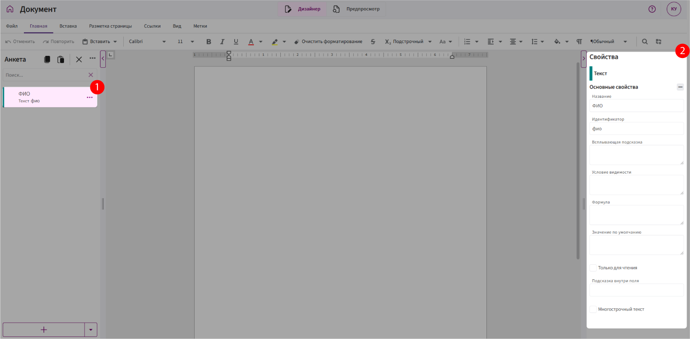
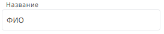
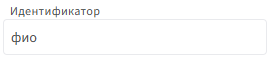
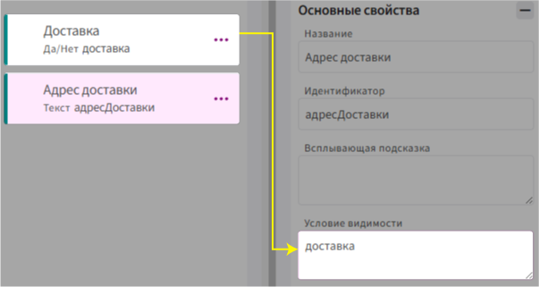
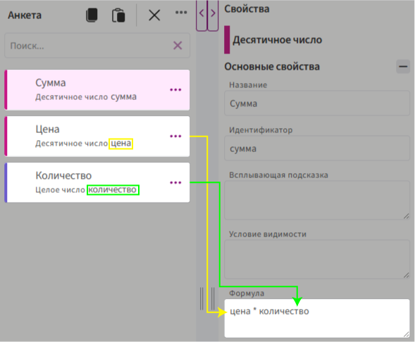
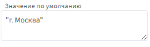
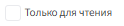
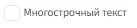
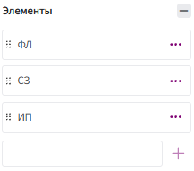

# Открытие свойств у поля

1. Нажмите **левой кнопкой мыши** на поле в анкете.

2. Справа откроется панель со **свойствами поля**.

    

# Свойства полей

## Название

**Что это такое:**

Название — это текст, который отображается рядом с полем в анкете.

**Зачем нужно:**

Помогает понять, что именно нужно ввести в это поле. Например:

`ФИО сотрудника`, `Номер договора`, `Дата начала`.

**Особенности:**

Название можно менять в любое время — это не влияет на работу формул или логики шаблона.

## Идентификатор

**Что это такое:**

Идентификатор — это **внутреннее имя** поля, которое используется в логике и формулах.

**Зачем нужно:**

Применяется в формулах, условиях видимости, метках, масках имени файла и других выражениях. Например:

`датаРождения`, `суммаЗаказа`, `контакт_менеджер`.

**Особенности:**

* Создаётся автоматически после ввода названия поля.

* Можно изменить вручную.

* Допустимые символы: **только буквы, цифры и подчёркивания**.

* Идентификаторы **не должны повторяться**.

**Важно:**

🚫 **Не меняйте идентификатор без необходимости.**

Если вы всё же изменили его — обязательно проверьте и обновите во всех местах, где он используется. Иначе шаблон может перестать работать корректно.

## Всплывающая подсказка

**Что это такое:**

Комментарий, который появляется при наведении на значок ⓘ рядом с полем.

**Зачем нужно:**

Помогает пользователю заполнить поле правильно — особенно если название поля не даёт полной ясности.

## Условия видимости

**Что это такое:**

Свойство, которое позволяет показывать или скрывать поле в зависимости от заданного условия.

**Как работает:**

Вы задаёте **логическое выражение**. Если оно выполняется — поле отображается. Если нет — скрывается.

**Зачем нужно:**

Чтобы анкета была удобной и динамичной — например, показывать дополнительные поля только **при необходимости**.

**Пример:** 

Поле `Адрес доставки`.

Условие: показывать поле только если отмечено «Доставка».

Выражение:

* `доставка` — идентификатор поля типа Да/Нет
  
Результат:

Если пользователь выбрал, что доставка нужна — появится поле `Адрес доставки`. Если не выбрал — поле останется скрытым.

## Формула

**Что это такое:**

Свойство, которое позволяет **вычислять значение поля автоматически** на основе других полей или данных.

**Зачем нужно:**

Чтобы поле не заполнялось вручную, а рассчитывалось по заданной логике. Например:

**Особенности:**

* Используется язык формул.

* Результат обновляется при изменении исходных значений или логике.

## Значение по умолчанию

**Что это такое:**

Начальное значение, которое автоматически подставляется в поле при создании документа.

**Зачем нужно:**

Чтобы сэкономить время при заполнении — особенно, если в большинстве случаев значение стандартное.

Примеры:

* `"г. Москва"` — для текстового поля «Город».

    

* `3` — для целочисленного поля «количество».

    

* `сегодня()` — для поля «Дата».

    

* `количество * цена` — для десятичного поля «Сумма».

    

**Особенности:**

* Можно использовать как текст, так и выражения на языке формул.

## Только для чтения

**Что это такое:**

Свойство, которое **блокирует редактирование** поля в режиме заполнения.

**Зачем нужно:**

Чтобы предотвратить случайное изменение значения пользователем.

**Особенности:**

* Поле остаётся видимым, но пользователь не может его изменить.

* Часто используется вместе с формулой или привязкой данных.

## Подсказка внутри поля (только для текстовых полей)

**Что это такое:**

Текст, который отображается **внутри самого текстового поля**, пока пользователь не начал ввод данных.

**Зачем нужно:**

Чтобы направить пользователя, что именно нужно ввести. Например:

`Введите ИНН, чтобы вытянуть данные из Дадаты`

**Особенности:**

* Пропадает при начале ввода.

## Многострочный текст (только для текстовых полей)

**Что это такое:**

Свойство, которое позволяет вводить **текст в несколько строк**.

**Зачем нужно:**

Когда пользователю нужно ввести большой объём текста — комментарии, описание, пояснение и т.д.

**Особенности:**

* Появляется увеличенная текстовая область с переносом строк.

## Количество знаков после запятой (только для десятичных полей)

**Что это такое:**

Указывает, сколько знаков должно отображаться после запятой в числе.

**Зачем нужно:**

Чтобы округлить значение и задать точность. Например:

* `2` знака: `123,456` → `123,46`

* `0` знаков: `5,9` → `6`

**Особенности:**

* Не влияет на внутренние вычисления, только на отображение.

## Показать в виде выпадающего списка (только для перечислений)

**Что это такое:**

Настройка отображения — превращает поле в выпадающий список со значениями.

**Зачем нужно:**

Чтобы поле занимало меньше места в анкете.

**Особенности:**

* Список формируется из заданных элементов (см. следующее свойство).

     

## Элементы (для поля Перечисление)

**Что это такое:**

Список значений, из которых пользователь может **выбрать только один**.

**Зачем нужно:**

Чтобы задать фиксированный набор допустимых вариантов. Например:

* `Мужчина`, `Женщина`

* `Предоплата`, `Постоплата`

**Как добавить элементы:**

1. Введите значение в строку **«Элемент»**.

     Если в тексте используются **двойные кавычки (")**, замените их на **одинарные (')**, чтобы избежать ошибок.

2. После ввода обязательно нажмите кнопку `+` справа — так элемент будет добавлен в список.

## Элемент списка (для поля Список)

**Что это такое:**

Структура повторяющегося элемента, который будет использоваться в списке.

**Зачем нужно:**

Чтобы задать, из чего будет состоять каждая строка списка. Например:

* Простая структура: одно поле (все поля, кроме составного).

* Составная структура: несколько полей в составном поле.

**Особенности:**

* Настраивается при создании поля «Список».

## Привязка данных (для Составного поля)

**Что это такое:**

Свойство, позволяющее получать значения из внешнего источника данных, например из DaData.

**Зачем нужно:**

Чтобы подставлять значения автоматически — например, по ИНН вытянуть из ДаДаты название организации, адрес и т.д.

**Особенности:**

* Работает только внутри составных полей.

* Требуется предварительная настройка подключения к источнику.
