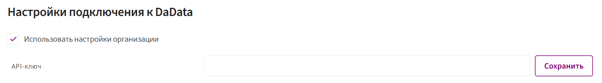

# Дадата для всей организации

Данный раздел предназначен для **подключения сервиса [DaData](../../Integrations/DaData.md)** к системе. Для автозаполнения данных (например, адресов, ИНН, реквизитов).

### **Использование общих настроек организации**

Можно задать единый API-ключ, который будет использоваться всеми пользователями организации.

Для этого необходимо:

1. Поставить галочку напротив пункта **«Использовать настройки организации»**.
2. Внести значение в строку **«API-ключ»**.
3. Сохранить изменения.

    

### **Инструкция по получению API-ключа**

Для получения API-ключа из сервиса DaData, следуйте следующим инструкциям:

1. Зайдите на официальный сайт DaData по ссылке: https://dadata.ru/.

2. Нажмите на кнопку **«Войти»** в правом верхнем углу страницы. Если у вас нет аккаунта, необходимо зарегистрироваться.

3. После успешной авторизации, перейдите в **личный кабинет пользователя**. Это можно сделать, нажав на кнопку в верхнем правом углу страницы и выбрав в выпадающем меню пункт **«Личный кабинет»**.

4. API-ключ расположен в личном кабинете на вкладке **«Почта, ключи, деньги» → раздел «Ключи»**.

5. Скопируйте значение API-ключа.

⚠️ Будьте внимательны: **не используйте значение «Секретный ключ»**.
