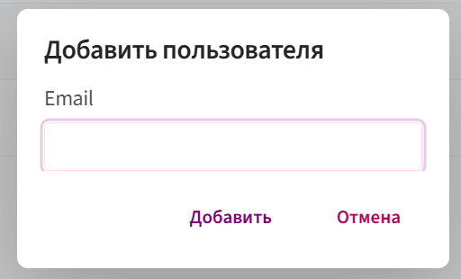
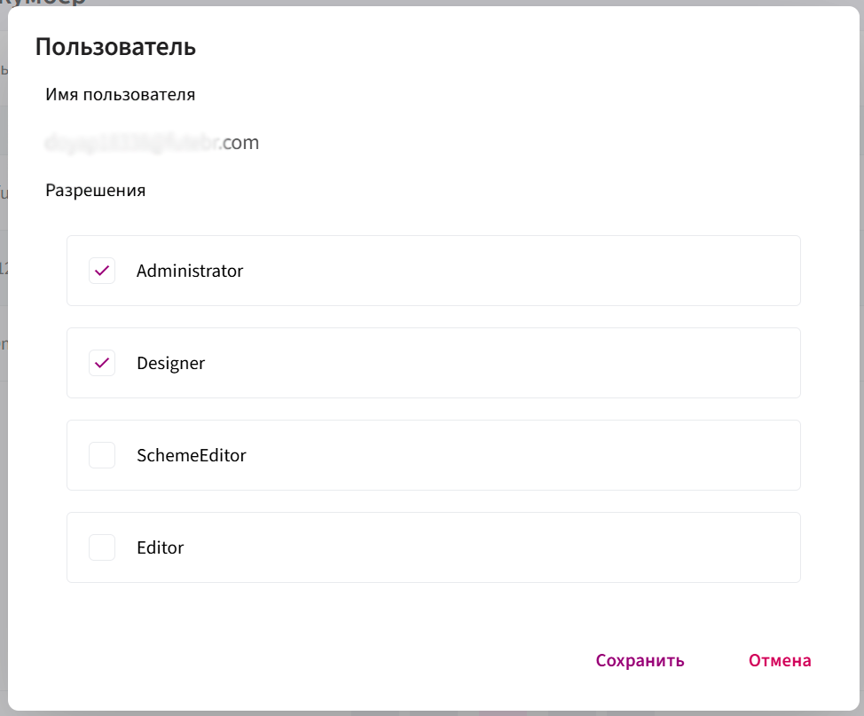

# Пользователи

Этот раздел предназначен для **управления пользователями организации**.

**Функционал включает:**

1. **Список пользователей**
   
    * Отображаются все пользователи, подключённые к организации.

2. **Добавление новых пользователей**
   
    * Кнопка «Добавить пользователя» позволяет подключить нового участника.
     
          

          Для этого введите адрес электронной почты человека, которого хотите добавить. На указанную почту придёт письмо с приглашением, где будет указана ссылка на [app.kombinator.ru](https://app.kombinator.ru/App), а также логин и пароль для входа в систему.

          После первого входа пользователь может сменить пароль в [настройках](../Interface/interface.md)

          ⚠️ Не забудьте после добавления назначить пользователю подходящую роль (см.ниже)

3. **Управление доступом**
   
    * Для каждого пользователя можно назначать и изменять роли (например, администратор, разработчик шаблонов и т. д.).
    * Чтобы изменить роль:
  
          * Кликните левой кнопкой мыши по добавленному пользователю.
       
          * Откроется список доступных [ролей](roles.md).

             
   
          * Выберите нужную роль и нажмите **«Сохранить»**.

4. **Удаление пользователей**
   
    * В интерфейсе есть возможность исключить пользователя из организации (иконка корзины).

Таким образом, данный раздел является центральной точкой **администрирования пользователей**: здесь добавляют новых сотрудников, управляют их ролями и при необходимости удаляют доступ.
