# Интерфейс Комбинатора

Раздел поможет разобраться, как устроен интерфейс Комбинатора — где искать документы, шаблоны, справочники и настройки.

Всё приложение поделено на несколько областей:

* **Левая панель** — основные разделы: **Документы**, **Шаблоны**, **Справочники**, **Панель администратора**.

      [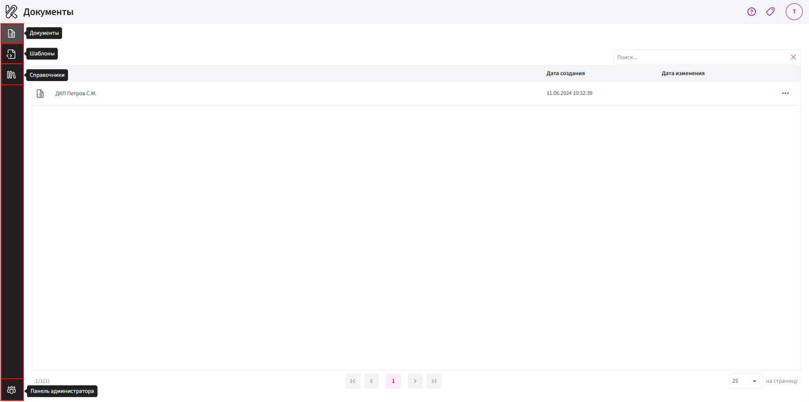{ width="100%" }](../img/Interface/1.png){ target="_blank" }

* **Центральная область** — рабочее пространство, где отображается список документов, шаблонов и справочников.

      [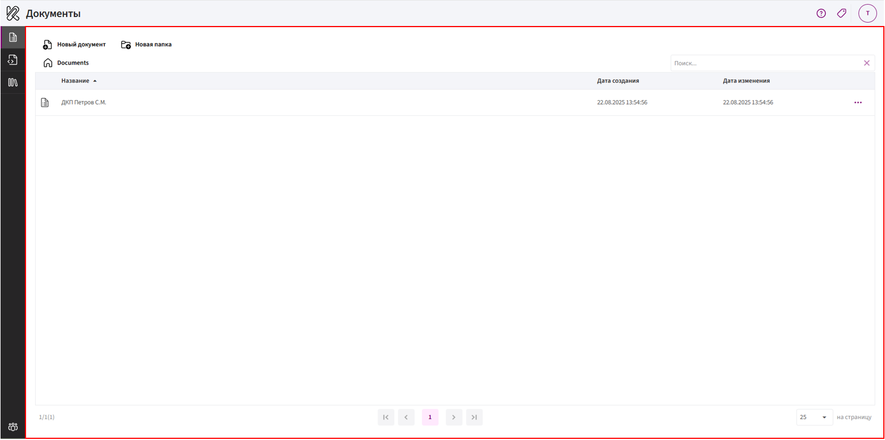{ width="100%" }](../img/Interface/2.png){ target="_blank" }

* **Верхняя панель** — меню пользователя, настройки, помощь.

      [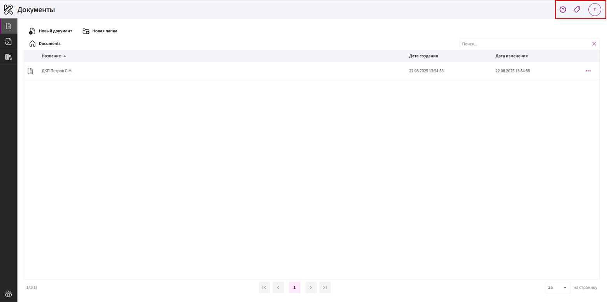{ width="100%" }](../img/Interface/3.png){ target="_blank" }

## Вкладка «Документы»

Раздел предназначен для работы с готовыми документами, созданными на основе шаблонов.

**Основные возможности:**

* Создание **нового документа**.
  
     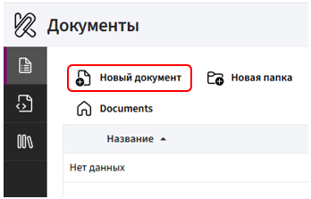

* Создание **папок** для организации документов.

     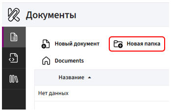

* Работа с документами через **контекстное меню** (нажатие правой кнопкой мыши по документу).
 
       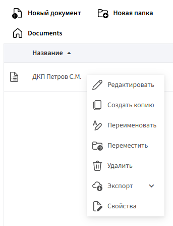

* **Поиск документа** по названию (строка поиска справа).

     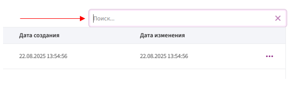

* Изменение **количества элементов на странице** (список внизу справа).

     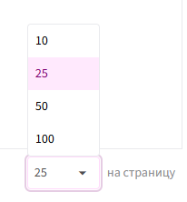

* **Навигация по страницам** через панель переключения (внизу справа: «в начало», «назад», номера страниц, «вперёд», «в конец»).

     

ℹ️ Примечание: инструкция по созданию и редактированию [документов](../Documents/add-document.md).

## Вкладка «Шаблоны»

В этом разделе создаются **шаблоны документов**, по которым затем формируются готовые документы.

**Основные возможности:**

* Создание **нового шаблона**.

      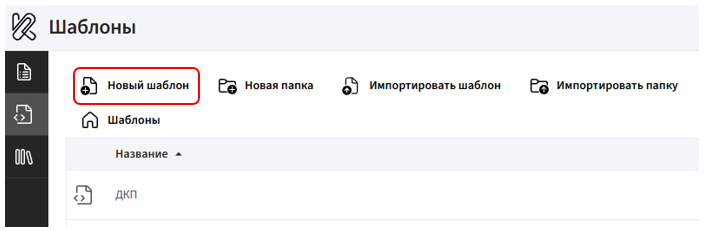

* Создание **папок** для структурирования шаблонов.

      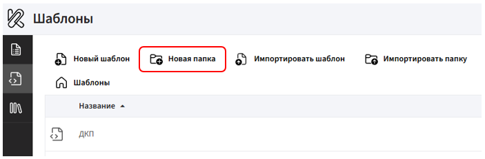

* **Импорт готового шаблона** («Импортировать шаблон») или **целой папки** («Импортировать папку»). Шаблон должен быть в формате `.fdt`.

      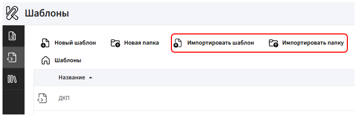

* Работа с шаблонами через **контекстное меню** (нажатие правой кнопкой мыши).

      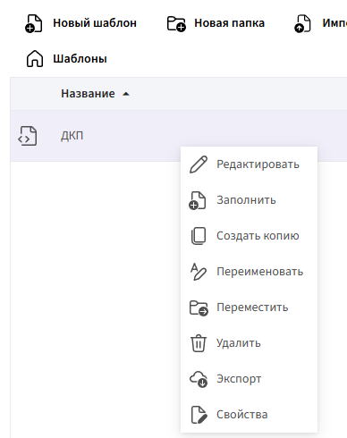

* Восстановление **удаленных шаблонов**.

      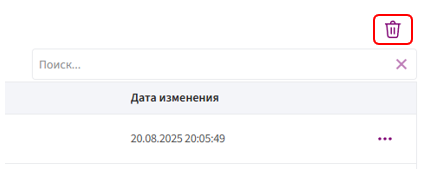
 
* **Поиск** по названию (строка поиска справа).

      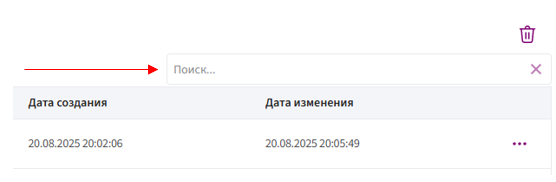

* Переключение количества **отображаемых элементов** и **постраничная навигация**.

      

      

ℹ️ Примечание: инструкция по работе с [шаблонами](../Templates/creating-template.md).

## Вкладка «Справочники»

Раздел предназначен для хранения и управления данными, которые можно использовать в шаблонах (например, списки товаров, услуг, регионов, сотрудников и т.д.).

**Основные возможности:**

* Добавление **нового справочника**.

      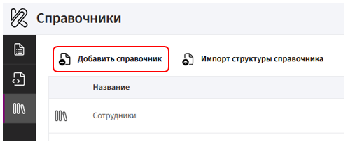

* **Импорт структуры** справочника (формат `.json`).
 
      

      При загрузке (импорте) порядок важен:

      * Сначала загружается **структура** — создаются нужные поля.

      * Потом **импортируются записи** — данные заполняются в готовую структуру.

* Работа со справочниками через **контекстное меню** (нажатие правой кнопкой мыши).

      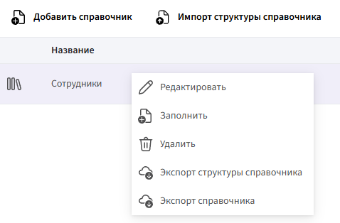

      * **Экспорт структуры справочника** — сохраняет только *настройку справочника*: названия и типы полей.
     
        👉 Это «каркас» без данных. Формат — `.json`.

      * **Экспорт справочника** — сохраняет все записи, но без описания структуры.

        👉 Это «содержимое» без каркаса. Формат — `.csv`.

ℹ️ Примечание: инструкция по работе со [справочниками](../References/add-reference.md).

## Панель администратора

Этот раздел предназначен для **управления пользователями**, **ролями**, **лицензиями и настройками интеграций**.

**Разделы панели администратора:**

* [Основная информация](../AdminPanel/summary.md)

* [Пользователи](../AdminPanel/users.md)

* Лицензии

* [Роли](../AdminPanel/roles.md)

* [Настройки](../AdminPanel/settingsDadata.md)

## Меню пользователя

Меню пользователя — это центр **управления личными настройками и рабочей средой**.

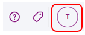

В меню доступны:

* **Текущая организация** (можно переключать, если подключено несколько).

      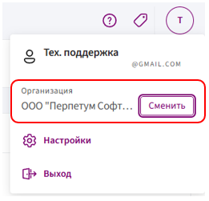

* **Настройки** — выбор языка интерфейса, личные параметры, настройки интеграции.

     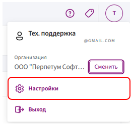

* **Выход** — завершение сеанса.

     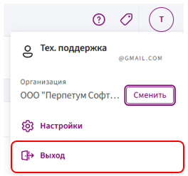

Также рядом расположены иконки:

 — помощь/справка.

 — добавление ярлыка приложения на рабочий стол.
