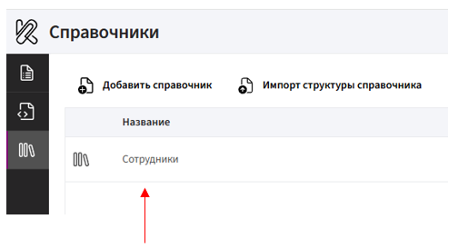
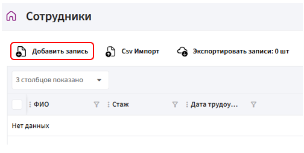

# Добавление записей в справочник

После создания структуры справочника его необходимо наполнить данными. Записи можно добавлять **вручную** или загружать через **импорт**.

## Добавление записей вручную

1. Перейдите в раздел **«Справочники»**.

2. В списке справочников **кликните левой кнопкой мыши** на ранее созданный справочник.

       

3. В открывшемся справочнике нажмите кнопку **«Добавить запись»**.

       
   
4. В открывшейся форме заполните все поля.

5. Нажмите кнопку **«ОК»**.

## Импорт данных в справочник

Если нужно загрузить большое количество данных, используйте **CSV импорт**.

1. Перейдите в раздел **«Справочники»**.

2. В списке справочников кликните **левой кнопкой мыши** на ранее созданный справочник.

3. В открывшемся справочнике нажмите кнопку **«CSV Импорт»**.

       

4. Выберите файл в формате CSV и нажмите «ОК».

    ⚠️ Важно:

    * В загружаемом файле должны быть корректно оформлены столбцы.

    * Типы данных в CSV-файле должны совпадать с типами полей, заданными в справочнике Комбинатора (например, число, дата, текст).

5. Сопоставьте столбцы файла с полями справочника и нажмите «ОК».

       

После загрузки все данные появятся в справочнике и станут доступны для дальнейшей работы.
