# Создание справочника

**Справочник** — это таблица с заранее заданной структурой (полями), в которую добавляются записи.

Примеры справочников:

* список сотрудников,

* список филиалов,

* перечень товаров или услуг.

## Создание справочника

1. Перейдите в раздел **«Справочники»**.

3. Нажмите кнопку **«Добавить справочник»**.

       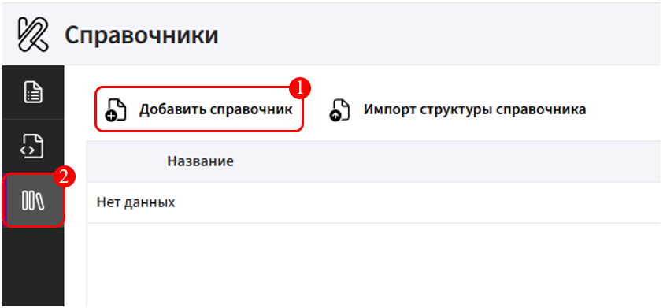

4. В открывшейся форме укажите **наименование справочника** (например, «Сотрудники»).

       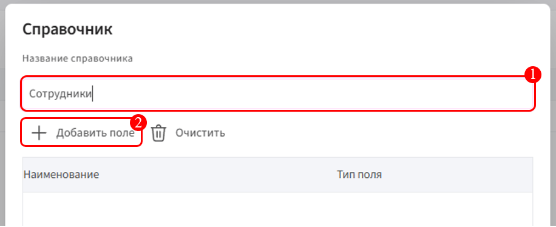

5. Добавьте поля (например: «ФИО» ([Текст](../../ReferenceGuide/typesField/text.md)), «Стаж» ([Целое число](../../ReferenceGuide/typesField/integer.md)), «Дата трудоустройства» ([Дата](../../ReferenceGuide/typesField/date.md))).

       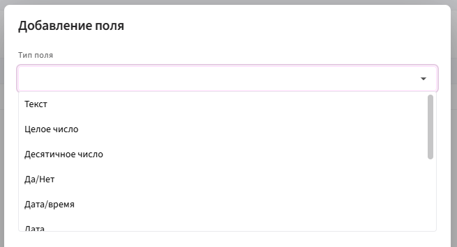
   
7. Нажмите кнопку **«ОК»**.

       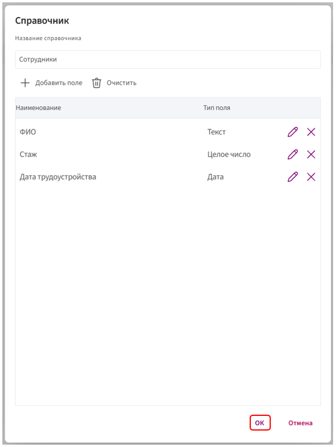

## Привязка справочника к полям

**Полный перенос полей из Справочника**

Это упрощённый способ: данные сразу распределяются по вложенным полям внутри составного поля. Требует минимальной ручной настройки.

**Создание:**

1. Во время создания [составного поля](../../ReferenceGuide/typesField/composite.md) нажмите **«Привязка данных»**.

       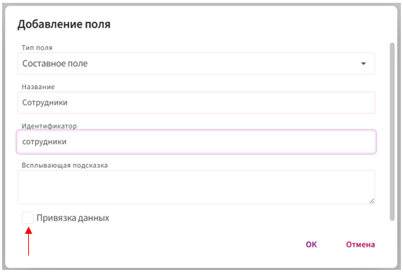

3. В разделе **«Доступ к источнику данных»** выберите **Справочник Комбинатор**.

4. Укажите **источник данных** (заранее созданный справочник), например: _Сотрудники_.

5. Отметьте галочками поля, которые нужно добавить в анкету.

       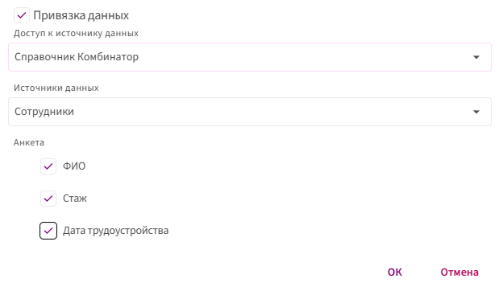

6. Нажмите **«ОК»**.

**Режим заполнения:**

Чтобы вытянуть данные из справочника, нажмите на три точки напротив созданного поля в анкете и выберите нужную строку с данными.

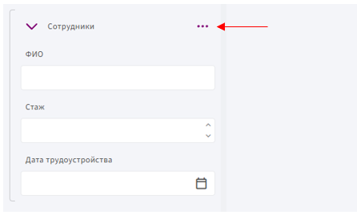

Если данных ещё нет, их можно добавить в справочник прямо из формы.

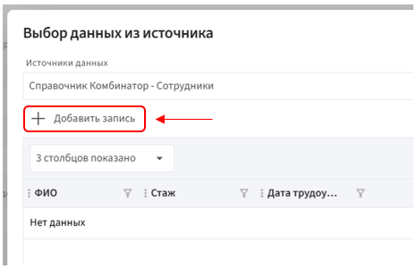

**Привязка данных к существующим полям**

Этот способ подходит, если вы хотите вручную связать поля анкеты с данными из **Справочника**. Он требует понимания, какие именно данные доступны и как они вытягиваются из источника.

⚠️ Все поля, которые вы хотите связать, должны находиться внутри **составного поля**.

1. Нажмите на **составное поле** в анкете.

2. Справа в **свойствах**, в разделе **«Привязка данных»**, нажмите кнопку **«Добавить»**.

       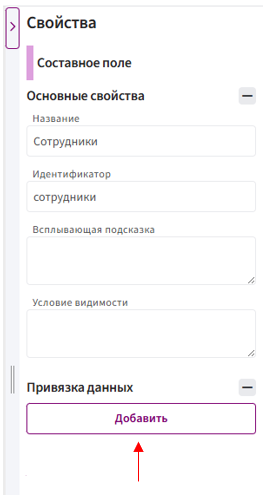

3. В поле **«Доступ к источнику данных»** выберите **Справочник Комбинатора**.

       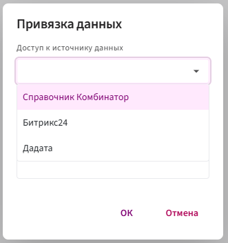

5. В поле **«Источник данных»** выберите заранее созданный справочник.

       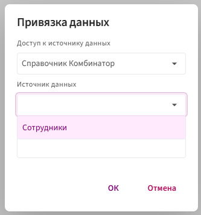

6. Нажмите **ОК** — источник будет добавлен.

7. Теперь поочерёдно перейдите в **свойства каждого поля внутри составного поля**, которое нужно связать.

8. В разделе **«Привязка данных»** вы увидите строку с иерархией, нажмите на нее:

       

8. Удалите текущую привязку и выберите нужную из предложенных.

       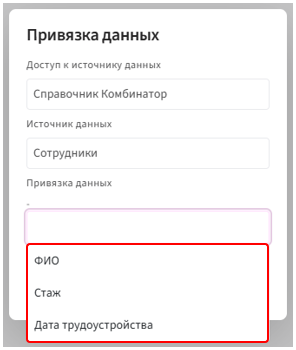

10. Нажмите «ОК».

**Режим заполнения:**

Чтобы вытянуть данные из справочника, нажмите на три точки напротив созданного поля в анкете и выберите нужную строку с данными.

Если данных ещё нет, их можно добавить в справочник прямо из формы.

