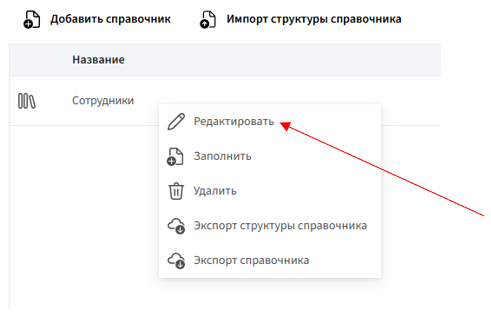
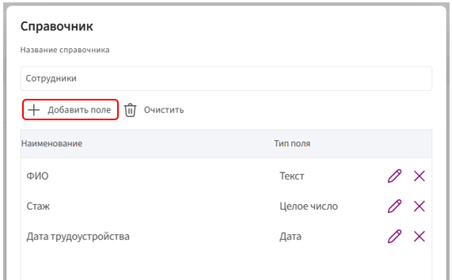
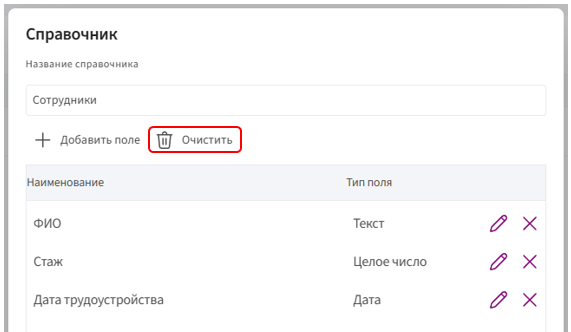
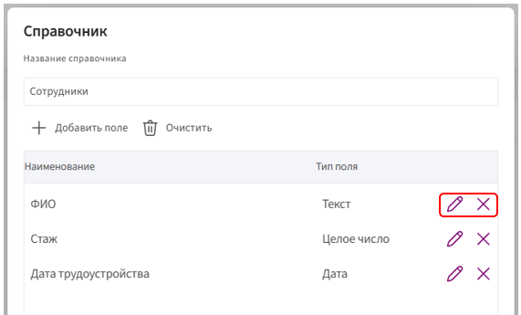
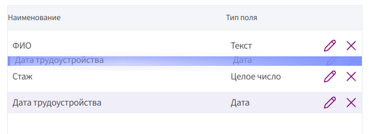

# Редактирование структуры справочника

**Структура справочника** — это набор полей, которые определяют, какие данные будут храниться в его записях. При необходимости структуру можно изменить: добавить новые поля, удалить ненужные или отредактировать существующие.

## Как отредактировать структуру

1. Перейдите в раздел **«Справочники»**.

2. В списке справочников кликните **правой кнопкой мыши** на нужный справочник и выберите пункт **«Редактировать»**.
   
       

3. В режиме редактирования доступны следующие действия:

     * добавление новых полей;
  
       
  
     * удаление всех записей в справочнике;
  
       
  
     * редактирование и удаление существующих полей;
  
       
  
     * перемещение полей вверх или вниз — для этого зажмите поле и перетащите его. Как только появится синяя строка, отпустите поле.

       

4. Чтобы применить изменения, нажмите кнопку **«ОК»**.
     
