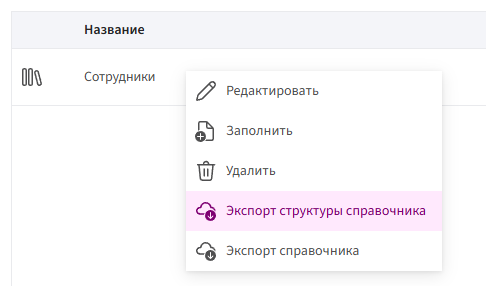
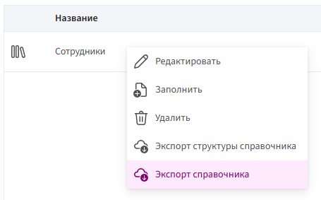
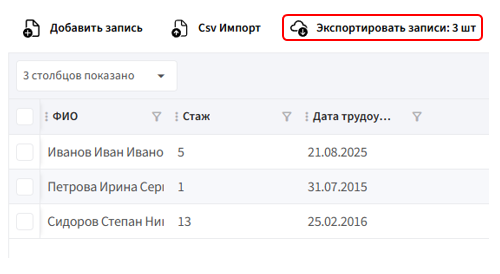

# Экспорт структуры и записей справочника

## Экспорт структуры

1. Перейдите в раздел **«Справочники»**.

2. В списке справочников кликните **правой кнопкой мыши** на нужный справочник и выберите пункт **«Экспорт структуры справочника»**.

     

3. Файл со структурой справочника будет автоматически сохранён на ваше устройство в формате **`.json`**.

## Экспорт записей

Экспортировать записи можно двумя способами:

1. В списке справочников кликните **правой кнопкой мыши** на нужный справочник и выберите пункт **«Экспорт справочника»**.

     

3. Зайдите в сам справочник и нажмите кнопку **«Экспортировать записи»**.

     

В обоих случаях записи будут сохранены в формате **`.csv`**.
