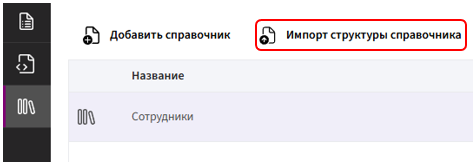
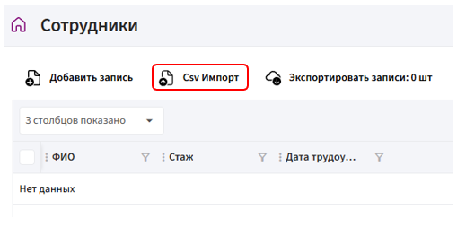
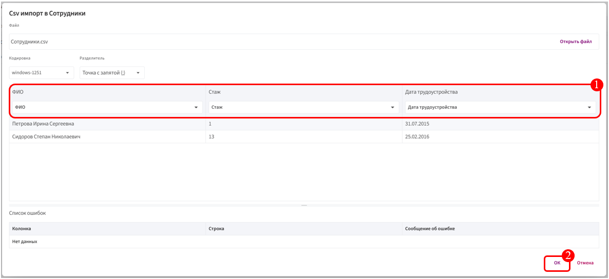

# Импорт структуры и записей справочника

## Импорт структуры

Импорт структуры справочника нужен для того, чтобы быстро создать или восстановить справочник с уже готовым набором полей.

Импорт чаще всего используется для:

* **переноса справочника между системами или организациями** — например, если структура справочника уже настроена в одной системе, её можно экспортировать и импортировать в другую, не создавая всё заново.

* **повторного использования готовых шаблонов** — когда нужно создать несколько однотипных справочников (например, «Сотрудники Москвы», «Сотрудники Санкт-Петербурга»), проще импортировать готовую структуру и наполнять её своими данными.

**Как выполнить импорт структуры**

1. Перейдите в раздел **«Справочники»**.

2. Нажмите на кнопку **«Импорт структуры справочника»**.

       

4. Выберите файл в формате **`.json`** и загрузите его в Комбинатор.

## Импорт записей

Импорт записей нужен для того, чтобы массово загрузить данные в справочник.

1. Перейдите в раздел **«Справочники»**.

2. В списке справочников кликните **левой кнопкой мыши** на ранее созданный справочник.

3. В открывшемся справочнике нажмите кнопку **«CSV Импорт»**.

       

4. Выберите файл в **формате CSV** и нажмите **«ОК»**.

    ⚠️ Важно:

    * В загружаемом файле должны быть корректно оформлены столбцы.

    * Типы данных в CSV-файле должны совпадать с типами полей, заданными в справочнике Комбинатора (например, число, дата, текст).

5. Сопоставьте столбцы файла с полями справочника и нажмите **«ОК»**.

       

После загрузки все данные появятся в справочнике и станут доступны для дальнейшей работы.
