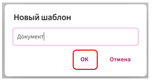
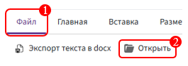
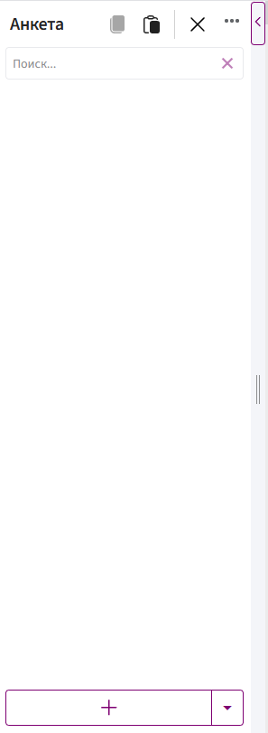
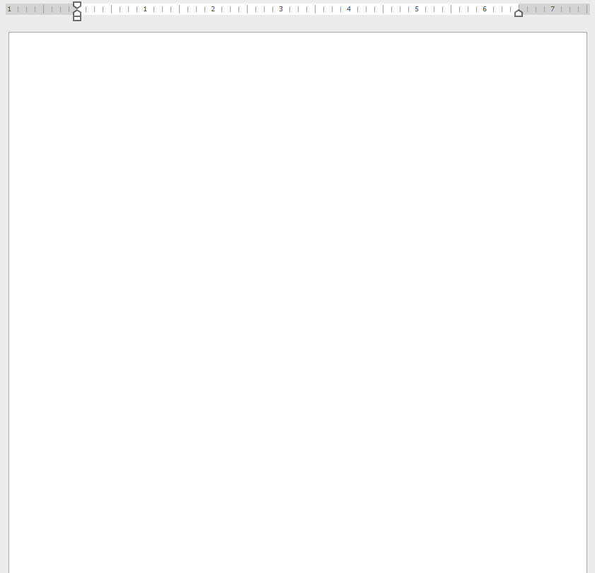
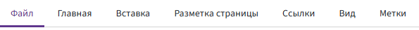
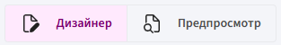

# Создание шаблона

1. Перейдите во вкладку **«Шаблоны»**.

    
   
3. Нажмите кнопку **«Новый шаблон»**.

    

4. В открывшемся окне введите название шаблона и нажмите **«ОК»**.

    

6. Перейдите во вкладку **«Файл»** и выберите команду **«Открыть»**.

    

8. Укажите документ в формате **.DOCX**.

**Как работать в редакторе с отдельными частями шаблона можно посмотреть здесь:**

1. Поля для автоматизации документа создаются в [анкете](fields.md).

    

3. Принцип работы с полями в [области редактирования](edit-area.md).

    

5. Как форматировать текст документа с помощью [панели инструментов](tabs.md)

    

7. Как [проверить](preview.md) шаблон, не выходя из режима редактирования.

    

9. [Горячие клавиши](keyboard-shortcuts.md) при работе с шаблонами.
