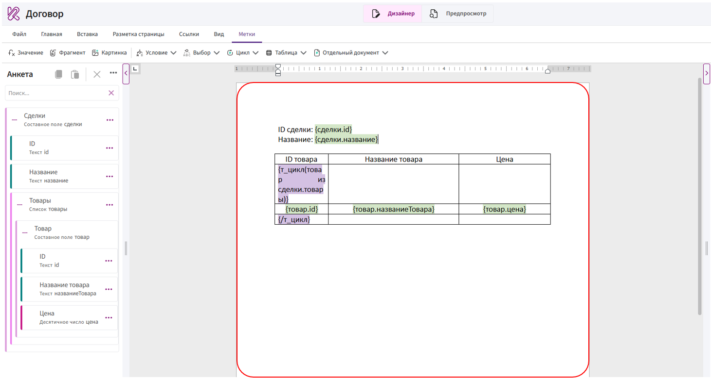
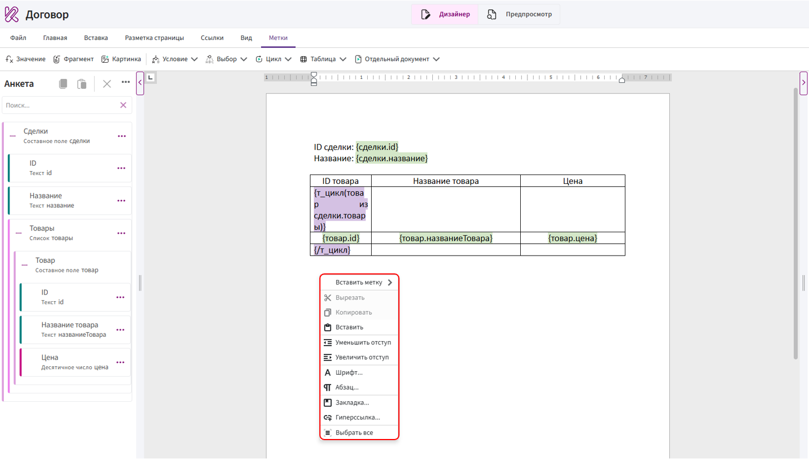
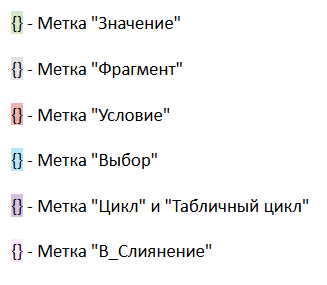
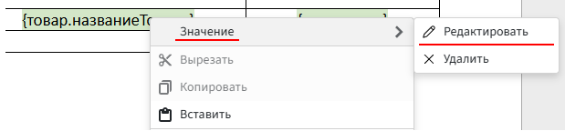

# Editing area

The **editing area** is the main part of the editor where the template content is displayed and edited.

Here you can work with text, tables, images, and added directives.

## Working with template content

In the editing area, you can:

- enter and edit text;
- configure the font, size, and text formatting;
- change alignment, indentation, and spacing;
- create lists;
- add and edit tables;
- insert images;
- change page settings;
- add and edit directives.

To add or edit content, place the cursor at the required position in the document. To apply formatting to existing content, select it first.

Text editing and formatting work in the same way as in a standard text editor.

## Context menu

The context menu contains commands for working with document content. To open it, right-click in the editing area.

The following commands are available in the context menu:

- **«Insert directive»** — opens the menu for adding directives;
- **«Cut»**, **«Copy»**, and **«Paste»** — allow you to work with document content;
- **«Decrease Indent»** and **«Increase Indent»** — change the indentation of the selected paragraph;
- **«Font»** — opens the font settings;
- **«Paragraph»** — opens alignment, indentation, and spacing settings;
- **«Bookmark»** — allows you to add or edit a bookmark;
- **«Hyperlink»** — allows you to add a hyperlink;
- **«Select All»** — selects all content in the document.

The available commands depend on where the context menu is opened and whether any content is selected. For example, **«Cut»** and **«Copy»** are unavailable if nothing is selected.

## Adding fields from Fields

Fields are inserted at the position of the cursor in the editing area. After insertion, a directive or another Kombinator construction appears in the document and is processed when the document is generated.

For information about adding fields, available insertion methods, and working with fields, see [«Fields»](fields.md).

## Editing directives

Kombinator treats fields and constructions added to the document as directives. Each directive type has its own color, making it easier to distinguish them in the template.

The color is used only to display directives in the editor and does not appear in the generated document.

Directive settings are changed in a separate window.

You can open the editing window in one of the following ways:

- double-click the directive;
- right-click the directive, open the first item in the context menu, and select **«Edit»**.

      

The name of the first context menu item depends on the selected directive type. For example, a simple field displays **«Expression»**, while a field inserted as a condition displays **«Condition expression»**.

After that, the editing window will open. Change the required settings and click **«OK»**.