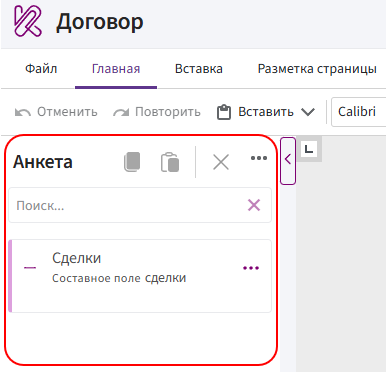
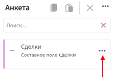
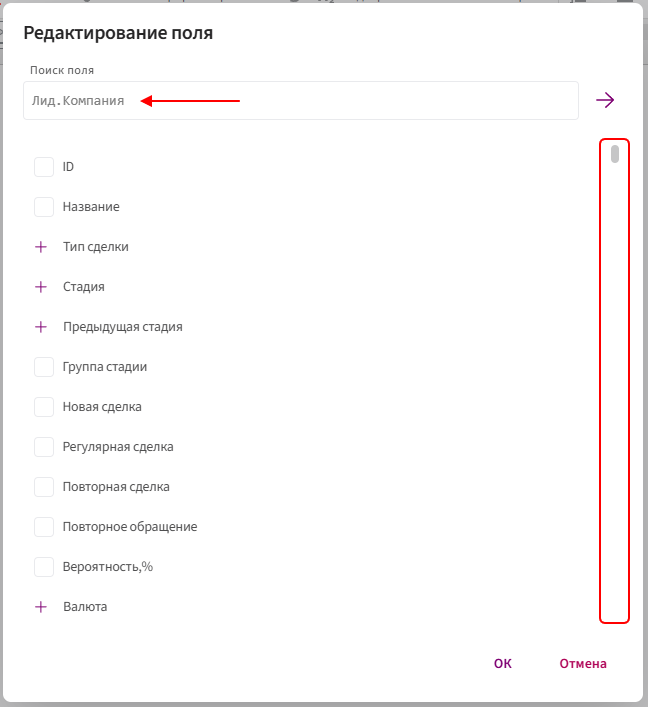
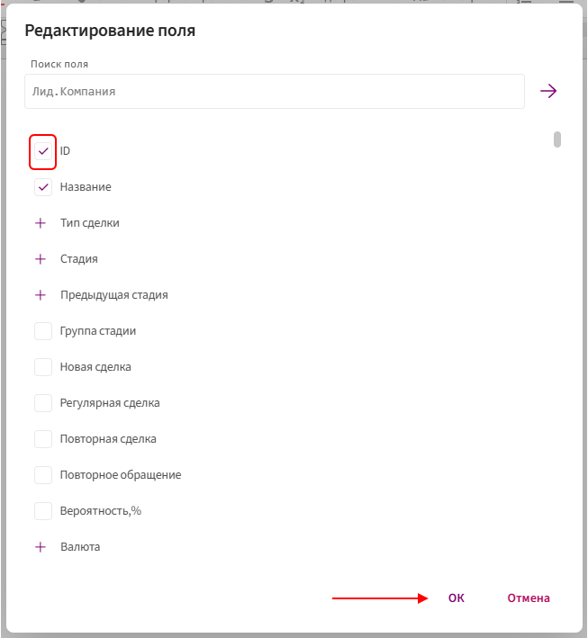
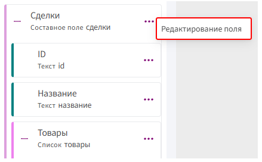
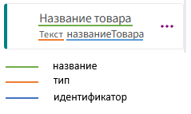
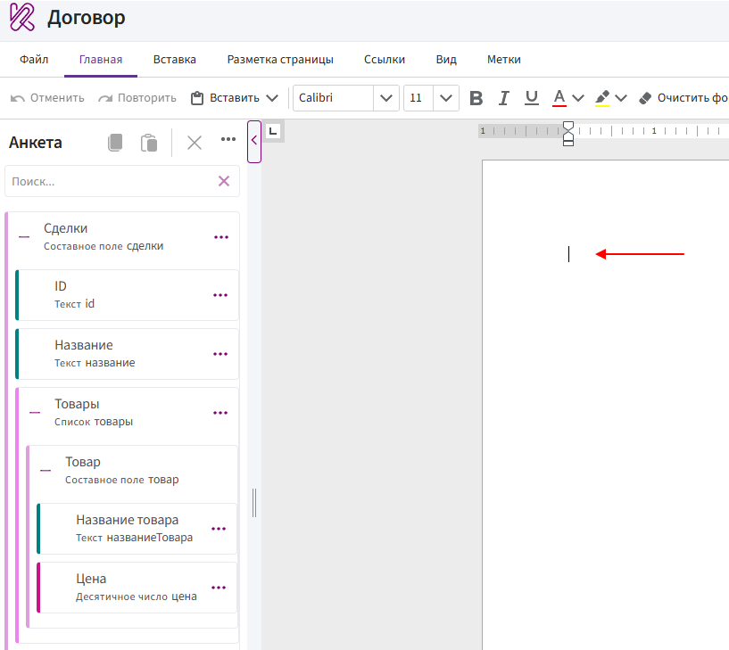
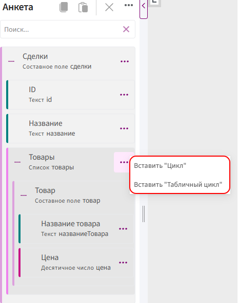

# Fields

**Fields** is the panel on the left side of the editor that displays Bitrix24 fields available for use in the template.

When a document is generated, Kombinator retrieves the values of these fields from the CRM item and inserts them into the template.

## How fields is used to generate a document

Fields connects Bitrix24 data with the document template.

For example:

1. In a deal, the **«Deal name»** field contains **«Equipment Supply»**.

2. The **«Deal name»** field is added to fields.

3. The field is inserted into the template using expression.

4. When the document is generated, **«Equipment Supply»** appears in place of the directive.

If the field is empty in Bitrix24, Kombinator has no value to insert into the document.

## Adding fields

All fields are located inside the main block, whose name corresponds to the CRM entity.

For example, if the template is created from a deal, the main block will be **«Deals»**.

To add fields:

1. Open the document template.

2. Click the three-dot menu next to the main block, for example **«Deals»**.

      

3. Select **«Edit fields»**.

4. In the window that opens, find the required fields. You can use the search bar or scroll through the list.

      

5. Select the fields you want to add.

6. Click **«OK»**.

      

The selected fields will appear inside the main block in **Fields**.

> You can add only fields that already exist in the corresponding CRM entity.

## Changing the set of fields

To add new fields or remove fields you no longer need:

1. Click the three-dot menu next to the main block.

2. Select **«Edit Fields»**.

      

3. Select the new fields or clear the fields you no longer need.

4. Click **«OK»**.

Removing a field from **Fields** does not delete it from Bitrix24.

> Before removing a field from Fields, make sure it is not used in the template.

## Field name, type, and identifier

Each field in **Fields** displays:

- its name;
- its type;
- its identifier.

The field type and identifier are displayed below the field name.

> Identifiers help distinguish fields with identical or similar names. They are also used in Kombinator directives and functions.

## Adding fields to the document

To insert a field into the document:

1. Place the cursor at the required position in the document.

      

2. Find the field in **Fields**.

3. Click the three-dot menu next to the field.

4. Select the required insertion method.

      

**Example:**

<video controls preload="metadata" style="width: 100%; max-width: 900px;">
  <source src="../../../ReferenceGuide/img/bitrix/34.mp4" type="video/mp4">
  Your browser does not support video playback.
</video>

Fields can be inserted into the document using **Expression**, **Condition expression**, **Switch**, **For**, or **Table**.

Before inserting a field, check its type and whether it is nested inside a list.

## Why fields can depend on each other

A field's behavior depends not only on its type but also on its position in **Fields**.

For example, **«Product name»** has the **«Text»** type but is located inside the **«Products»** list. Since a deal can contain multiple products, each product can have its own name.

If you insert **«Product name»** into the document using **Expression** outside the **«Products»** list, Kombinator cannot determine which product name should be inserted and returns an [error](fields.md#marker-must-be-inside-error).

First, insert **«Products»** using **For** or **Table**, then place **«Product name»** inside the inserted structure.

## «Marker must be inside…» error

The **«Marker must be inside…»** message appears when a field is nested inside a list but is inserted into the document outside that list.

For example, if you try to insert **«Product name»** outside the **«Products»** list, the following message will appear:

> Marker must be inside Products.

This means that **«Product name»** is nested inside the **«Products»** list.

In this case:

1. Insert **«Products»** using **For** or **Table**.

2. Place the cursor inside the inserted structure.

3. Insert **«Product name»** using **Expression**.

> If a similar message then appears with the name of another list, the field is nested inside multiple lists. Add a separate **For** or **Table** directive for each list, starting with the outermost list and moving inward.

