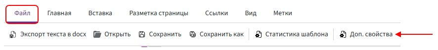

# File name mask

A **file name mask** is an expression that Kombinator uses to generate the name of the final file.

The mask allows you to define in advance which parts will be included in the file name. For example, you can combine the document type, contract number, date, and company name.

As a result, the generated file may have a name such as:

```text
Contract № 125 dated 28.07.2026
```

When the document is generated, the number and date are automatically taken from the corresponding fields.

## Opening the file name mask settings

The file name mask is configured while editing the template.

> In Bitrix24, you can also specify the file name mask directly in the [automation rule settings](../../ReferenceGuide/Bitrix/template-automation.md#setting-up-the-file-name-mask). The same syntax rules apply to a mask configured in the automation rule and a mask configured in the template.
>
> If a mask is already saved in the template, enable **«Use the name mask from the template»** in the automation rule settings. You do not need to create the expression again.

To open the file name mask settings in the template:

1. Open the **«File»** tab at the top of the editor.

2. Click **«Metadata»**.

      

3. In the **«Name mask»** field, enter the expression that should be used to generate the file name.

4. Click **«OK»** to save the mask.

## What you can use in a file name mask

A file name mask can contain:

- static text;
- field references;
- operators;
- functions;
- other syntax constructions supported by Kombinator.

The file name mask follows the same expression rules as expressions used elsewhere in Kombinator.

### Static text

Static text is the part of the file name that remains the same every time a document is generated.

Enclose static text in double quotation marks:

```text
"Contract"
```

or:

```text
"Contract № "
```

The text inside the quotation marks is added to the file name without changes.

### Field directives

Field directives allow you to add field values to the file name.

When the document is generated, the directive is replaced with the actual value of the corresponding field.

For example, the `contractNumber` directive can provide the contract number, while the `contractDate` directive can provide the contract date.

The available directives depend on the fields added to the template.

### Functions and other expressions

You can use functions and other Kombinator syntax constructions in a file name mask.

For example, functions can be used to format a date, modify text, or process a value before adding it to the file name.

### Concatenation operator

Use the `&` operator to combine the parts of the mask.

The `&` operator combines static text, directive values, and expression results into a single file name.

For example:

```text
"Contract № " & deals.id
```

If the `id` directive contains the value `125`, the generated file name will be:

```text
Contract № 125
```

To add multiple values, place `&` between each part of the mask:

```text
"Contract № " & deals.id & " dated " & formatDate(deals.contractDate, "dd.MM.yyyy")
```

The resulting file name may be:

```text
Contract № 125 dated 28.07.2026
```

This mask consists of the following parts:

1. `"Contract № "` — static text.
2. `&` — concatenation operator.
3. `deals.id` — field directive.
4. `" dated "` — static text.
5. `formatDate(deals.contractDate, "dd.MM.yyyy")` — a directive processed by a function.

The `&` operator is placed only between the values being combined. Do not add it before the first or after the last part of the mask.

## Using the «/» character

The `/` character cannot be used as part of a file name because Kombinator treats it as a path separator.

Do not use `/` to separate parts of a document number, date, or other value.

For example, instead of:

```text
"Contract 125/2026"
```

use:

```text
"Contract 125-2026"
```