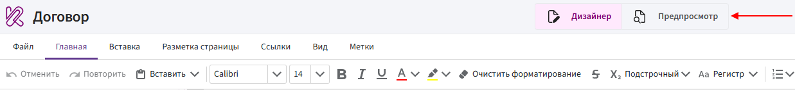
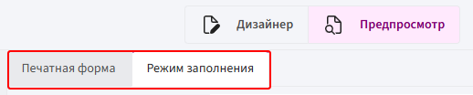
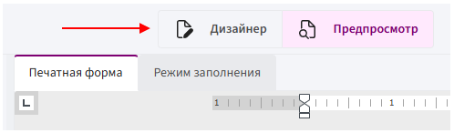

# Preview mode

**Preview mode** allows you to check how data is inserted, how directives work, and how the template looks before generating the final document.

In preview mode, you can check:

- which data is inserted by directives;
- whether conditions and switch options work correctly;
- whether **For** and **Table** directives process lists correctly;
- how tables and images are displayed;
- how the document looks after the template is processed.

In Bitrix24, preview data is loaded automatically from the CRM item from which the template was opened.

For example, if the template was opened from a deal, Kombinator uses the data from that deal.

1. Switch to **preview mode**.

      

2. Select a display mode: **«Filling mode»** or **«Printed from»**.

      

3. Check the processed template.

> If a required field is empty in the Bitrix24 CRM item, its value will not be displayed in the preview.

## Document display modes

Preview mode provides two ways to display the document: **«Filling mode»** and **«Printed from»**.

### Filling mode

Filling mode uses a simplified document view.

Use this mode to quickly check:

- inserted values;
- **Condition expression** directives;
- **Switch** options;
- repeated content created with **For**;
- tables generated with **Table**.

> The document appearance in Filling mode may differ from the final file. For example, spacing, margins, or element positioning may be displayed differently.

### Printed from

Printed from displays the document in a layout close to the final DOCX or PDF file.

Use this mode to check:

- text placement on the page;
- fonts and formatting;
- margins and spacing;
- tables and images;
- line and page breaks;
- the overall appearance of the document.

Minor formatting differences between Printed from and the generated file may still occur.

> Use **Filling mode** to check data and template logic, and **Printed from** to check the document layout and formatting.

## Returning to the Designer

If you find an issue during the preview, return to **«Designer»** and update the template.

Then open Preview mode again and check the result.

> Preview mode helps you check the template before generating a document, but it does not replace testing the final file. Before using the template, generate a test document in DOCX or PDF format.