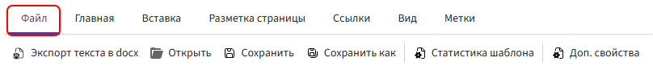
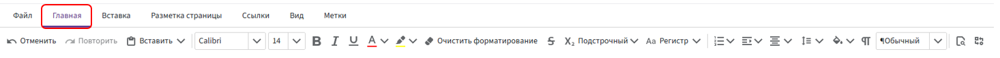
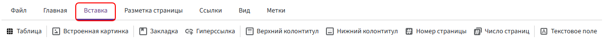
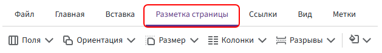
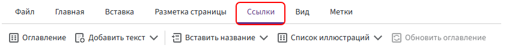
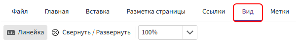
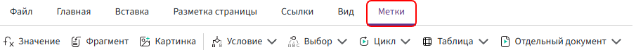
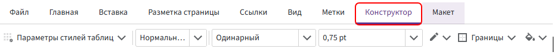
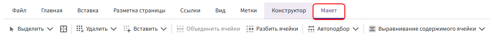

# Toolbar

The toolbar contains commands for editing and formatting a template. You can use it to format text, add tables, images, and Kombinator directives, and configure page settings.

> Some tabs appear only when working with specific elements. For example, **«Design»** and **«Layout»** are available when the cursor is placed inside a table.

## «File» tab

The following commands are available:

1. **Export text to docx** — exports the template content, including directives, conditions, loops, and functions, to a `.DOCX` file.

      The exported document can be opened in another template using **«File» → «Open»**. Kombinator constructions are preserved.

      > Fields are not transferred. If the directives use fields, add the same fields to the new template.

2. **Open** — loads a `.DOCX` document into the editor.

      The document content is used as the text basis of the template. After opening it, you can add directives, functions, and other automation elements.

3. **Save** — saves changes made to the template.

4. **Save as** — saves a copy of the template under a new name.

5. **Template statistics** — shows the number of fields, directives, and functions used in the template.

6. **Metadata** — opens the template metadata, where you can configure the file name mask.

      For more information, see [«File name mask»](file-name-mask.md).

## «Home» tab

The main tab for editing and formatting text.

1. **Undo** — undoes the last action.

2. **Redo** — repeats the last undone action.

3. **Paste** — opens the standard clipboard menu:

      - `Paste` — inserts text or an object from the clipboard, such as copied text or a directive;
      - `Copy` — copies the selected text or directive to the clipboard;
      - `Cut` — removes the selected content and places it on the clipboard.

      You can also use the standard keyboard shortcuts:

      - `Ctrl + V` — paste;
      - `Ctrl + C` — copy;
      - `Ctrl + X` — cut.

4. **Font** — selects the font, for example Calibri or Times New Roman.

5. **Font size** — sets the font size, for example 11, 12, or 14.

6. **Bold** — applies bold formatting to the selected text (`Ctrl + B`).

7. **Italic** — applies italic formatting to the selected text (`Ctrl + I`).

8. **Underline** — underlines the selected text (`Ctrl + U`).

9. **Font color** — changes the color of the selected text.

10. **Text highlight color** — highlights the selected text with a background color.

11. **Clear Formatting** — removes applied text formatting, including font, color, and size.

12. **Strikethrough** — applies strikethrough formatting to the selected text.

13. **Superscript and Subscript** — converts selected text to superscript or subscript.

14. **Change Case** — changes the capitalization of the selected text.

15. **Numbering** — creates bulleted, numbered, and multilevel lists.

16. **Increase Indent** — changes the paragraph indentation level.

17. **Align Paragraph** — changes paragraph alignment.

18. **Line Spacing** — sets the line spacing, for example 1.0, 1.5, or 2.0.

19. **Shading** — changes the background color of the selected paragraph.

20. **Show/Hide formatting marks** — shows or hides non-printing characters such as spaces, paragraph marks, tabs, and line breaks.

21. **Text style** — applies a selected style to the text, for example **Normal** or a heading style.

22. **Find** — searches for text in the document.

23. **Replace** — finds and replaces text in the document.

## «Insert» tab

Contains commands for adding tables, images, links, and other objects to the document.

1. **Table** — inserts a table into the editing area. You can specify the required number of rows and columns.

2. **Inline Picture** — inserts an image into the document.

3. **Bookmark** — creates a bookmark inside the document. Bookmarks can be used for navigation and internal links.

4. **Hyperlink** — adds a link to a website, email address, or bookmarked location inside the document.

5. **Header** — adds content that is repeated at the top of document pages.

6. **Footer** — adds content that is repeated at the bottom of document pages.

7. **Page Number** — inserts automatic page numbering.

8. **Page Count** — inserts the total number of pages in the document.

9. **Text Box** — inserts a separate text block that can be positioned on the page.

## «Page Layout» tab

Contains commands for configuring page settings.

1. **«Margins»** — configures the top, bottom, left, and right page margins.

      You can select a predefined option or specify custom values.

2. **«Orientation»** — changes the page orientation:

      - Portrait — vertical orientation;
      - Landscape — horizontal orientation.

3. **«Size»** — sets the paper size.

4. **«Columns»** — divides text into multiple columns.

5. **«Breaks»** — inserts page, section, or column breaks.

6. **Page color** — changes the background color of document pages.

## «References» tab

Contains commands for creating a table of contents, captions, and lists of document elements.

1. **«Table of Contents»** — inserts an automatic table of contents.

2. **«Add Text»** — adds the selected text to the table of contents structure.

3. **«Insert Caption»** — adds a caption to an image, table, chart, or another object.

4. **«Insert Table of Elements»** — creates a list of objects that have captions, such as a list of figures or tables.

5. **«Update Table of Contents»** — updates the structure and page numbers in the table of contents.

## «View» tab

Contains commands for changing how the editing area is displayed.

1. **«Horizontal Ruler»** — shows or hides the horizontal ruler.

2. **«Collapse / Expand»** — collapses or expands directives. When collapsed, directives take up less space, making it easier to review the document layout and formatting.

3. **Zoom** — increases or decreases the document zoom level in the editing area.

## «Directives» tab

The tab contains Kombinator directives used to automatically populate and generate documents.

1. **«Expression»** — inserts a field value or the result of an expression into the document. [Learn more](../../ReferenceGuide/directives/value.md)

2. **«External»** — inserts content from another template located at the specified path. [Learn more](../../ReferenceGuide/directives/fragment.md)

3. **«Picture»** — inserts an image from a Bitrix24 file field. [Learn more](../../ReferenceGuide/directives/picture.md)

4. **«Condition expression»** — adds conditional logic that displays or hides part of the document depending on the specified condition. [Learn more](../../ReferenceGuide/directives/if.md)

5. **«Switch»** — displays one of several content options depending on the selected field value. [Learn more](../../ReferenceGuide/directives/switch.md)

6. **«For»** — repeats a document fragment for each item in a list. [Learn more](../../ReferenceGuide/directives/for.md)

7. **«Table»** — repeats table rows according to the number of items in a list. [Learn more](../../ReferenceGuide/directives/table.md)

> The toolbar also contains **«Separate document»**. Its behavior is not described in the source article, so it is not included in the list above.

## «Design» tab

The tab appears when the cursor is placed inside a table. It contains tools for formatting the selected table.

1. **«Table Style Options»** — allows you to select which table elements should use specific formatting.

2. **Table style** — applies a predefined style to the table.

3. **Line style** — sets the border line style, for example **Single**.

4. **Line width** — sets the border thickness, for example `0.75 pt`.

5. **Line color** — changes the color of table borders.

6. **«Borders»** — adds or removes selected borders from the table or selected cells.

7. **Shading** — changes the background color of the table or selected cells.

> Before applying formatting, select the required cells or place the cursor inside the table.

## «Layout» tab

The tab appears when the cursor is placed inside a table. It contains tools for changing the table structure and positioning content inside cells.

1. **«Select»** — selects a cell, row, column, or the entire table.

2. **Gridlines** — shows or hides cell boundaries that do not have visible borders.

      > Gridlines are displayed only in the editor and are not added to the generated document.

3. **«Delete»** — deletes selected cells, rows, columns, or the entire table.

4. **«Insert»** — adds new rows or columns relative to the selected cell.

5. **«Merge Cells»** — merges multiple selected cells into one.

      > The command becomes available after selecting multiple adjacent cells.

6. **«Split Cells»** — splits the selected cell into multiple rows and columns.

7. **«AutoFit»** — automatically adjusts column width to the table content or the available page width.

8. **«Cell Alignment»** — sets the horizontal and vertical alignment of content inside selected cells.